# Pytorch官方FasterRCNN

# 0. 代码结构

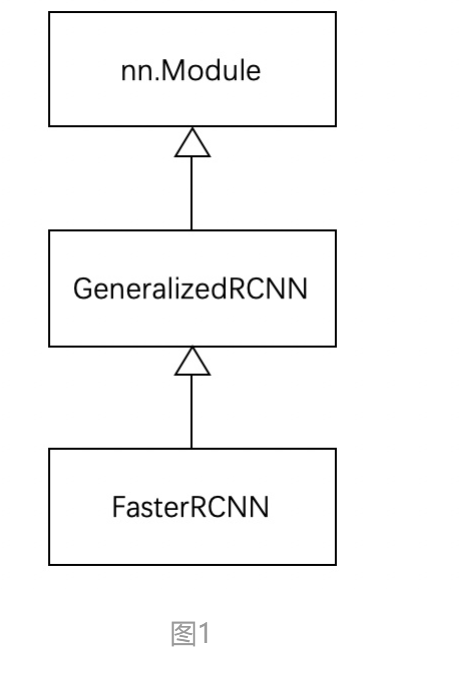

FasterRCNN继承GeneralizedRCNN， GeneralizedRCNN继承nn.Module

# 1. GeneralizedRCNN

```python
class GeneralizedRCNN(nn.Module):
    def __init__(self, backbone, rpn, roi_heads, transform):
        super(GeneralizedRCNN, self).__init__()
        self.transform = transform
        self.backbone = backbone
        self.rpn = rpn
        self.roi_heads = roi_heads

    # images是输入的除以255归一化后的batch图像
    # targets是输入对应images的batch标记框（如果self.training训练模式，targets不能为空）
    def forward(self, images, targets=None):
        original_image_sizes = torch.jit.annotate(List[Tuple[int, int]], [])
        for img in images:
            val = img.shape[-2:]
            assert len(val) == 2
            original_image_sizes.append((val[0], val[1]))

        images, targets = self.transform(images, targets)
        features = self.backbone(images.tensors)
        if isinstance(features, torch.Tensor):
            features = OrderedDict([('0', features)])
        proposals, proposal_losses = self.rpn(images, features, targets)
        detections, detector_losses = self.roi_heads(features, proposals, images.image_sizes, targets)
        detections = self.transform.postprocess(detections, images.image_sizes, original_image_sizes)

        losses = {}
        losses.update(detector_losses)
        losses.update(proposal_losses)

        return (losses, detections)
```

有四个重要接口：

- transform
- backbone
- rpn
- roi_heads

## 1.1 transform

```python
# GeneralizedRCNN.forward(...)
for img in images:
    val = img.shape[-2:]
    assert len(val) == 2
    original_image_sizes.append((val[0], val[1]))

images, targets = self.transform(images, targets)
```

1. 记录每个图片的原始大小，便于把网络输出的缩放框放在原始图像上。
2. 对`images`, `targets`进行transform
   1. 将输入标准化( Norm )
   2. 将图像缩放到固定大小 ( Resize )。 对于`FasterRCNN`，从纯理论上来说确实可以支持任意大小的图片。但是若图片过大，会爆内存。

## 1.2 backbone+rpn+roi_heads

将图像缩放后，进行下面四个步骤：

1. 将transform 后的图像输入到backbone模块提取特征图.

   ```python
   features = self.backbone(images.tensors)
   if isinstance(features, torch.Tensor):
   	features = OrderedDict([('0', features)])
   ```

   backbone一般为VGG，ResNet，MobileNet

2. 经过rpn模块生成propsals和proposal_losses

   ```python
   proposals, proposal_losses = self.rpn(images, features, targets)
   ```

3. 进入roi_heads模块(即roi_pooling+分类)

   ```python
   detections, detector_losses = self.roi_heads(features, proposals, images.image_sizes, targets)
   ```

4. 最后经过postproces模块（进行NMS，同时将box用过original_images_size映射回原图）

   ```python
   detections = self.transform.postprocess(detections, images.image_sizes, original_image_sizes)
   ```

# 2. FasterRCNN

FasterRCNN继承基类GeneralizedRCNN。

```python
class FasterRCNN(GeneralizedRCNN):
    def __init__(self, backbone, num_classes=None,
                 # transform parameters
                 min_size=800, max_size=1333,
                 image_mean=None, image_std=None,
                 # RPN parameters
                 rpn_anchor_generator=None, rpn_head=None,
                 rpn_pre_nms_top_n_train=2000, rpn_pre_nms_top_n_test=1000,
                 rpn_post_nms_top_n_train=2000, rpn_post_nms_top_n_test=1000,
                 rpn_nms_thresh=0.7,
                 rpn_fg_iou_thresh=0.7, rpn_bg_iou_thresh=0.3,
                 rpn_batch_size_per_image=256, rpn_positive_fraction=0.5,
                 # Box parameters
                 box_roi_pool=None, box_head=None, box_predictor=None,
                 box_score_thresh=0.05, box_nms_thresh=0.5, box_detections_per_img=100,
                 box_fg_iou_thresh=0.5, box_bg_iou_thresh=0.5,
                 box_batch_size_per_image=512, box_positive_fraction=0.25,
                 bbox_reg_weights=None):
		# backbone
        out_channels = backbone.out_channels
		# rpn
        if rpn_anchor_generator is None:
            anchor_sizes = ((32,), (64,), (128,), (256,), (512,))
            aspect_ratios = ((0.5, 1.0, 2.0),) * len(anchor_sizes)
            rpn_anchor_generator = AnchorGenerator(
                anchor_sizes, aspect_ratios
            )
        if rpn_head is None:
            rpn_head = RPNHead(
                out_channels, rpn_anchor_generator.num_anchors_per_location()[0]
            )

        rpn_pre_nms_top_n = dict(training=rpn_pre_nms_top_n_train, testing=rpn_pre_nms_top_n_test)
        rpn_post_nms_top_n = dict(training=rpn_post_nms_top_n_train, testing=rpn_post_nms_top_n_test)
	
        rpn = RegionProposalNetwork(
            rpn_anchor_generator, rpn_head,
            rpn_fg_iou_thresh, rpn_bg_iou_thresh,
            rpn_batch_size_per_image, rpn_positive_fraction,
            rpn_pre_nms_top_n, rpn_post_nms_top_n, rpn_nms_thresh)
		# roi
        if box_roi_pool is None:
            box_roi_pool = MultiScaleRoIAlign(
                featmap_names=['0', '1', '2', '3'],
                output_size=7,
                sampling_ratio=2)

        if box_head is None:
            resolution = box_roi_pool.output_size[0]
            representation_size = 1024
            box_head = TwoMLPHead(
                out_channels * resolution ** 2,
                representation_size)

        if box_predictor is None:
            representation_size = 1024
            box_predictor = FastRCNNPredictor(
                representation_size,
                num_classes)

        roi_heads = RoIHeads(
            # Box
            box_roi_pool, box_head, box_predictor,
            box_fg_iou_thresh, box_bg_iou_thresh,
            box_batch_size_per_image, box_positive_fraction,
            bbox_reg_weights,
            box_score_thresh, box_nms_thresh, box_detections_per_img)

        if image_mean is None:
            image_mean = [0.485, 0.456, 0.406]
        if image_std is None:
            image_std = [0.229, 0.224, 0.225]
        transform = GeneralizedRCNNTransform(min_size, max_size, image_mean, image_std)

        super(FasterRCNN, self).__init__(backbone, rpn, roi_heads, transform)
```

FasterRCNN 实现了 GeneralizedRCNN 中的 transform、backbone、rpn、roi_heads 接口：

```python
# FasterRCNN.__init__(...)
super(FasterRCNN, self).__init__(backbone, rpn, roi_heads, transform)
```

## 2.1 transform 接口

```python
transform = GeneralizedRCNNTransform(min_size, max_size, image_mean, image_std)
```

使用 GeneralizedRCNNTransform 实现。从代码变量名可以明显看到包含：

- 与缩放有关的参数：：min_size + max_size
- 与归一化有关的参数: image_mean + image_std（对输入[0, 1]减去image_mean再除以image_std）

## 2.2 backbone 接口

使用 ResNet50 + FPN(resnet_fpn_backbone) 结构：

在生成model前，通过backbone将参数传入

```python
def fasterrcnn_resnet50_fpn(pretrained=False, progress=True, num_classes=91, pretrained_backbone=True, **kwargs):
    if pretrained:
        # no need to download the backbone if pretrained is set
        pretrained_backbone = False
    backbone = resnet_fpn_backbone('resnet50', pretrained_backbone)
    model = FasterRCNN(backbone, num_classes, **kwargs)
    if pretrained:
        state_dict = load_state_dict_from_url(model_urls['fasterrcnn_resnet50_fpn_coco'], progress=progress)
        model.load_state_dict(state_dict)
    return model
```

### 2.2.1 ResNet50

### 2.2.2 FPN (Feature Pyramid Network)

#### 1. 动机

识别不同尺寸的物体是目标检测中的一个基本挑战，而特征金字塔一直是多尺度目标检测中的一个基本的组成部分，但是由于特征金字塔计算量大，会拖慢整个检测速度，所以大多数方法为了检测速度而尽可能的去避免使用特征金字塔，而是只使用高层的特征来进行预测。高层的特征虽然包含了丰富的语义信息，但是由于低分辨率，很难准确地保存物体的位置信息。与之相反，低层的特征虽然语义信息较少，但是由于分辨率高，就可以准确地包含物体位置信息。所以如果可以将低层的特征和高层的特征融合起来，就能得到一个识别和定位都准确的目标检测系统。所以本文就旨在设计出这样的一个结构来使得检测准确且快速。

#### 2.结构

传统的结构包含以下三种

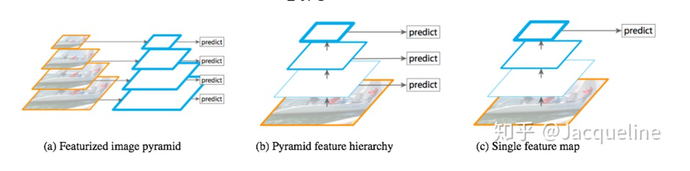

- Featurized image pyramid：将图片转换成不同尺寸的，对不同尺寸提取特征，再对每个尺度的特征进行单独预测，优点是：不同尺度的都可以包含丰富的语义信息，但是缺点就是时间成本太高。
- Pyramid feature hierarchy：SSD采用的多尺度融合的方法，即从网络不同层抽取不同尺度的特征，然后在这不同尺度的特征上分别进行预测。优点：在于它不需要额外的计算量。缺点：有些尺度的特征语义信息不是很丰富。此外，SSD没有用到足够低层的特征，作者认为低层的特征对于小物体检测是非常有帮助的。
- Single feature map：这是在SPPnet，Fast R-CNN，Faster R-CNN中使用的，就是在网络的最后一层的特征图上进行预测。优点：计算速度会比较快。缺点：最后一层的特征图分辨率低，不能准确的包含物体的位置信息。

为了使得不同尺度的特征都含丰富的语义信息，同时又不使得计算成本过高。作者采用了top down 和 lateral connection的方式，让低层高分辨率低语义的特征和高层低分辨率高语义的特征融合在一起，使得最终得到的不同尺度的特征图都有丰富的语义信息。

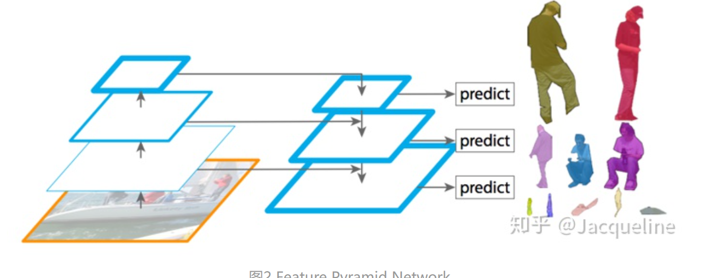

#### 3. 特征金字塔


包含三个部分：

- bottom-up
- top-down
- lateral connection

buttom-up: 将图片输入到backbone ConvNet中提取特征的过程，Backbone输出的feature map的尺寸有的是不变的，有的是成2倍的减小的。对于那些输出的尺寸不变的层，归为一个stage。每个stage的最后一层输出的特征被抽取出来。

以ResNet为例，将卷积块conv2, conv3, conv4, conv5的输出定义为{C2, C3, C4, C5}，这些输出都是stage中最后一个残差块的输出。分别是原图的{1/4, 1/8, 1/16, 1/32}。

Top-down: 将高层得到的feature map进行上采样然后往下传递。层的特征包含丰富的语义信息，经过top-down的传播就能使得这些语义信息传播到低层特征上，使得低层特征也包含丰富的语义信息。

采样方法：最近邻上采样，使得特征图扩大2倍。上采样的目的就是放大图片，在原有图像像素的基础上在像素点之间采用合适的插值算法插入新的像素，在本文中使用的是最近邻上采样(插值)。如下图所示：


待求像素坐标为(i+u, j+v), 则像素灰度值f(i+u, j+v) = a(u<0.5, v<0.5),或b或c或d

Lateral connection


1. 对于每个stage输出的feater map Cn, 进行一个1X1的卷积降低维度
2. 得到的特征与上一层采样的Pn+1进行融合，element-wise addition。因为每个stage输出的特征图之间是2倍的关系，所以上一层上采样得到的特征图的大小和本层的大小一样，就可以直接将对应元素相加 
3. 相加完之后进行一个3X3的卷积，得到本层的特征输出Pn, 使用这个3*3卷积的目的是为了消除上采样产生的混叠效应(aliasing effect)，混叠效应应该就是指上边提到的‘插值生成的图像灰度不连续，在灰度变化的地方可能出现明显的锯齿状’。在本文中，因为金字塔所有层的输出特征都共享classifiers/ regressors，所以输出的维度都被统一为256，即这些3*3的卷积的channel都为256。

##  2.3 rpn 

```python
	if rpn_anchor_generator is None:
            anchor_sizes = ((32,), (64,), (128,), (256,), (512,))
            aspect_ratios = ((0.5, 1.0, 2.0),) * len(anchor_sizes)
            rpn_anchor_generator = AnchorGenerator(
                anchor_sizes, aspect_ratios
            )
        if rpn_head is None:
            rpn_head = RPNHead(
                out_channels, rpn_anchor_generator.num_anchors_per_location()[0]
            )

        rpn_pre_nms_top_n = dict(training=rpn_pre_nms_top_n_train, testing=rpn_pre_nms_top_n_test)
        rpn_post_nms_top_n = dict(training=rpn_post_nms_top_n_train, testing=rpn_post_nms_top_n_test)

        rpn = RegionProposalNetwork(
            rpn_anchor_generator, rpn_head,
            rpn_fg_iou_thresh, rpn_bg_iou_thresh,
            rpn_batch_size_per_image, rpn_positive_fraction,
            rpn_pre_nms_top_n, rpn_post_nms_top_n, rpn_nms_thresh)
```

### 2.3.1 rpn_anchor_generator

对于普通的 FasterRCNN 只需要将 feature_map 输入到 rpn 网络生成 proposals 即可。但是由于加入 FPN，需要将多个 feature_map 逐个输入到 rpn 网络。

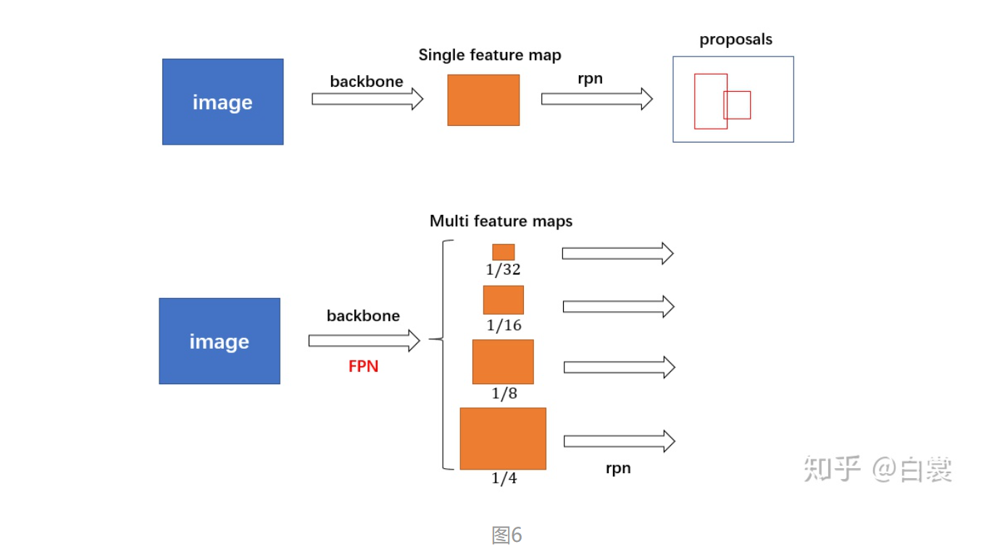

AnchorGenerator的实现：

```python
class AnchorGenerator(nn.Module):
        ......

    def generate_anchors(self, scales, aspect_ratios, dtype=torch.float32, device="cpu"):
        # type: (List[int], List[float], int, Device)  # noqa: F821
        scales = torch.as_tensor(scales, dtype=dtype, device=device)
        aspect_ratios = torch.as_tensor(aspect_ratios, dtype=dtype, device=device)
        h_ratios = torch.sqrt(aspect_ratios)
        w_ratios = 1 / h_ratios

        ws = (w_ratios[:, None] * scales[None, :]).view(-1)
        hs = (h_ratios[:, None] * scales[None, :]).view(-1)

        base_anchors = torch.stack([-ws, -hs, ws, hs], dim=1) / 2
        return base_anchors.round()

    def set_cell_anchors(self, dtype, device):
        # type: (int, Device) -> None    # noqa: F821
        ......

        cell_anchors = [
            self.generate_anchors(
                sizes,
                aspect_ratios,
                dtype,
                device
            )
            for sizes, aspect_ratios in zip(self.sizes, self.aspect_ratios)
        ]
        self.cell_anchors = cell_anchors
```

每个位置有5种`anchor_size`, 3种`aspect_radios`, 所以每个位置生成15个`base_anchors`。

```
[ -23.,  -11.,   23.,   11.] # w = h = 32,  ratio = 2
[ -16.,  -16.,   16.,   16.] # w = h = 32,  ratio = 1
[ -11.,  -23.,   11.,   23.] # w = h = 32,  ratio = 0.5
[ -45.,  -23.,   45.,   23.] # w = h = 64,  ratio = 2
[ -32.,  -32.,   32.,   32.] # w = h = 64,  ratio = 1
[ -23.,  -45.,   23.,   45.] # w = h = 64,  ratio = 0.5
[ -91.,  -45.,   91.,   45.] # w = h = 128, ratio = 2
[ -64.,  -64.,   64.,   64.] # w = h = 128, ratio = 1
[ -45.,  -91.,   45.,   91.] # w = h = 128, ratio = 0.5
[-181.,  -91.,  181.,   91.] # w = h = 256, ratio = 2
[-128., -128.,  128.,  128.] # w = h = 256, ratio = 1
[ -91., -181.,   91.,  181.] # w = h = 256, ratio = 0.5
[-362., -181.,  362.,  181.] # w = h = 512, ratio = 2
[-256., -256.,  256.,  256.] # w = h = 512, ratio = 1
[-181., -362.,  181.,  362.] # w = h = 512, ratio = 0.5
```

base_anchors如下图所示：

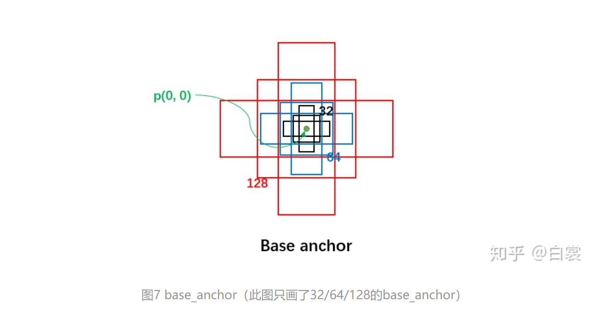

接着来看 AnchorGenerator.grid_anchors 函数：

```python
# AnchorGenerator
   def grid_anchors(self, grid_sizes, strides):
        # type: (List[List[int]], List[List[Tensor]])
        anchors = []
        cell_anchors = self.cell_anchors
        assert cell_anchors is not None

        for size, stride, base_anchors in zip(
            grid_sizes, strides, cell_anchors
        ):
            grid_height, grid_width = size
            stride_height, stride_width = stride
            device = base_anchors.device

            # For output anchor, compute [x_center, y_center, x_center, y_center]
            shifts_x = torch.arange(
                0, grid_width, dtype=torch.float32, device=device
            ) * stride_width
            shifts_y = torch.arange(
                0, grid_height, dtype=torch.float32, device=device
            ) * stride_height
            shift_y, shift_x = torch.meshgrid(shifts_y, shifts_x)
            shift_x = shift_x.reshape(-1)
            shift_y = shift_y.reshape(-1)
            shifts = torch.stack((shift_x, shift_y, shift_x, shift_y), dim=1)

            # For every (base anchor, output anchor) pair,
            # offset each zero-centered base anchor by the center of the output anchor.
            anchors.append(
                (shifts.view(-1, 1, 4) + base_anchors.view(1, -1, 4)).reshape(-1, 4)
            )

        return anchors

    def forward(self, image_list, feature_maps):
        # type: (ImageList, List[Tensor])
        grid_sizes = list([feature_map.shape[-2:] for feature_map in feature_maps])
        image_size = image_list.tensors.shape[-2:]
        dtype, device = feature_maps[0].dtype, feature_maps[0].device
        strides = [[torch.tensor(image_size[0] / g[0], dtype=torch.int64, device=device),
                    torch.tensor(image_size[1] / g[1], dtype=torch.int64, device=device)] for g in grid_sizes]
        self.set_cell_anchors(dtype, device)
        anchors_over_all_feature_maps = self.cached_grid_anchors(grid_sizes, strides)
        ......
```

因为存在FPN网络，输入rpn的是多个特征。以下对一个特征进行描述，其他特征相似。

假设有h X w的特征，首先会计算每个特征相对于图像的下采样倍数stride（特征相当于原图放缩的倍数）: 

```
stride = image_size / feature_map_size
```

然后生成一个h X w 大小的网格，每个格子长度为stride, 如下图

```python
# AnchorGenerator.grid_anchors(...)
shifts_x = torch.arange(0, grid_width, dtype=torch.float32, device=device) * stride_width
shifts_y = torch.arange(0, grid_height, dtype=torch.float32, device=device) * stride_height
shift_y, shift_x = torch.meshgrid(shifts_y, shifts_x)
```

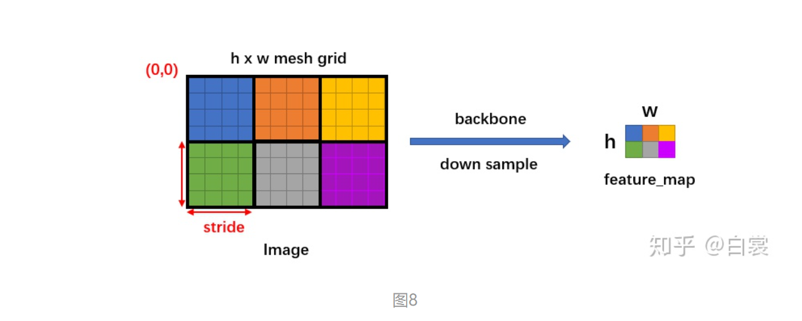

然后将 base_anchors 的中心从 (0,0) 移动到网格的点，且在网格的每个点都放置一组 base_anchors。这样就在当前 feature_map 上有了很多的 anchors。

需要特别说明，stride 代表网络的感受野，网络不可能检测到比 feature_map 更密集的框了！所以才只会在网格中每个点设置 anchors（反过来说，如果在网格的两个点之间设置 anchors，那么就对应 feature_map 中半个点，显然不合理）。

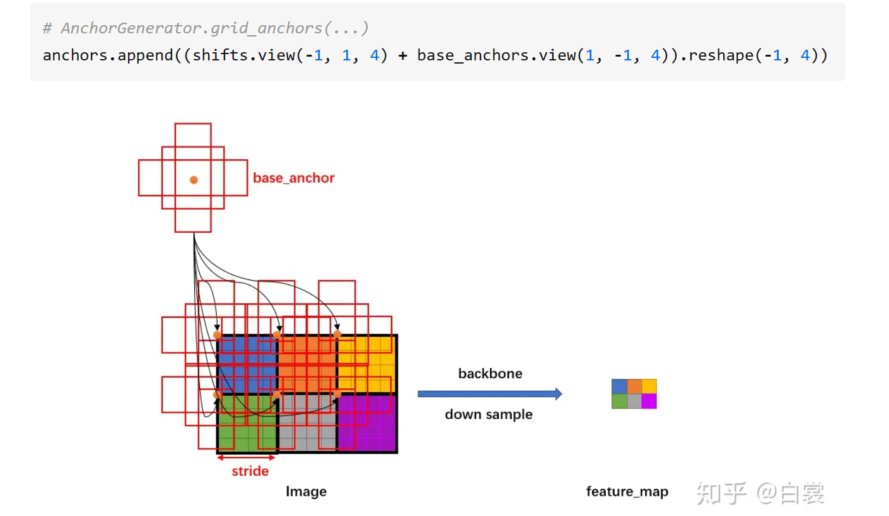

### 2.3.2 RPNHead

放置好 anchors 后，接下来就要调整网络，使网络输出能够判断每个 anchor 是否有目标，同时还要有 bounding box regression 需要的4个值 （dx, dy, dw, dh)。

```python
class RPNHead(nn.Module):
    def __init__(self, in_channels, num_anchors):
        super(RPNHead, self).__init__()
        self.conv = nn.Conv2d(
            in_channels, in_channels, kernel_size=3, stride=1, padding=1
        )
        self.cls_logits = nn.Conv2d(in_channels, num_anchors, kernel_size=1, stride=1)
        self.bbox_pred = nn.Conv2d(
            in_channels, num_anchors * 4, kernel_size=1, stride=1
        )

    def forward(self, x):
        logits = []
        bbox_reg = []
        for feature in x:
            t = F.relu(self.conv(feature))
            logits.append(self.cls_logits(t))
            bbox_reg.append(self.bbox_pred(t))
        return logits, bbox_reg
```

假设 feature 的大小 NCHW ，每个点 k 个 anchor。从 RPNHead 的代码中可以明显看到

1. 对每个feature进行3X3的卷积
2. 对feature进行1X1卷积，输出输出 cls_logits 大小是 NkHW ，对应每个 anchor 是否有目标
3. 对feature进行1X1卷积，输出bbox_pred大小是N(4k)HW，对应每个点的4个框位置回归信息(dx, dy, dw, dh)

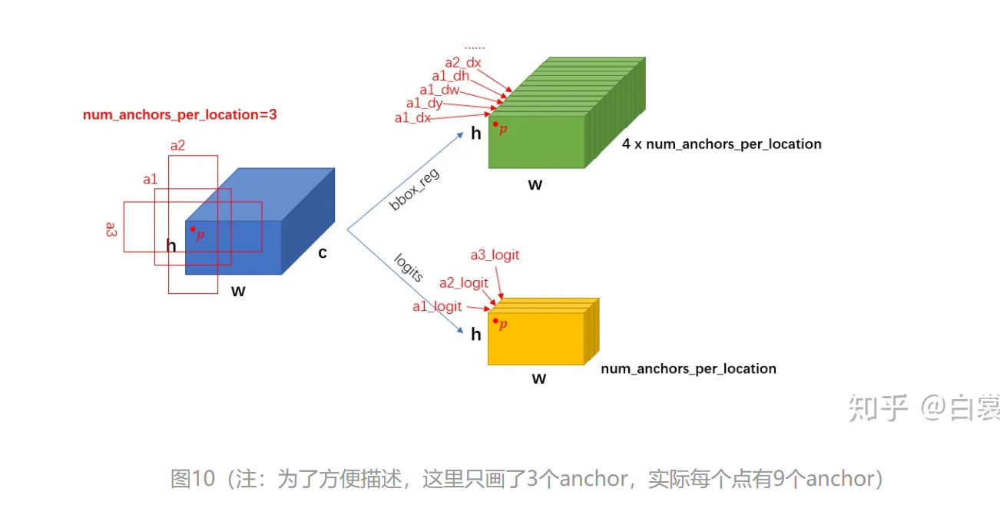

上述过程只是单个 feature_map 的处理流程。对于 FPN 网络的输出的多个大小不同的 feature_maps，每个特征图都会按照上述过程计算 stride 和网格，并设置 anchors。当处理完后获得密密麻麻的各种 anchors 了。

### 2.3.3 RegionProposalNetwork

接下来进入 RegionProposalNetwork 类：

```python
# FasterRCNN.__init__(...)
rpn_pre_nms_top_n = dict(training=rpn_pre_nms_top_n_train, testing=rpn_pre_nms_top_n_test)
rpn_post_nms_top_n = dict(training=rpn_post_nms_top_n_train, testing=rpn_post_nms_top_n_test)

# rpn_anchor_generator 生成anchors
# rpn_head 调整feature_map获得cls_logits+bbox_pred
rpn = RegionProposalNetwork(
    rpn_anchor_generator, rpn_head,
    rpn_fg_iou_thresh, rpn_bg_iou_thresh,
    rpn_batch_size_per_image, rpn_positive_fraction,
    rpn_pre_nms_top_n, rpn_post_nms_top_n, rpn_nms_thresh)
```

RegionProposalNetwork 类的用是：

- test 阶段 ：计算有目标的 anchor 并进行框回归生成 proposals，然后 NMS
- train 阶段 ：除了上面的作用，还计算 rpn loss

```python
class RegionProposalNetwork(torch.nn.Module):
    .......

    def forward(self, images, features, targets=None):
        features = list(features.values())
        objectness, pred_bbox_deltas = self.head(features)
        anchors = self.anchor_generator(images, features)

        num_images = len(anchors)
        num_anchors_per_level_shape_tensors = [o[0].shape for o in objectness]
        num_anchors_per_level = [s[0] * s[1] * s[2] for s in num_anchors_per_level_shape_tensors]
        objectness, pred_bbox_deltas = \
            concat_box_prediction_layers(objectness, pred_bbox_deltas)
        # apply pred_bbox_deltas to anchors to obtain the decoded proposals
        # note that we detach the deltas because Faster R-CNN do not backprop through
        # the proposals
        proposals = self.box_coder.decode(pred_bbox_deltas.detach(), anchors)
        proposals = proposals.view(num_images, -1, 4)
        boxes, scores = self.filter_proposals(proposals, objectness, images.image_sizes, num_anchors_per_level)

        losses = {}
        if self.training:
            assert targets is not None
            labels, matched_gt_boxes = self.assign_targets_to_anchors(anchors, targets)
            regression_targets = self.box_coder.encode(matched_gt_boxes, anchors)
            loss_objectness, loss_rpn_box_reg = self.compute_loss(
                objectness, pred_bbox_deltas, labels, regression_targets)
            losses = {
                "loss_objectness": loss_objectness,
                "loss_rpn_box_reg": loss_rpn_box_reg,
            }
        return boxes, losses
```

具体来看首先，计算有目标的anchor并进行框回归生成proposals

```python
objectness, pred_bbox_deltas = self.head(features)
anchors = self.anchor_generator(images, features)
......
proposals = self.box_coder.decode(pred_bbox_deltas.detach(), anchors)
proposals = proposals.view(num_images, -1, 4)
```

然后依照 objectness 置信由大到小度排序（优先提取更可能包含目标的的），并 NMS，生成 boxes （即 NMS 后的 proposal boxes ） ：

```python
# RegionProposalNetwork.forward(...)
boxes, scores = self.filter_proposals(proposals, objectness, images.image_sizes, num_anchors_per_level)
```

如果是训练阶段，还要将 boxes 与 anchors 进行匹配，计算 cls_logits 的损失 loss_objectness，同时计算 bbox_pred 的损失 loss_rpn_box_reg。

## 2.4 roi_heads

在 RegionProposalNetwork 之后已经生成了 boxes ，接下来就要提取 boxes 内的特征进行 roi_pooling ：

```python
roi_heads = RoIHeads(
    # Box
    box_roi_pool, box_head, box_predictor,
    box_fg_iou_thresh, box_bg_iou_thresh,
    box_batch_size_per_image, box_positive_fraction,
    bbox_reg_weights,
    box_score_thresh, box_nms_thresh, box_detections_per_img)
```

### 2.4.1 计算box归属的feature_map

这里一点问题是如何计算 box 所属的 feature_map：

- 对于原始 FasterRCNN，只在 backbone 的最后一层 feature_map 提取 box 对应特征；
- 当加入 FPN 后 backbone 会输出多个特征图，由于RPN对anchor进行了box regression后改变了box的大小，所以此时需要重新计算当前 boxes 对应于哪一个特征。

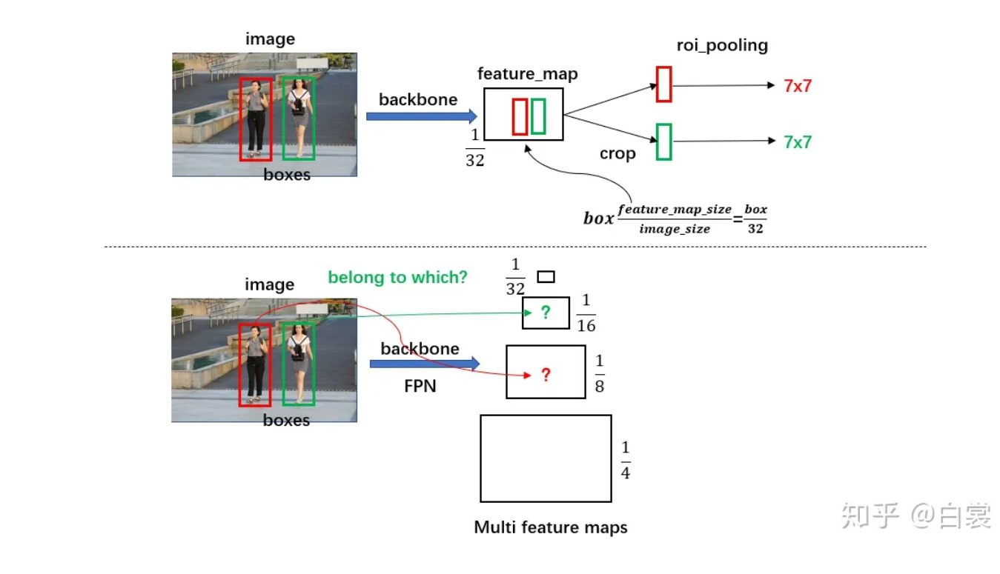

```python
class MultiScaleRoIAlign(nn.Module):
   ......

   def infer_scale(self, feature, original_size):
        # type: (Tensor, List[int])
        # assumption: the scale is of the form 2 ** (-k), with k integer
        size = feature.shape[-2:]
        possible_scales = torch.jit.annotate(List[float], [])
        for s1, s2 in zip(size, original_size):
            approx_scale = float(s1) / float(s2)
            scale = 2 ** float(torch.tensor(approx_scale).log2().round())
            possible_scales.append(scale)
        assert possible_scales[0] == possible_scales[1]
        return possible_scales[0]

    def setup_scales(self, features, image_shapes):
        # type: (List[Tensor], List[Tuple[int, int]])
        assert len(image_shapes) != 0
        max_x = 0
        max_y = 0
        for shape in image_shapes:
            max_x = max(shape[0], max_x)
            max_y = max(shape[1], max_y)
        original_input_shape = (max_x, max_y)

        scales = [self.infer_scale(feat, original_input_shape) for feat in features]
        # get the levels in the feature map by leveraging the fact that the network always
        # downsamples by a factor of 2 at each level.
        lvl_min = -torch.log2(torch.tensor(scales[0], dtype=torch.float32)).item()
        lvl_max = -torch.log2(torch.tensor(scales[-1], dtype=torch.float32)).item()
        self.scales = scales
        self.map_levels = initLevelMapper(int(lvl_min), int(lvl_max))
```

首先对每个feature_map输入的image的 下采样倍率scale进行计算，其中 infer_scale 函数采用如下的近似公式：

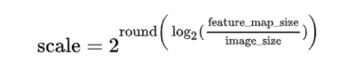

该公式相当于做了一个简单的映射，将不同的 feature_map 与 image 大小比映射到附近的尺度：

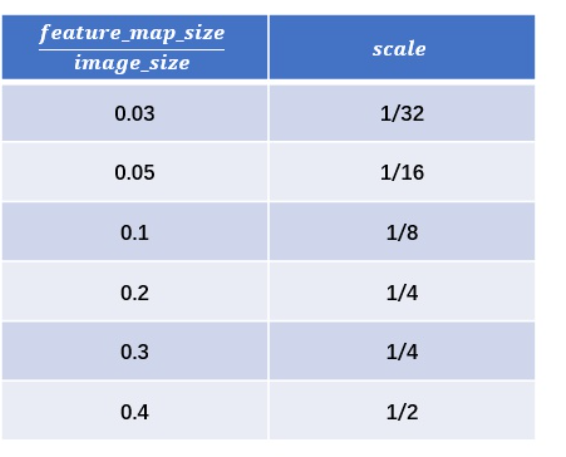

对于fasterRCNN实际值为[1/4, 1/8, 1/16, 1/32]

之后设置 lvl_min=2 和 lvl_max=5：

```python
lvl_min = -torch.log2(torch.tensor(scales[0], dtype=torch.float32)).item()
lvl_max = -torch.log2(torch.tensor(scales[-1], dtype=torch.float32)).item()
```

接着使用 FPN 原文中的公式计算 box 所在 anchor（其中 k0=4 ， wℎ 为 box 面积）

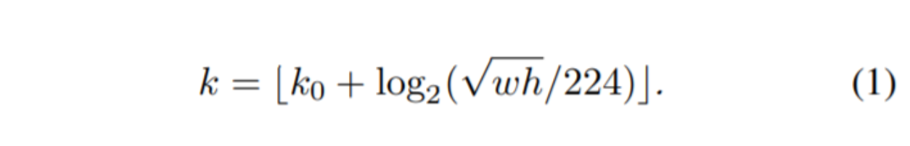

```python
class LevelMapper(object)
    def __init__(self, k_min, k_max, canonical_scale=224, canonical_level=4, eps=1e-6):
        self.k_min = k_min          # lvl_min=2
        self.k_max = k_max          # lvl_max=5
        self.s0 = canonical_scale   # 224
        self.lvl0 = canonical_level # 4
        self.eps = eps

    def __call__(self, boxlists):
        s = torch.sqrt(torch.cat([box_area(boxlist) for boxlist in boxlists]))

        # Eqn.(1) in FPN paper
        target_lvls = torch.floor(self.lvl0 + torch.log2(s / self.s0) + torch.tensor(self.eps, dtype=s.dtype))
        target_lvls = torch.clamp(target_lvls, min=self.k_min, max=self.k_max)
        return (target_lvls.to(torch.int64) - self.k_min).to(torch.int64)
```

其中 torch.clamp(input, min, max) → Tensor 函数的作用是截断，防止越界：

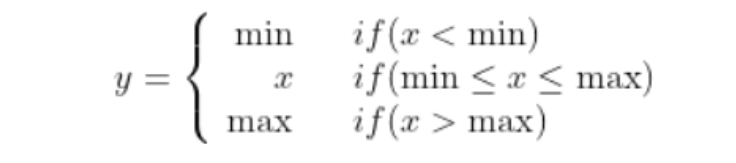

 可以看到，通过 LevelMapper 类将不同大小的 box 定位到某个 feature_map，如下图。之后就是按照图11中的流程进行 roi_pooling 操作。

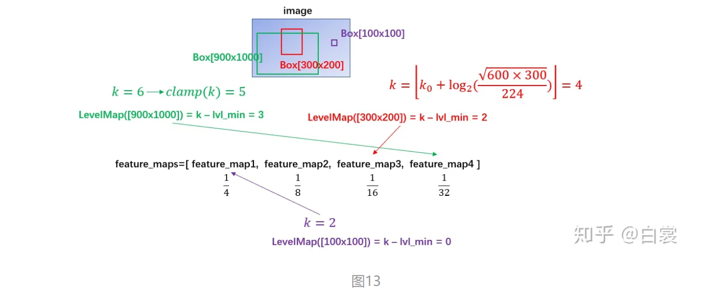

### 2.4.2 roi_pooling

在确定 proposal box 所属 FPN 中哪个 feature_map 之后，接着来看 MultiScaleRoIAlign 如何进行 roi_pooling 操作：

```python
class MultiScaleRoIAlign(nn.Module):
   ......

   def forward(self, x, boxes, image_shapes):
        # type: (Dict[str, Tensor], List[Tensor], List[Tuple[int, int]]) -> Tensor
        x_filtered = []
        for k, v in x.items():
            if k in self.featmap_names:
                x_filtered.append(v)
        num_levels = len(x_filtered)
        rois = self.convert_to_roi_format(boxes)
        if self.scales is None:
            self.setup_scales(x_filtered, image_shapes)

        scales = self.scales
        assert scales is not None

        # 没有 FPN 时，只有1/32的最后一个feature_map进行roi_pooling
        if num_levels == 1:
            return roi_align(
                x_filtered[0], rois,
                output_size=self.output_size,
                spatial_scale=scales[0],
                sampling_ratio=self.sampling_ratio
            )

        # 有 FPN 时，有4个feature_map进行roi_pooling
        # 首先按照
        mapper = self.map_levels
        assert mapper is not None

        levels = mapper(boxes)

        num_rois = len(rois)
        num_channels = x_filtered[0].shape[1]

        dtype, device = x_filtered[0].dtype, x_filtered[0].device
        result = torch.zeros(
            (num_rois, num_channels,) + self.output_size,
            dtype=dtype,
            device=device,
        )

        tracing_results = []
        for level, (per_level_feature, scale) in enumerate(zip(x_filtered, scales)):
            idx_in_level = torch.nonzero(levels == level).squeeze(1)
            rois_per_level = rois[idx_in_level]

            result_idx_in_level = roi_align(
                per_level_feature, rois_per_level,
                output_size=self.output_size,
                spatial_scale=scale, sampling_ratio=self.sampling_ratio)

            if torchvision._is_tracing():
                tracing_results.append(result_idx_in_level.to(dtype))
            else:
                result[idx_in_level] = result_idx_in_level

        if torchvision._is_tracing():
            result = _onnx_merge_levels(levels, tracing_results)

        return result
```

在 MultiScaleRoIAlign.forward(...) 函数可以看到：

- 没有 FPN 时，只有1/32的最后一个 feature_map 进行 roi_pooling

  ```python
   if num_levels == 1:
          return roi_align(
              x_filtered[0], rois,
              output_size=self.output_size,
              spatial_scale=scales[0],
              sampling_ratio=self.sampling_ratio
          )
  ```

- 有 FPN 时，有4个 [1/4,1/8,1/16,1/32] 的 feature maps 参加计算。首先计算每个每个 box 所属哪个 feature map ，再在所属 feature map 进行 roi_pooling

  ```python
   # 首先计算每个每个 box 所属哪个 feature map
          levels = mapper(boxes) 
          ......
  
          # 再在所属  feature map 进行 roi_pooling
          # 即 idx_in_level = torch.nonzero(levels == level).squeeze(1)
          for level, (per_level_feature, scale) in enumerate(zip(x_filtered, scales)):
              idx_in_level = torch.nonzero(levels == level).squeeze(1)
              rois_per_level = rois[idx_in_level]
  
              result_idx_in_level = roi_align(
                  per_level_feature, rois_per_level,
                  output_size=self.output_size,
                  spatial_scale=scale, sampling_ratio=self.sampling_ratio)
  ```

之后就获得了所谓的 7x7 特征（在 FasterRCNN.__init__(...) 中设置了 output_size=7）。需要说明，原始 FasterRCNN 应该是使用 roi_pooling，但是这里使用 roi_align 代替以提升检测器性能。

对于 torchvision.ops.roi_align 函数输入的参数，分别为：

- per_level_feature 代表 FPN 输出的某一 feature_map
- rois_per_level 为该特征 feature_map 对应的所有 proposal boxes（之前计算 level得到）
- output_size=7 代表输出为 7x7
- spatial_scale 代表特征 feature_map 相对输入 image 的下采样尺度（如 1/4，1/8，...）
- sampling_ratio 为 roi_align 采样率，有兴趣的读者请自行查阅 MaskRCNN 文章

### 2.4.3 分类回归信息

接下来就是将特征转为最后针对 box 的类别信息（如人、猫、狗、车）和进一步的框回归信息。

```python
class TwoMLPHead(nn.Module):

    def __init__(self, in_channels, representation_size):
        super(TwoMLPHead, self).__init__()

        self.fc6 = nn.Linear(in_channels, representation_size)
        self.fc7 = nn.Linear(representation_size, representation_size)

    def forward(self, x):
        x = x.flatten(start_dim=1)

        x = F.relu(self.fc6(x))
        x = F.relu(self.fc7(x))

        return x


class FastRCNNPredictor(nn.Module):

    def __init__(self, in_channels, num_classes):
        super(FastRCNNPredictor, self).__init__()
        self.cls_score = nn.Linear(in_channels, num_classes)
        self.bbox_pred = nn.Linear(in_channels, num_classes * 4)

    def forward(self, x):
        if x.dim() == 4:
            assert list(x.shape[2:]) == [1, 1]
        x = x.flatten(start_dim=1)
        scores = self.cls_score(x)
        bbox_deltas = self.bbox_pred(x)

        return scores, bbox_deltas
```

首先 TwoMLPHead 将 7x7 特征经过两个全连接层转为 1024，然后 FastRCNNPredictor 将每个 box 对应的 1024 维特征转为 cls_score 和 bbox_pred :

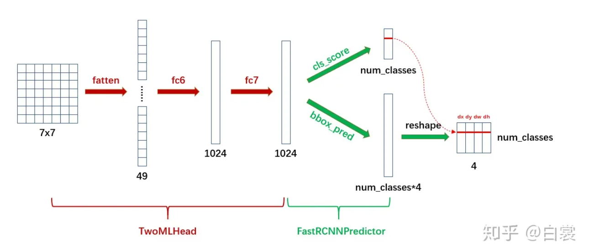

显然 cls_score 后接 softmax 即为类别概率，可以确定 box 的类别；在确定类别后，在 bbox_pred 中对应类别的 （dx, dy, dw, dh）4个值即为第二次 bounding box regression 需要的4个偏移值。

**简单的说，带有FPN的FasterRCNN网络结构可以用下图表示：**

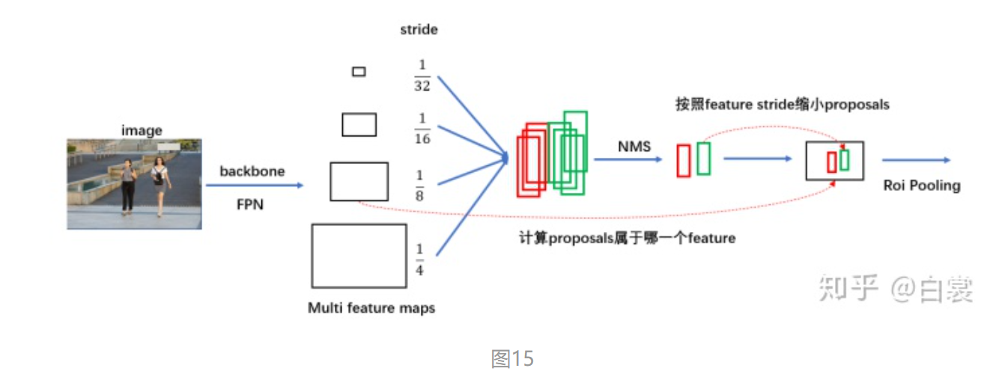

# 3. 关于训练

FasterRCNN模型在两处地方有损失函数：

- 在 RegionProposalNetwork 类，需要判别 anchor 中是否包含目标从而生成 proposals，这里需要计算 loss
- 在 RoIHeads 类，对 roi_pooling 后的全连接生成的 cls_score 和 bbox_pred 进行训练，也需要计算 loss

## 3.1 assign_targets_to_anchors 

首先来看 RegionProposalNetwork 类中的 assign_targets_to_anchors 函数。

```python
def assign_targets_to_anchors(self, anchors, targets):
    # type: (List[Tensor], List[Dict[str, Tensor]])
    labels = []
    matched_gt_boxes = []
    for anchors_per_image, targets_per_image in zip(anchors, targets):
        gt_boxes = targets_per_image["boxes"]

        if gt_boxes.numel() == 0:
            # Background image (negative example)
            device = anchors_per_image.device
            matched_gt_boxes_per_image = torch.zeros(anchors_per_image.shape, dtype=torch.float32, device=device)
            labels_per_image = torch.zeros((anchors_per_image.shape[0],), dtype=torch.float32, device=device)
        else:
            match_quality_matrix = box_ops.box_iou(gt_boxes, anchors_per_image)
            matched_idxs = self.proposal_matcher(match_quality_matrix)
            # get the targets corresponding GT for each proposal
            # NB: need to clamp the indices because we can have a single
            # GT in the image, and matched_idxs can be -2, which goes
            # out of bounds
            matched_gt_boxes_per_image = gt_boxes[matched_idxs.clamp(min=0)]

            labels_per_image = matched_idxs >= 0
            labels_per_image = labels_per_image.to(dtype=torch.float32)
            # Background (negative examples)
            bg_indices = matched_idxs == self.proposal_matcher.BELOW_LOW_THRESHOLD
            labels_per_image[bg_indices] = torch.tensor(0.0)

            # discard indices that are between thresholds
            inds_to_discard = matched_idxs == self.proposal_matcher.BETWEEN_THRESHOLDS
            labels_per_image[inds_to_discard] = torch.tensor(-1.0)

        labels.append(labels_per_image)
        matched_gt_boxes.append(matched_gt_boxes_per_image)
    return labels, matched_gt_boxes
```

当图像中没有 gt_boxes 时，设置所有 anchor 都为 background（即 label 为 0）：

当图像中有 gt_boxes 时，计算 anchor 与 gt_box 的 IOU：

- 选择 IOU < 0.3 的 anchor 为 background，标签为 0

  ```python
  labels_per_image[bg_indices] = torch.tensor(0.0)
  ```

- 选择 IOU > 0.7 的 anchor 为 foreground，标签为 1

  ```python
  labels_per_image = matched_idxs >= 0
  ```

- 忽略 0.3 < IOU < 0.7 的 anchor，不参与训练

从 FasterRCNN 类的 __init__ 函数默认参数就可以清晰的看到这一点：

```python
rpn_fg_iou_thresh=0.7, rpn_bg_iou_thresh=0.3,
```

## 3.2 assign_targets_to_proposals

```python
def assign_targets_to_proposals(self, proposals, gt_boxes, gt_labels):
    # type: (List[Tensor], List[Tensor], List[Tensor])
    matched_idxs = []
    labels = []
    for proposals_in_image, gt_boxes_in_image, gt_labels_in_image in zip(proposals, gt_boxes, gt_labels):

        if gt_boxes_in_image.numel() == 0:
            # Background image
            device = proposals_in_image.device
            clamped_matched_idxs_in_image = torch.zeros(
                (proposals_in_image.shape[0],), dtype=torch.int64, device=device
            )
            labels_in_image = torch.zeros(
                (proposals_in_image.shape[0],), dtype=torch.int64, device=device
            )
        else:
            #  set to self.box_similarity when https://github.com/pytorch/pytorch/issues/27495 lands
            match_quality_matrix = box_ops.box_iou(gt_boxes_in_image, proposals_in_image)
            matched_idxs_in_image = self.proposal_matcher(match_quality_matrix)

            clamped_matched_idxs_in_image = matched_idxs_in_image.clamp(min=0)

            labels_in_image = gt_labels_in_image[clamped_matched_idxs_in_image]
            labels_in_image = labels_in_image.to(dtype=torch.int64)

            # Label background (below the low threshold)
            bg_inds = matched_idxs_in_image == self.proposal_matcher.BELOW_LOW_THRESHOLD
            labels_in_image[bg_inds] = torch.tensor(0)

            # Label ignore proposals (between low and high thresholds)
            ignore_inds = matched_idxs_in_image == self.proposal_matcher.BETWEEN_THRESHOLDS
            labels_in_image[ignore_inds] = torch.tensor(-1)  # -1 is ignored by sampler

        matched_idxs.append(clamped_matched_idxs_in_image)
        labels.append(labels_in_image)
    return matched_idxs, labels
```

与 assign_targets_to_anchors 不同，该函数设置：

```python
box_fg_iou_thresh=0.5, box_bg_iou_thresh=0.5,
```

- IOU > 0.5 的 proposal 为 foreground，标签为对应的 class_id

  ```python
  labels_in_image = gt_labels_in_image[clamped_matched_idxs_in_image]
  ```

  这里与上面不同：RegionProposalNetwork 只需要判断 anchor 是否有目标，正类别为1；RoIHeads 需要判断 proposal 的具体类别，所以正类别为具体的 class_id。

- IOU < 0.5 的为 background，标签为 0

  ```python
  labels_in_image[bg_inds] = torch.tensor(0)
  ```

- 