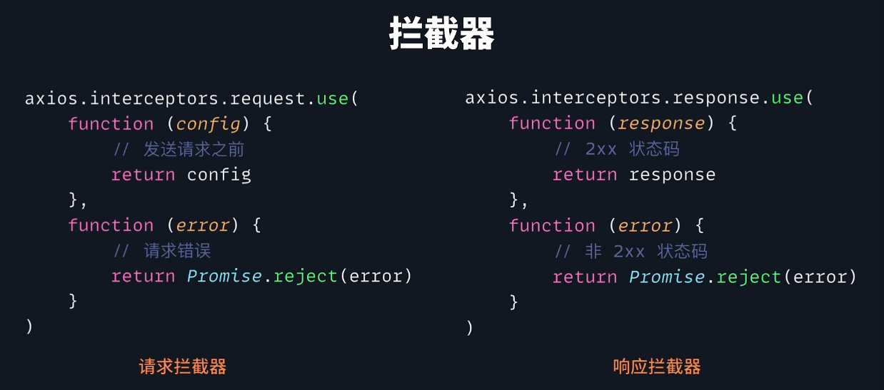

# 0. 概述

axios是对XMLHttpRequest的封装，而Fetch是一种新的获取资源的接口方式，并不是对XMLHttpRequest的封装。

它们最大的不同点在于Fetch是浏览器原生支持，而Axios需要引入Axios库。

# 1. 基本用法

## 1.1 Get

- axios可以根据headers里content-type自动转换。
- fetch需要手动对响应内容进行转换。

## 1.2 Post

json

formdata

## 1.3 数据流

## 1.4 中止请求

## 1.5 请求超时

## 1.6 进度监控

# 2. 封装和配置

## 2.1 baseURL

## 2.2 拦截器

fetch需要自己封装

# 3. 兼容性与体积

# 4. 总结

