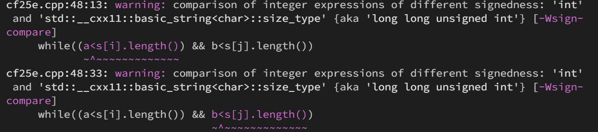
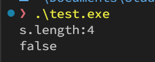
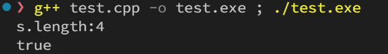

# 0. 背景

最近在写KMP的时候遇到了个bug

```c++
while((a<s[i].length()) && b<s[j].length())
{
    if((b == -1) || (s[i][a] == s[j][b]))
    {
        a++;
        b++;
    }
    else
        b = nxt[j][b];
    if(b == s[j].length())
        break;
}
```

编译过程中，存在如下的warning信息，提示表示序号的a类型与string.length()函数的返回类型不一致，一个是int,一个是unsigned int。



在调试过程中，发现函数在while中仅仅循环了一次就退出了，按理说会进行多次循环。

# 1. 原因分析

string.length()函数返回的长度为`unsigned int`类型，变量b的类型为`int`。

在kmp中，b的值可能为-1（表示nxt[0]的值）

比较过程中,b的值会被`类型提升`为unsigned int，因此b的值会变为0xffffffff，大于string.length()返回值，导致循环错误退出。

测试代码:

```cpp
int b = -1;
string s = "test";
cout << "s.length:" << s.length() << endl;
if(b < s.length())
    cout << "true" << endl;
else
    cout << "false" << endl;
```

测试输出为:



验证了上述猜想

# 2. 解决方法

在将int类型的变量与s.length()比较时，加上`显式类型`转换，将unsigned int转换为int进行比较

```cpp
int b = -1;
string s = "test";
cout << "s.length:" << s.length() << endl;
if(b < (int)s.length())
    cout << "true" << endl;
else
    cout << "false" << endl;
```

输出结果就正确了，编译时也不会提示warning了。


