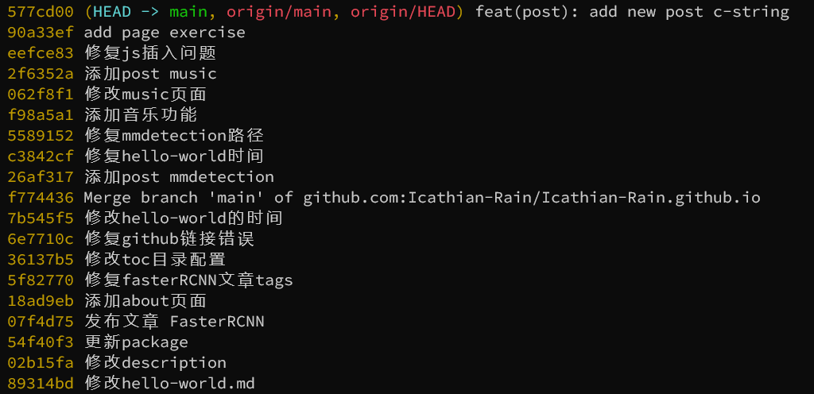
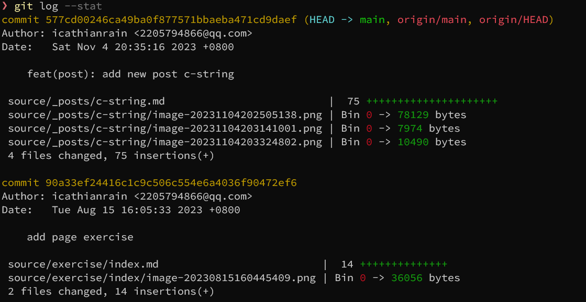
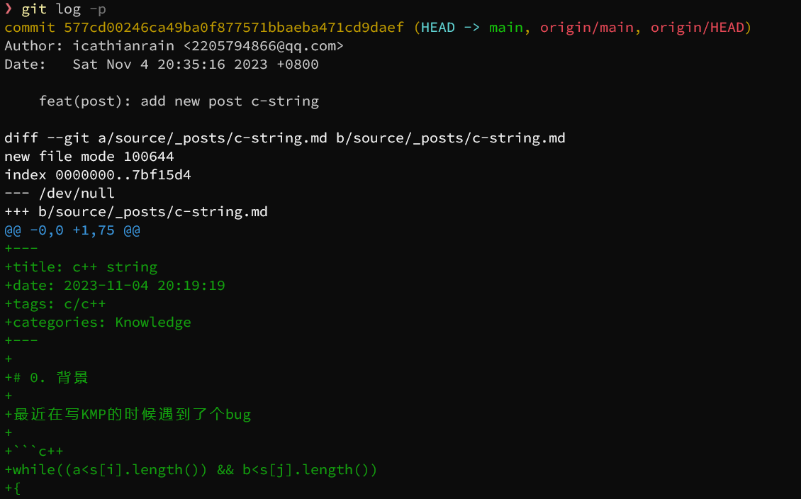
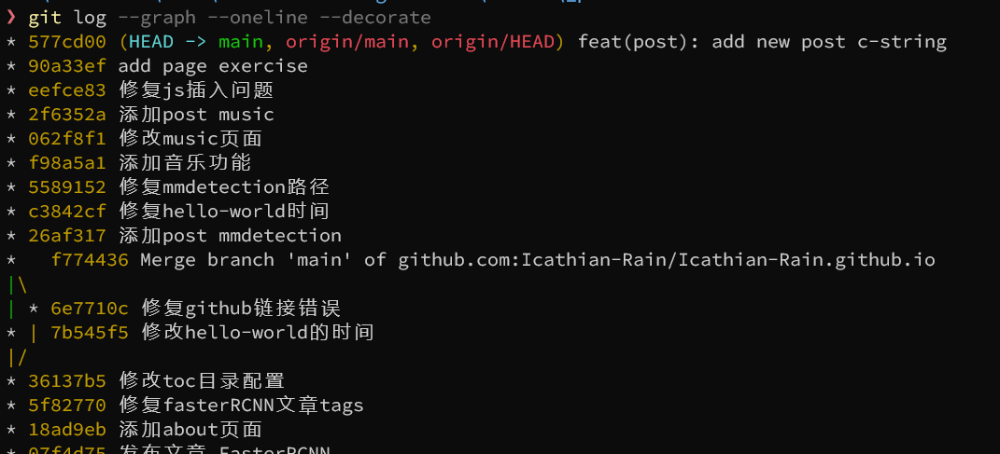
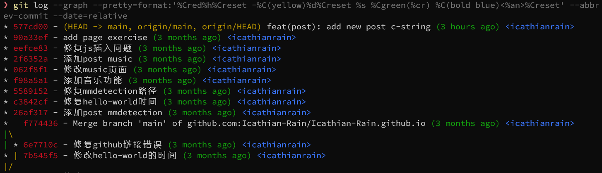

# 1. git log

## 1.1 description

show the commit logs

功能：

- Commit Limiting：过滤提交
- History Simplification : 简化提交历史的
- Commit Ordering: 修改默认提交排序的
- Commit Formatting : 修改默认提交显示格式的
- Diff Formatting: 控制提交显示文件的差异格式的

## 1.2 commit limiting

### search - 作者

```bash
//命令格式
git log  --author=<pattern>
git log --committer=<pattern>

//示例
git log --author=“小明”
git log --author=“小明\|小红”
```

### search - time

```bash
//某个日期之后
git log --since=<date>
git log --after=<date>

//某个日期之前
git log --until=<date>
git log --before=<date>

//查出 03.12-03.18 期间的提交
git log --since="2018.03.12" --until="2018.03.18"
```

### search - 提交信息

```bash
git log --grep=<pattern>

//示例
git log --grep='喜欢' --oneline
```

### search - 修改内容

```bash
//文件
git log [\--] <path>…​

//示例
git log --oneline -- 11.txt

//查看某个字符串的变动历史提交
git log -S<string>
//查看某符合某一个正则表达式内容的变动历史提交  
git log -G<regex>


//例子
git log -S"喜欢你" --oneine
```

### search-合并相关的提交 & 文件

```bash
//查看合并提交
git log --merges

//查看非合并提交
git log --no-merges
```

## 1.3 Commit History Formatting

### online

一行输出，

```bash
git log --oneline
```



### stat & p

```bash
git log --stat
```



```bash
git log -p
```



### graph

```bash
git log --graph --oneline --decorate
```



- --online: 一行
- --graph: 图形输出
- --decorate: 显示标签指针

### final

```bash
git log --graph --pretty=format:'%Cred%h%Creset -%C(yellow)%d%Creset %s %Cgreen(%cr) %C(bold blue)<%an>%Creset' --abbrev-commit --date=relative
```



## 1.4 alias

可以将上述指令保存为别名

```bash
git config --global alias.lg "log --graph --pretty=format:'%Cred%h%Creset -%C(yellow)%d%Creset %s %Cgreen(%cr) %C(bold blue)<%an>%Creset' --abbrev-commit --date=relative"
```

以后输入`git lg`就可以了

