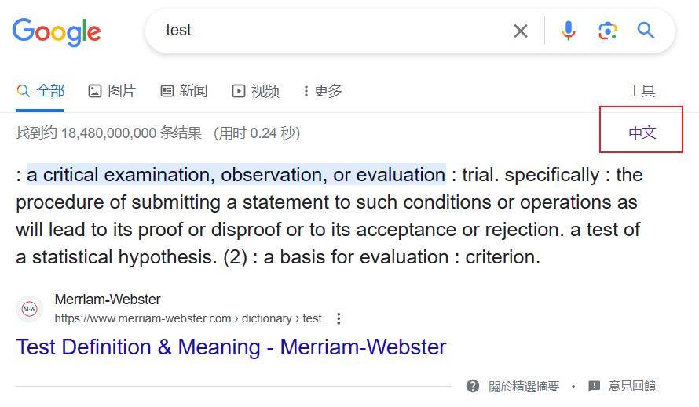

# 0. about

在google search的工具栏中插入中英文切换按钮

# 1. script

油猴脚本

```js
// ==UserScript==
// @name         看看中文结果
// @namespace    http://tampermonkey.net/
// @version      0.1
// @description  查看中文搜索结果
// @author       IcathianRain
// @match        *://*.google.com/search*
// @match        *://*.google.com.hk/search*
// @icon         https://www.google.com/s2/favicons?sz=64&domain=google.com.hk
// @grant        none
// ==/UserScript==

(function() {
    'use strict';
    let url = location.href;
    let cn = "&lr=lang_zh-CN"
    // 判断当前页面为中文或英文
    if(!RegExp(cn).test(url))
    {
        // 在toolbar中添加中文切换按钮
        let toolBar = document.getElementsByClassName("LHJvCe")[0]
        let child = document.createElement("a");
        child.className = "result-stats";
        child.innerHTML = "中文";
        // 插入中文结果url
        let new_url = url+cn
        child.href = new_url;
        toolBar.appendChild(child);
    }
    else
    {
        // 在toolbar中添加英文切换按钮
        let toolBar = document.getElementsByClassName("LHJvCe")[0]
        let child = document.createElement("a");
        child.className = "result-stats";
        child.innerHTML = "英文";
        // 插入英文结果url(即删除中文限制)
        let new_url = url.replace(cn, "");
        child.href = new_url;
        toolBar.appendChild(child);
    }

})();
```

# 2. result

英文结果:



中文结果:


若未出现切换按钮，请尝试点击工具按钮


