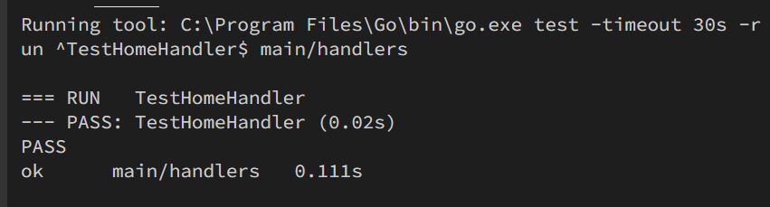
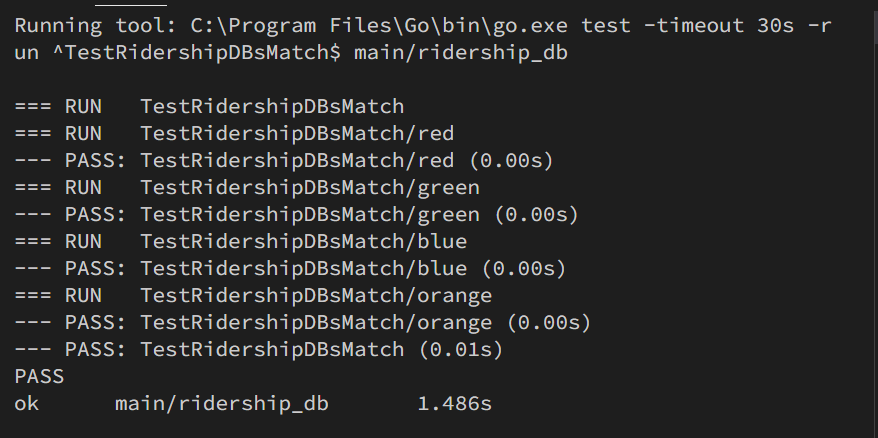

# task1

Start an http server and handle requests
## Q:
> This task requires you to start up the http server in main.go and handle the user's GET requests by filling out the HomeHandler method in handlers/handlers.go.
> The final web app looks like in the screenshot below, where users can select a T line (e.g. red line) and display its ridership statistics in a bar chart. The HomeHandler function first checks which line the user has selected in the drop down menu and then queries ridership numbers for that line from a RiderhipDB instance. The returned values are then displayed in a bar chart. You don't need to write code to plot the bar chart yourself, you can simply use the GenerateBarChart function in utils/render_chart.go.
> After completing this task, you should be able to start the web server by running go run main.go and see the web app in your browser by going to http://localhost:PORT (where PORT is the port number you specified):

此任务要求您在main.go中启动http服务器，并通过在handlers/handlers.go中填写HomeHandler方法来处理用户的GET请求。
最终的web应用程序如下面的屏幕截图所示，用户可以选择T线 (例如红线) 并在条形图中显示其乘客人数统计信息。HomeHandler函数首先检查用户在下拉菜单中选择了哪一行，然后从RiderhipDB实例中查询该行的载客号。然后将返回的值显示在条形图中。你不需要自己编写代码来绘制条形图，你可以简单地在utils/render_chart.go中使用GenerateBarChart函数。
完成此任务后，您应该能够通过运行go run main来启动web服务器。转到http:// localhost:PORT (其中PORT是您指定的端口号)，然后在浏览器中查看web应用程序。
## TODO1: 读取数据
```go
// TODO: some code goes here
// Get the chart data from RidershipDB

db.Open("C:\\Users\\22057\\Documents\\Study\\MIT_s6583\\mbta.sqlite")
// db.Open("C:\\Users\\22057\\Documents\\Study\\MIT_s6583\\lab\\lab0\\mbta.csv")
chart_data, err := db.GetRidership(selectedChart)
if err != nil {
    panic(err.Error())
}
```
打开数据库，并从数据库中读取Ridership数据
## TODO2：将数据转为条形图
```go
// TODO: some code goes here
// Plot the bar chart using utils.GenerateBarChart. The function will return the bar chart
// as PNG byte slice. Convert the bytes to a base64 string, which is used to embed images in HTML.
bar_chart, err := utils.GenerateBarChart(chart_data)
if err != nil {
    panic(err.Error())
}
bar_chart = []byte(base64.StdEncoding.EncodeToString(bar_chart))
```
将读取的数据转换为条形图，并进行base64转换
## TODO3：数据嵌入返回
```go
// TODO: some code goes here
// We now want to create a struct to hold the values we want to embed in the HTML
data := struct {
    Image string
    Chart string
}{
    Image: string(bar_chart), // TODO: base64 string
    Chart: selectedChart,
}

// TODO: some code goes here
// Use tmpl.Execute to generate the final HTML output and send it as a response
// to the client's request.
tmpl.Execute(w, data)
```
构造数据，并将其嵌入html中返回
## TODO4：HTTP服务
```go
// TODO: some code goes here
// Fill out the HomeHandler function in handlers/handlers.go which handles the user's GET request.
// Start an http server using http.ListenAndServe that handles requests using HomeHandler.
fmt.Println("start server")
http.HandleFunc("/", handlers.HomeHandler)
http.ListenAndServe("127.0.0.1:6670", nil)
```
将/目录与响应函数绑定
启动HTTP服务
## 测试
测试结果，通过

## 仓库地址
[https://github.com/Icathian-Rain/lab0/tree/task1](https://github.com/Icathian-Rain/lab0/tree/task1)
# task2
## Q:
> This task requires you to implement the missing methods in ridership_db/csv_ridership_db.go
> Instead of issuing the query against sqlite, CsvRidershipDB directly runs it over the mbta.csv CSV file. MBTA divides a day into nine different time periods (_time_period_01_, ..., _time_period_09_). The CSV file contains how many passengers boarded trains during a specific time period, at a specific station and for a specific line and direction. For the queried line (passed to GetRidership) compute the total number of passengers that boarded a train for each given time period (for each time period, sum over all stations and directions). The sum for each time period should be an entry in the returned int64 slice. Make sure to use the idIdxMap map to map the time period id strings (e.g. _time_period_01_) to the correct index in the boardings slice (e.g. 0).
> To use your CSV implementation in the web app, instantiate RidershipDB to be a CsvRidershipDB instead of a SqliteRidershipDB in lines 23-24 in handlers/handlers.go:

此任务要求您实现 ridership_db/csv_ridership_db.go 中缺少的方法 CsvRidershipDB 不是针对 sqlite 发出查询，而是直接在 mbta.csv CSV 文件上运行查询。 MBTA 将一天分为九个不同的时间段 (time_period_01, ..., time_period_09)。 CSV 文件包含在特定时间段、特定车站、特定线路和方向登上火车的乘客数量。对于查询的线路（传递给 GetRidership），计算每个给定时间段内登上火车的乘客总数（对于每个时间段，所有车站和方向的总和）。每个时间段的总和应该是返回的 int64 切片中的一个条目。确保使用 idIdxMap 映射将时间段 ID 字符串（例如 time_period_01）映射到登机切片中的正确索引（例如 0）。 要在 Web 应用程序中使用 CSV 实现，请在 handlers/handlers.go 中的第 23-24 行中将 RidershipDB 实例化为 CsvRidershipDB，而不是 SqliteRidershipDB：
## TODO1: 实现GetRidership方法
```go
// TODO: some code goes here
// Implement the remaining RidershipDB methods
func (c *CsvRidershipDB) GetRidership(lineId string) ([]int64, error) {
	// return res
	var res = make([]int64, 9)
	for {
		record, err := c.csvReader.Read()
		// if record == nil, there is no more record, break
		if record == nil {
			break
		}
		if err != nil {
			panic(err.Error())
		}
		// sum the ons
		if record[0] == lineId {
			// time_period_0i -> idx = i-1
			idx := c.idIdxMap[record[2]]
			ons, _ := strconv.Atoi(record[4])
			res[idx] += int64(ons)
		}

	}
	return res, nil
}
```
从csv中按条读入数据
record[0]为线路id
record[2]为时间段
record[4]为ons
统计各个时间段的ons总和
将数据存入数据对应部分
## TODO2: close方法
```go
func (c *CsvRidershipDB) Close() error {
	return nil
}
```
## 测试

对各个线路进行测试，测试通过
## 仓库
[https://github.com/Icathian-Rain/lab0/tree/task2](https://github.com/Icathian-Rain/lab0/tree/task2)
