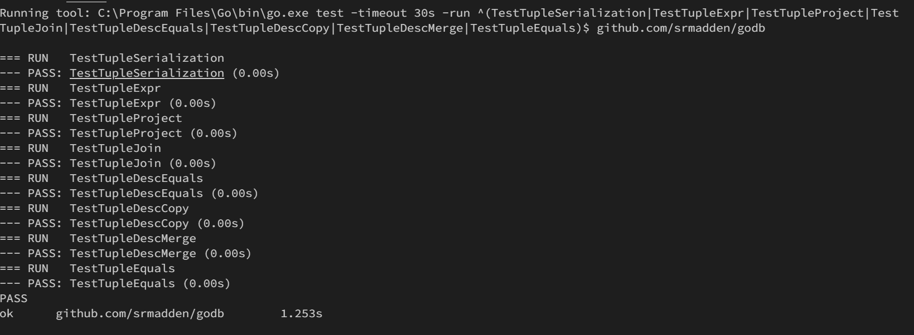
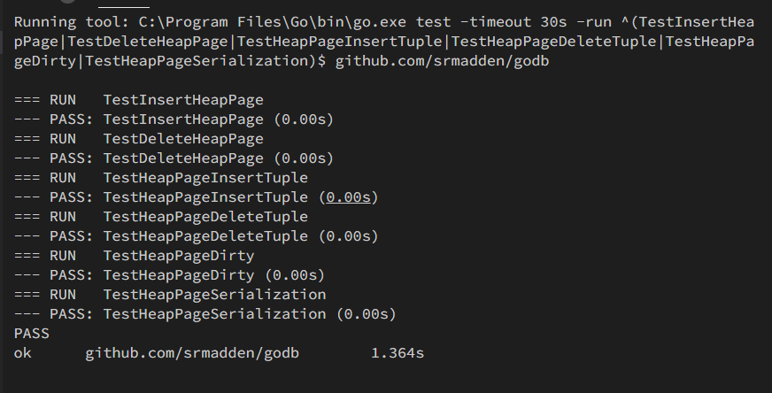
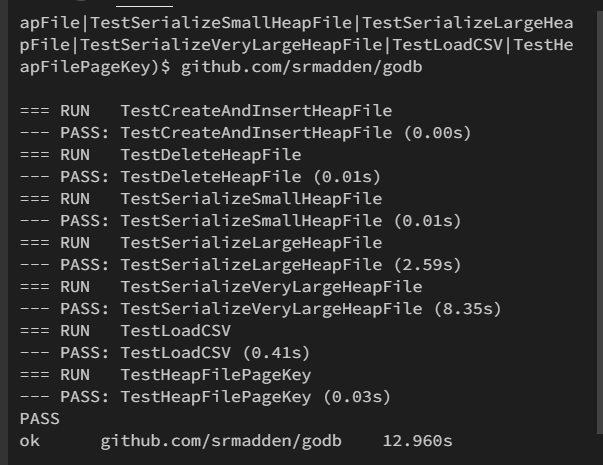
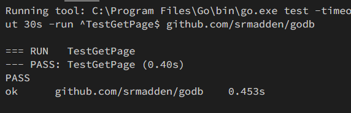
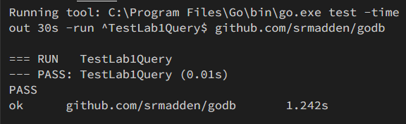

# 简介

> In the lab assignments in 6.5830/6.5831 you will write a basic database
> management system called GoDB. For this lab, you will focus on implementing
> the core modules required to access stored data on disk; in future labs, you
> will add support for various query processing operators, as well as
> transactions, locking, and concurrent queries.

在 6.5830/6.5831 的实验作业中，您将编写一个基本数据库管理系统称为GoDB。在本实验中，您将专注于实施访问磁盘上存储的数据所需的核心模块；在未来的实验室中，你将添加对各种查询处理运算符的支持，以及事务、锁定和并发查询。
:::info
接下来是对GODB的简介，使用GO来替代往年的JAVA项目，介绍GO的使用与test，在此不再赘述。
:::
**以下是您可以继续使用 GoDB 的一种方法的粗略概述执行**

> - We have provided you with a set of core types and interfaces in `types.go`.  Review these as you will need to use them.
> - Implement the missing functions in `tuple.go`.  These methods allow you to compare tuples and tuple descriptors.
> - Implement the `buffer_pool.go` constructor and the `GetPage()` method.  You can ignore the transaction methods for lab 1.
> - Implement the missing methods in `heap_file.go` and `heap_page.go`.
>   These allow you to create heap files, insert and delete records from them,
>   and iterate through them.  Some of the methods have already been written for you.
> - At this point, you should be able to pass the `lab1_query_test.go` test, which isthe goal for this lab.

- 在 `types.go` 中定义了一些核心类型与接口
- 实现`tuple.go`中的方法，这些方法用来比较tuples与tuple descriptors
- 在 `buffer_pool.go` 中实现构造函数与 GetPage()函数
- 实现 `heap_file.go` 和 `heap_page.go` 中实现方法，这些方法用来创建heap files, 插入和删除records 与迭代。
- 通过 `lab1_query_test.db` 测试

GoDB 有以下几部分组成

> - Structures that represent fields, tuples, and tuple schemas;
> - Methods that apply predicates and conditions to tuples;
> - One or more access methods (e.g., heap files) that store relations on disk and
>   provide a way to iterate through tuples of those relations;
> - A collection of operator classes (e.g., select, join, insert, delete, etc.)
>   that process tuples;
> - A buffer pool that caches active tuples and pages in memory and handles
>   concurrency control and transactions (neither of which you need to worry about
>   for this lab); and,
> - A catalog that stores information about available tables and their schemas.

表示字段、元组和元组模式的结构；
将谓词和条件应用于元组的方法；
一种或多种访问方法（如堆文件），用于在磁盘上存储关系，并提供一种迭代这些关系的元组的方法；运算符类的集合（如select、join、insert、delete等）处理元组；
一个缓冲池，用于在内存中缓存活动元组和页面并处理它们。
并发控制和事务（两者都不需要担心）对于这个实验室）；
以及一个用于存储有关可用表及其模式的信息的目录。

# Fields and Tuples

> The Tuple struct in GoDB is used to store the in-memory value of a database tuple.
> They consist of a collection of fields implementing the DBValue interface. Different data types (e.g., IntField, StringField) implement DBValue. Tuple objects are created by the underlying access methods (e.g., heap files, or B-trees), as described in the next section. Tuples also have a type (or schema), called a tuple descriptor, represented by a TupleDesc struct, which consists of a collection of FieldType objects, one per field in the tuple, each of which describes the type of the corresponding field.

GoDB中的Tuple结构用于存储数据库元组的内存值。
它们由实现DBValue接口的一组字段组成。
不同的数据类型(例如，Intfield、Stringfield)实现DBValue。
元组对象由底层访问方法(例如，堆文件或B树)创建，如下一节所述。
元组还有一个类型(或架构)，称为元组描述符，由TupleDesc结构表示，该结构由一组FieldType对象组成，元组中的每个字段一个，每个对象描述相应字段的类型。

# Exercise 1

## Q：

> tuple.go
> At this point, your code should pass the unit tests in tuple_test.go.

## TupleDesc 

类型FileType

```go
// FieldType is the type of a field in a tuple, e.g., its name, table, and [godb.DBType].
// TableQualifier may or may not be an emtpy string, depending on whether the table
// was specified in the query
type FieldType struct {
    Fname          string
    TableQualifier string
    Ftype          DBType
}
```

类型 TupleDesc

```go
// TupleDesc is "type" of the tuple, e.g., the field names and types
type TupleDesc struct {
	Fields []FieldType
}
```

TupleDesc 由一个FieldType切片组成，描述Tuple中数据的名称，Table名与类型

## TupleDesc.equals 方法

```go
// Compare two tuple descs, and return true iff
// all of their field objects are equal and they
// are the same length
func (d1 *TupleDesc) equals(d2 *TupleDesc) bool {
	// TODO: some code goes here
	// 若 d1 和 d2 的长度不相等，则返回 false
	length := len(d1.Fields)
	if length != len(d2.Fields) {
		return false
	}
	// 比较 d1 和 d2 的每一个字段
	for i := 0; i < length; i++ {
		f1 := d1.Fields[i]
		f2 := d2.Fields[i]
		// 若 f1 和 f2 的字段名或字段类型或表名不相等，则返回 false
		if f1.Fname != f2.Fname || f1.Ftype != f2.Ftype || f1.TableQualifier != f2.TableQualifier {
			return false
		}
	}
	return true

}
```

比较d1 和 d2 是否相同

## TupleDesc.copy 方法

```go
// Make a copy of a tuple desc.  Note that in go, assignment of a slice to
// another slice object does not make a copy of the contents of the slice.
// Look at the built-in function "copy".
func (td *TupleDesc) copy() *TupleDesc {
	// TODO: some code goes here
	// 初始化一个FieldType类型的切片
	fields := make([]FieldType, len(td.Fields))
	// 将 td.Fields 的内容复制到 fields 中
	copy(fields, td.Fields)
	return &TupleDesc{Fields: fields} //replace me
}
```

将 td 拷贝一份并返回

## TupleDesc.merge 方法

```go
// Merge two TupleDescs together.  The resulting TupleDesc
// should consist of the fields of desc2
// appended onto the fields of desc.
func (desc *TupleDesc) merge(desc2 *TupleDesc) *TupleDesc {
	// TODO: some code goes here
	// 初始化一个FieldType类型的切片，长度为 desc.Fields 的长度加上 desc2.Fields 的长度
	length1 := len(desc.Fields)
	length2 := len(desc2.Fields)
	fields := make([]FieldType, length1, length1+length2)
	// 将 desc.Fields 的内容复制到 fields 中
	copy(fields, desc.Fields)
	// 将 desc2.Fields 的内容添加到 fields 中
	fields = append(fields, desc2.Fields...)
	return &TupleDesc{Fields: fields} //replace me
}
```

将 desc2 接到 desc 后， 并返回一个新的TupleDesc

## Tuple 

```go
// Interface used for tuple field values
// Since it implements no methods, any object can be used
// but having an interface for this improves code readability
// where tuple values are used
type DBValue interface {
}

// Integer field value
type IntField struct {
	Value int64
}

// String field value
type StringField struct {
	Value string
}

// Tuple represents the contents of a tuple read from a database
// It includes the tuple descriptor, and the value of the fields
type Tuple struct {
	Desc   TupleDesc
	Fields []DBValue
	Rid    recordID //used to track the page and position this page was read from
}

type recordID interface {
}
```

Tuple 由Desc描述，Fields 数据与recordID组成

## Tuple.writeTo方法

```go
// Serialize the contents of the tuple into a byte array Since all tuples are of
// fixed size, this method should simply write the fields in sequential order
// into the supplied buffer.
//
// See the function [binary.Write].  Objects should be serialized in little
// endian oder.
//
// Strings can be converted to byte arrays by casting to []byte. Note that all
// strings need to be padded to StringLength bytes (set in types.go). For
// example if StringLength is set to 5, the string 'mit' should be written as
// 'm', 'i', 't', 0, 0
//
// May return an error if the buffer has insufficient capacity to store the
// tuple.
func (t *Tuple) writeTo(b *bytes.Buffer) error {
	// TODO: some code goes here
	// 遍历 t.Fields，将每个字段的值写入 b 中
	for i, field := range t.Fields {
		// 判断数据类型
		if t.Desc.Fields[i].Ftype == IntType {
			// 若为 IntType，则将 int64 直接写入
			err := binary.Write(b, binary.LittleEndian, field.(IntField).Value)
			if err != nil {
				return err
			}
		} else if t.Desc.Fields[i].Ftype == StringType {
			// 初始化一个长度为 StringLength 的字节数组
			data := make([]byte, StringLength)
			// 若为 StringType，则将 string 转换为字节数组
			copy(data, []byte(field.(StringField).Value))
			// 将 data 写入 b 中
			err := binary.Write(b, binary.LittleEndian, data)
			if err != nil {
				return err
			}
		} else {
			return GoDBError{
				code:      0,
				errString: "unkonwn type err",
			}
		}
	}
	return nil //replace me
}
```

将 Tuple中的字段序列化写入 buffer中
区分 IntType 和 StringType
int类型以int64进行写入
string类型补充StringLength长度后写入

> ！不确定UnknownType 如何处理
> 暂时以报错进行处理

## Tuple.readTupleFrom 方法

```go
// TODO: recordID inplement
type RecordID struct {
	PageNo int
	SlotNo int
}
```

```go
// Read the contents of a tuple with the specified [TupleDesc] from the
// specified buffer, returning a Tuple.
//
// See [binary.Read]. Objects should be deserialized in little endian oder.
//
// All strings are stored as StringLength byte objects.
//
// Strings with length < StringLength will be padded with zeros, and these
// trailing zeros should be removed from the strings.  A []byte can be cast
// directly to string.
//
// May return an error if the buffer has insufficent data to deserialize the
// tuple.
func readTupleFrom(b *bytes.Buffer, desc *TupleDesc) (*Tuple, error) {
	// TODO: some code goes here
	// fields 存储每个字段的值
	fields := make([]DBValue, len(desc.Fields))
	// 遍历 desc.Fields，将每个字段的值存储到 fields 中
	for i, v := range desc.Fields {
		// 判断数据类型
		if v.Ftype == IntType {
			// 若未 IntType，则读取 int64
			var field_value IntField
			err := binary.Read(b, binary.LittleEndian, &field_value.Value)
			if err != nil {
				return nil, err
			}
			fields[i] = field_value
		} else if v.Ftype == StringType {
			// 若为 StringType，则读取 StringLength 长度的字节数组，再将字节数组转换为 string
			var field_value StringField
			stringBytes := make([]byte, StringLength)
			err := binary.Read(b, binary.LittleEndian, &stringBytes)
			if err != nil {
				return nil, err
			}
			// 去除字符串中的空字符
			c := bytes.Trim(stringBytes, "\x00")
			field_value.Value = string(c)
			fields[i] = field_value
		} else {
			// 若为 UnknownType，则返回错误
			return nil, GoDBError{
				code:      0,
				errString: "unkonwn type err",
			}
		}
	}
	// 返回一个 Tuple 对象
	return &Tuple{
		Desc:   *desc.copy(),
		Fields: fields,
		Rid: RecordID{
			PageNo: -1,
			SlotNo: -1,
		},
	}, nil //replace me

}
```

从buffer中读取数据，根据desc中提供的类型
int类型以int64读入
string类型以stringlength长度字节串读入。
将data中的数据转换为fields

> ！不确定UnknownType 如何处理
> 以报错处理

## Tuple.equals 方法

```go
// Compare two tuples for equality.  Equality means that the TupleDescs are equal
// and all of the fields are equal.  TupleDescs should be compared with
// the [TupleDesc.equals] method, but fields can be compared directly with equality
// operators.
func (t1 *Tuple) equals(t2 *Tuple) bool {
	// TODO: some code goes here
	// 先判断 t1 和 t2 的 TupleDesc 是否相等
	if !t1.Desc.equals(&t2.Desc) {
		return false
	}
	// 再判断 t1 和 t2 的 Fields 是否相等
	// 若长度不相等，则返回 false
	length := len(t1.Fields)
	if length != len(t2.Fields) {
		return false
	}
	// 遍历 t1 和 t2 的 Fields，比较每个字段的值
	for i := 0; i < length; i++ {
		if t1.Fields[i] != t2.Fields[i] {
			return false
		}
	}
	return true
}
```

比较 t1 和 t2 是否相等
TupleDesc 使用 TupleDesc.equals 方法
Fields 进行遍历比较

## Tuple.joinTuples 方法

```go
// Merge two tuples together, producing a new tuple with the fields of t2 appended to t1.
func joinTuples(t1 *Tuple, t2 *Tuple) *Tuple {
	// TODO: some code goes here
	// 合并 t1 和 t2 的 TupleDesc
	desc := t1.Desc.merge(&t2.Desc)
	// 合并 t1 和 t2 的 Fields
	fields := append(t1.Fields, t2.Fields...)
	return &Tuple{
		Desc:   *desc,
		Fields: fields,
	}
}
```

合并 t1 和 t2
先合并 Desc，使用Desc.merge方法
再合并Fields

## Tuple.compareField 方法

```go
// Apply the supplied expression to both t and t2, and compare the results,
// returning an orderByState value.
//
// Takes an arbitrary expressions rather than a field, because, e.g., for an
// ORDER BY SQL may ORDER BY arbitrary expressions, e.g., substr(name, 1, 2)
//
// Note that in most cases Expr will be a [godb.FieldExpr], which simply
// extracts a named field from a supplied tuple.
//
// Calling the [Expr.EvalExpr] method on a tuple will return the value of the
// expression on the supplied tuple.
func (t *Tuple) compareField(t2 *Tuple, field Expr) (orderByState, error) {
	// TODO: some code goes here
	// 调用 Expr.EvalExpr 方法，获取 t 和 t2 中字段的值
	val1, err := field.EvalExpr(t)
	if err != nil {
		return OrderedEqual, err
	}
	val2, err := field.EvalExpr(t2)
	if err != nil {
		return OrderedEqual, err
	}
	// 判断字段的类型
	typeName := field.GetExprType().Ftype
	if typeName == IntType {
		// 若为 IntType，则进行IntField类型的比较
		value1 := val1.(IntField).Value
		value2 := val2.(IntField).Value
		if value1 < value2 {
			return OrderedLessThan, nil
		} else if value1 > value2 {
			return OrderedGreaterThan, nil
		} else {
			return OrderedEqual, nil
		}
	} else if typeName == StringType {
		// 若为 StringType，则进行StringField类型的比较
		value1 := val1.(StringField).Value
		value2 := val2.(StringField).Value
		if value1 < value2 {
			return OrderedLessThan, nil
		} else if value1 > value2 {
			return OrderedGreaterThan, nil
		} else {
			return OrderedEqual, nil
		}
	}
	return OrderedEqual, GoDBError{
		code:      0,
		errString: "err",
	} // replace me
}
```

首先获取t和t2的值
然后获取类型
根据类型进行类型断言处理，比较值的结果

## Tuple.project 方法

```go
// Project out the supplied fields from the tuple. Should return a new Tuple
// with just the fields named in fields.
//
// Should not require a match on TableQualifier, but should prefer fields that
// do match on TableQualifier (e.g., a field  t1.name in fields should match an
// entry t2.name in t, but only if there is not an entry t1.name in t)
func (t *Tuple) project(fields []FieldType) (*Tuple, error) {
	// TODO: some code goes here
	// 初始化一个 DBValue 类型的切片
	values := make([]DBValue, len(fields))
	// 依次获取 fields 中对应的字段的值
	for i, v := range fields {
		ans := -1
		// 遍历 t.Desc.Fields，找到对应的字段
		for j, val := range t.Desc.Fields {
			if val.Fname == v.Fname {
				ans = j
				// 只有当 TableQualifier 相等时，为精准匹配
				if val.TableQualifier == v.TableQualifier {
					break
				}
			}
		}
		// 若未找到对应的字段，则返回错误
		if ans == -1 {
			return nil, GoDBError{}
		}
		// 将字段的值存储到 values 中
		values[i] = t.Fields[ans]
	}

	return &Tuple{
		Fields: values,
	}, nil //replace me
}

```

从 tuples 投影出 fields中对应的字段
通过遍历进行寻找fields中对应的字段

## 测试

`tuple_test`

全部测试通过

# BufferPool

> The buffer pool (class BufferPool in GoDB) is responsible for caching pages in memory that have been recently read from disk. All operators read and write pages from various files on disk through the buffer pool. It consists of a fixed number of pages, defined by the numPages parameter to the BufferPool constructor NewBufferPool.
> For this lab, you only need to implement the constructor and the BufferPool.getPage() method used by the HeapFile iterator. The buffer pool stores structs that implement the Page interface; these pages can be read from underlying database files (such as a heap file) which implement the DBFile interface using the readPage method. The BufferPool should store up to numPages pages. If more than numPages requests are made for different pages, you should evict one of them according to an eviction policy of your choice. Note that you should not evict dirty pages (pages where the Page method isDirty() returns true), for reasons we will explain when we discuss transactions later in the class. You don't need to worry about locking in lab 1.

缓冲池（Godb class Bufferpool）负责最近从磁盘阅读的记忆中的缓存页面。 所有操作员都通过缓冲池从磁盘上的各个文件读取页面。 它由固定数量的页面组成，由numpages参数定义为bufferpool构造函数newbufferpool。
对于此实验室，您只需要实现HeapFile Iterator使用的构造函数和BufferPool.getPage（）方法即可。 缓冲池存储实现页面接口的结构； 这些页面可以从基础数据库文件（例如堆文件）中读取，这些文件使用readPage方法实现了DBFILE接口。 BufferPool应该存储到数字页面。 如果针对不同页面提出了超过数字请求，则应根据您选择的驱逐政策将其中之一驱逐。 请注意，您不应驱逐肮脏的页面（页面方法iSdirty（）返回true的页面），其原因是当我们稍后在课堂上讨论交易时，我们将解释。 您不必担心在实验室1中锁定。

---

# Exercise 2

## Q:

> 实现`getPage()` 方法
> `buffer_pool.go`
> There is a unit test buffer_pool_test.go, but you will not be able to pass this testuntil you implement the heap file and heap page methods below. You will also test the functionalityof the buffer pool when you implement your heap file iterator.
> When more than this many pages are in the buffer pool, one page should be evicted from the pool before the next is loaded. The choice of eviction policy is up to you; it is not necessary to do something sophisticated.
> Notice that BufferPool asks you to implementa flush_all_pages() method. This is not something you would everneed in a real implementation of a buffer pool. However, we need this methodfor testing purposes. You really should never call this method from anywherein your code.

存在单元测试Buffer_Pool_Test.go，但在实现下面的堆文件和堆页面方法之前，您将无法通过此测试。在实现堆文件迭代器时，您还将测试缓冲池的功能。
当缓冲池中的页面数量超过这个数目时，应该在加载下一个页面之前将一个页面从池中逐出。驱逐政策的选择由你自己决定；没有必要做一些复杂的事情。
注意，BufferPool要求您实现flush_all_ages()方法。在真正的缓冲池实现中，这不是您永远需要的东西。
然而，出于测试目的，我们需要此方法。您真的不应该从代码中的任何位置调用此方法。

## Bufferpool

```go
type BufferPool struct {
	// TODO: some code goes here
	pages    map[uint64]*Page // 用于存储页面, key为pageKey(FileName, PageNo)
	numPages int              // BufferPool的容量
}

// Create a new BufferPool with the specified number of pages
func NewBufferPool(numPages int) *BufferPool {
	// TODO: some code goes here
	pages := make(map[uint64]*Page, numPages)
	return &BufferPool{pages: pages, numPages: numPages}
}
```

BufferPool中含有一个map存储Page, numPages为BufferPool的容量
在HeapFile中实现的PageKey方法，为对应的FileName和PageNo生成一个哈希值作为key

## Bufferpool.FlushAllPages()

```go
// Testing method -- iterate through all pages in the buffer pool
// and flush them using [DBFile.flushPage]. Does not need to be thread/transaction safe
func (bp *BufferPool) FlushAllPages() {
	// TODO: some code goes here
	// 遍历所有页面，将页面写入磁盘
	for _, page := range bp.pages {
		// 如果页面不是空的，就写入磁盘
		if page != nil {
			file := (*page).getFile()
			(*file).flushPage(page)
		}
	}
}
```

遍历所有的Page，调用dbfile的flush方法
测试方法，仅用于测试，在实际使用中不需要

## Bufferpool.GetPage()

```go
func (bp *BufferPool) GetPage(file DBFile, pageNo int, tid TransactionID, perm RWPerm) (*Page, error) {
	// TODO: some code goes here
	hpfile := file.(*HeapFile)
	key := hpfile.pageKey(pageNo).(uint64)
	if bp.pages[key] != nil {
		return bp.pages[key], nil
	} else {
		// 判断buffer pool是否已满
		if len(bp.pages) >= bp.numPages {
			// 若已满，遍历所有页面，找到一个不是脏的页面，驱逐
			flag := false
			for _, page := range bp.pages {
				// 如果页面不是脏的，就可以驱逐
				if page != nil && !(*page).isDirty() {
					hpfile.flushPage(page)
					delete(bp.pages, hpfile.pageKey(pageNo).(uint64))
					flag = true
					break
				}
			}
			// 如果所有页面都是脏的，就报错
			if !flag {
				return nil, GoDBError{
					code:      PageFullError,
					errString: "buffer pool is full",
				}
			}
		}
		// 读取页面
		page, err := hpfile.readPage(pageNo)
		if err != nil {
			return nil, err
		}
		bp.pages[key] = page
		return page, nil
	}
}
```

从BufferPool中获取pageNo对应的页面
根据Page的hash值，判断Page是否位于BufferPool中
若在，则直接返回
若不在，则从读取页面，存入BufferPool中
若BufferPool已满，则需要驱逐一个非脏页。

## 测试

`buffer_pool_test.go`
测试需要完成以下的HeapFile和HeapPage才能通过

# HeapFile access method

> Access methods provide a way to read or write data from disk that is arranged in a specific way. Common access methods include heap files (unsorted files of tuples) and B-trees; for this assignment, you will only implement a heap file access method, and we have written some of the code for you.
> A HeapFile object is arranged into a set of pages, each of which consists of a fixed number of bytes for storing tuples, (defined by the constant PageSize), including a header. In GoDB, there is one HeapFile object for each table in the database. Each page in a HeapFile is arranged as a set of slots, each of which can hold one tuple (tuples for a given table in GoDB are all of the same size).
> Pages of HeapFile objects are of type HeapPage which implements the Page interface. Pages are stored in the buffer pool but are read and written by the HeapFile class. Because pages are fixed size, and tuple are fixed size, in GoDB, all pages store the same number of tuples. You are free to choose your in-memory implementation of HeapPage but a reasonable choice would be a slice of Tuples.
> GoDB stores heap files on disk as pages of data arranged consecutively on disk. On disk, each page consists of a header, followed by the PageSize - header size bytes of actual page content. The header consists of a 32 bit integer with the number of slots (tuples), and a second 32 bit integer with the number of used slots. See the comments at the beginning of heap_page.go for more details on the representation.

访问方法提供了一种从以特定方式排列的磁盘读取或写入数据的方法。常见的访问方法包括堆文件(未排序的元组文件)和B树；对于此赋值，您将只实现堆文件访问方法，我们已经为您编写了部分代码。
一个HeapFile对象被安排到一组页面中，每个页面由固定数量的字节组成，用于存储元组(由常量pageSize定义)，包括一个标头。在GoDB中，数据库中的每个表都有一个HeapFile对象。HeapFile中的每个页面都被安排为一组槽，每个槽可以容纳一个元组(GoDB中给定表的元组都具有相同的大小)。
HeapFile对象的页面是实现Page接口的HeapPage类型。页面存储在缓冲池中，但由HeapFile类读取和写入。由于页面大小固定，元组大小固定，因此在GoDB中，所有页面都存储相同数量的元组。您可以自由选择HeapPage的内存实现，但合理的选择应该是一段元组。
GoDB将堆文件作为连续排列在磁盘上的数据页存储在磁盘上。在磁盘上，每个页面都包含一个页眉，后跟实际页面内容的pageSize-Header大小字节。报头由一个带有时隙(元组)数量的32位整数和另一个带有已用时隙数量的32位整数组成。请参阅heap_page开头的注释。有关表示的更多详细信息，请转至。
`heap_page.go`

# Exercise 3

## Q:

> `heap_page.go`
> Although you are not required to use exactly our interface for heap_page.go, you will likely find the methods we have provided to be useful and we recommend following our skeleton.

尽管您不需要完全使用我们的heap_page.go接口，但您可能会发现我们提供的方法很有用，我们建议您遵循我们的框架。

> Assuming you follow our outline, there are five non-trivial methods to implement:
>
> 1. insertTuple() : This method should add a tuple to the page if there is space. Because a heap file is unordered, itcan be inserted in any free slot.
> 2. deleteTuple() : Delete a specific tuple from the page.Note that this method takes a specific recordID (or "rid") to delete. recordID is an empty interface; you are freeto use any struct you like for the rid, but for a heap file a rid would typically include the page number and the slot number on the page.The page number would typically be the offset in the heap file of the page, and the slot number would likely by the position of the tuplein the in-memory slice of tuples on the page. You will set the rid field of the tuples you return from your iterator. Your heap file implementation should use this rid to identify the specific page to delete from, and then pass the rid into this method so that you can delete the appropriate tuple. Note that if you choose to represent a page in memory as a slice of tuples, and the slot in the rid is the position in the slice, you should take care to not cause the rid to change when you perform the deletion. One way to achieve this is to set the position in the slice to nil (rather than creating a new slice with the deleted tuple removed from it), but many implementations are possible.
> 3. toBuffer() : Serialize the pages to a bytes.Buffer object for saving to disk, using the binary.Write() method to encode the header and the writeTo() method from your tuple implementation. Note that the header includes the number of used slots, but does not encode which slots are empty and which are not. This is ok, because, in GoDB you do not need to preserve the record ids of records when they are written out (so a particular tuple's rid may change after it is written and then read back.) 
> 4. initFromBuffer() : Read the page from the specified buffer by reading the header with the binary.Read() method and then the tuples using the readTupleFrom() method.
> 5. tupleIter() : Return a function that can be invoked to interate through the tuples of the page. See the note about iterators in [2.2](#22-operators-and-iterators) above.

假设您遵循我们的大纲，有五种重要的方法可以实现：

  1. `insertTuple()` ：如果有空间，此方法应该向页面添加一个元组。 由于堆文件是无序的，因此可以将其插入到任何空闲槽中。
 2. `deleteTuple()` ：从页面中删除特定的元组。请注意，此方法需要特定的 recordID（或“rid”）来删除。  recordID是一个空接口； 您可以自由地使用任何您喜欢的结构来删除，但对于堆文件，删除通常包括页码和页面上的槽号。页号通常是该页的堆文件中的偏移量，而槽号可能是该页上元组的内存片中元组的位置。 您将设置从迭代器返回的元组的 Rid 字段。 您的堆文件实现应该使用此rid 来识别要从中删除的特定页面，然后将rid 传递到此方法中，以便您可以删除适当的元组。 请注意，如果您选择将内存中的页面表示为元组切片，并且rid中的槽是切片中的位置，则应注意在执行删除时不要导致rid发生更改。 实现此目的的一种方法是将切片中的位置设置为 nil（而不是创建一个新切片并从中删除已删除的元组），但许多实现都是可能的。
 3. `toBuffer()` ：将页面序列化为 `bytes.Buffer` 对象以保存到磁盘，使用 `binary.Write()` 方法对标头进行编码，并使用元组实现中的 `writeTo()` 方法 。 请注意，标头包括已使用的时隙数，但不编码哪些时隙为空、哪些时隙不是。 这是可以的，因为在 GoDB 中，您不需要在写出记录时保留记录的记录 ID（因此特定元组的 ID 在写入然后读回后可能会发生变化。）
  4. `initFromBuffer()` ： 通过使用“binary.Read()”方法读取标头，然后使用“readTupleFrom()”方法读取元组，从指定缓冲区读取页面。
 5. `tupleIter()` ：返回一个可以被调用以通过页面的元组进行交互的函数。 请参阅上面 [2.2](#22-operators-and-iterators) 中有关迭代器的注释。

> There are a few other methods (setDirty(), isDirty(), getNumSlots(), and the newHeapPage() constructor) that you will need to implement, but these should be straightfoward.
> At this point, your code should pass the unit tests in heap_page_test.go.
> After you have implemented HeapPage, you will write methods for HeapFile thatread pages from the file, iterate through pages, and insert and deleterecords. 

您还需要实现一些其他方法（`setDirty()`、`isDirty()`、`getNumSlots()` 和 `newHeapPage()` 构造函数），但这些方法应该很简单。
此时，您的代码应该通过“heap_page_test.go”中的单元测试。
实现“HeapPage”后，您将为“HeapFile”编写方法 从文件中读取页面、遍历页面以及插入和删除记录。

## heapPage

```go
type heapPage struct {
	// TODO: some code goes here
	pageNo   int        // 页号
	tuples   []*Tuple   // 页面上的元组, 若为nil代表空闲
	td       *TupleDesc // 元组描述
	numSlots int32      // 页面上的总槽位数
	numUsed  int32      // 页面上已经使用的槽位数
	dirty    bool       // 是否脏页
	file     DBFile     // page对应的DBFile
}

// Construct a new heap page
func newHeapPage(desc *TupleDesc, pageNo int, f *HeapFile) *heapPage {
	// TODO: some code goes here
	size := 0
	// 计算单个元组大小
	for _, v := range desc.Fields {
		switch v.Ftype {
		case IntType:
			// 若为int64, 则size为8
			size += int(unsafe.Sizeof(int64(0)))
		case StringType:
			// 若为字符串，则为StringLength大小
			size += StringLength * int(unsafe.Sizeof(byte('a')))
		}
	}
	// 计算槽位数
	numSlots := int32((PageSize - 8) / size)
	return &heapPage{
		pageNo:   pageNo,
		tuples:   make([]*Tuple, numSlots),
		td:       desc,
		numSlots: numSlots,
		numUsed:  0,
		dirty:    false,
		file:     f,
	} //replace me
}
```

一个页面在文件中的存储如下

- 大小为PageSize
- 4个字节存储numSlots
- 4个字节存储numUsed
- 剩下存储numSlots个槽的内容
  :::info
  !Attention:
  若页面不能刚好存储整数倍个槽的时候或有空闲的槽，存在空位需要用0来填充（否则影响下一个页面）
  将页面内容写入文件时，空的槽不写入，存数据的槽直接写入
  下次读取页面的时候，数据将填充前numUsed个槽
  简单理解: 0, 2, 4, 5, 6, 10槽有数据，写入文件，则文件前6个槽中有数据
  下次读取时，RecordID变为0,1,2,3,4,5
  :::

## NumSlots

```go
func (h *heapPage) getNumSlots() int {
	// TODO: some code goes here
	return int(h.numSlots) //replace me
}

func (h *heapPage) getNumEmptySlots() int {
	return int(h.numSlots - h.numUsed)
}
```

返回现有的槽数，空闲的槽数

## insertTuple

```go
// Insert the tuple into a free slot on the page, or return an error if there are
// no free slots.  Set the tuples rid and return it.
func (h *heapPage) insertTuple(t *Tuple) (recordID, error) {
	// TODO: some code goes here
	// 判断是否为符合的元组
	if h.td.equals(&t.Desc) {
		// 判断是否有空位
		if h.numUsed < h.numSlots {
			// 寻找空位
			for i, v := range h.tuples {
				// 若为空，则插入
				if v == nil {
					t.Rid = RecordID{
						PageNo: h.pageNo,
						SlotNo: i,
					}
					h.tuples[i] = t
					h.numUsed++
					return t.Rid, nil
				}
			}
			// 若没有空位， 返回错误
			return 0, GoDBError{code: PageFullError, errString: "no free slots"}
		}
		// 若没有空位，返回错误
		return 0, GoDBError{code: PageFullError, errString: "no free slots"}
	}
	// 若类型不符合，返回错误
	return 0, GoDBError{code: TypeMismatchError, errString: "tuple's desc doesn't match"} //replace me
}
```

在heapPage中，可以通过遍历tuples数组，若值为nil则说明为空，插入Tuple

## deleteTuple

```go
// Delete the tuple in the specified slot number, or return an error if
// the slot is invalid
func (h *heapPage) deleteTuple(rid recordID) error {
	// TODO: some code goes here
	// 获取槽位号
	SlotNo := rid.(RecordID).SlotNo
	// 判断槽位号是否合法
	if int32(SlotNo) < h.numSlots {
		if h.tuples[SlotNo] != nil {
			h.tuples[SlotNo] = nil
			h.numUsed--
            h.dirty = true
			return nil
		}
		return GoDBError{code: TupleNotFoundError, errString: "tuple not found"}
	}
	return GoDBError{code: TupleNotFoundError, errString: "tuple Numer over"} //replace me
}
```

删除指定recordID的元组

## Dirty & File

```go
// Page method - return whether or not the page is dirty
func (h *heapPage) isDirty() bool {
	// TODO: some code goes here
	return h.dirty //replace me
}

// Page method - mark the page as dirty
func (h *heapPage) setDirty(dirty bool) {
	// TODO: some code goes here
	h.dirty = dirty
}

// Page method - return the corresponding HeapFile
// for this page.
func (p *heapPage) getFile() *DBFile {
	// TODO: some code goes here
	return &p.file //replace me
}
```

## toBuffer()

```go
func (h *heapPage) toBuffer() (*bytes.Buffer, error) {
	// TODO: some code goes here
	buf := new(bytes.Buffer)
	// 写入页头
	// 写入槽位数
	err := binary.Write(buf, binary.LittleEndian, h.numSlots)
	if err != nil {
		return nil, err
	}
	// 写入已使用的槽位数
	err = binary.Write(buf, binary.LittleEndian, h.numUsed)
	if err != nil {
		return nil, err
	}
	// 写入元组
	for _, v := range h.tuples {
		// 若不为空，则写入
		if v != nil {
			err = v.writeTo(buf)
			if err != nil {
				return nil, err
			}
		}
	}
	// 若还有空间，则填充
	paddingLen := PageSize - buf.Len()
	paddingBytes := make([]byte, paddingLen)
	_, err = buf.Write(paddingBytes)
	if err != nil {
		return nil, err
	}
	return buf, nil //replace me
}
```

首先写入槽位数和已使用槽位数
接着将非空的写入
将剩余空间以0进行填充
读写前后，元组的RID会发生变化

## initFromBuffer

```go
// Read the contents of the HeapPage from the supplied buffer.
func (h *heapPage) initFromBuffer(buf *bytes.Buffer) error {
	// TODO: some code goes here
	// 读取页头
	// 读取槽位数
	binary.Read(buf, binary.LittleEndian, &h.numSlots)
	// 读取已使用的槽位数
	binary.Read(buf, binary.LittleEndian, &h.numUsed)
	// 读取元组
	for i := 0; i < int(h.numUsed); i++ {
		// 读取元组
		t, err := readTupleFrom(buf, h.td)
		if err != nil {
			return err
		}
		// 写入tuples
		h.tuples[i] = t
		// 更新tuples的Rid
		h.tuples[i].Rid = RecordID{
			PageNo: h.pageNo,
			SlotNo: i,
		}
	}
	return nil //replace me
}
```

从字节数据中初始化页面
首先初始化页头
然后将存有数据的元组读取出来

## tupleIter

```go
func (p *heapPage) tupleIter() func() (*Tuple, error) {
	// TODO: some code goes here
	// index作为迭代
	index := 0
	return func() (*Tuple, error) {
		// 若index小于槽位数且tuples[index]为空，则index++
		// 直到index大于槽位数或tuples[index]不为空
		for index < int(p.numSlots) && p.tuples[index] == nil {
			index++
		}
		// 若index小于槽位数，则返回tuples[index]
		if index < int(p.numSlots) {
			index++
			return p.tuples[index], nil
		}
		return nil, nil
	} //replace me
}
```

返回一个迭代器函数函数
每调用一次该函数，将会返回下一个非空tuple，若为结尾则返回空

## 测试

`heap_page_test.go`

全部测试通过

# Exercise 4

## Q：

> Implement the skeleton methods in:
> `heap_file.go`
> There are a number of methods you need to implement; we have provided additional implementation tips in the comments in `heap_file.go`.
>
> 1. `NewHeapFile()` - The constructor.  It takes a file name that contains the binary encoding of the file (we name these `table.dat` by convention), as well as the TupleDesc that can be used to determine the expected format of the file and a buffer pool object that you will use to retrieve cached pages.
> 2. `NumPages()` - Return the number of pages in the heap file;  you can use the `File.Stat()` method to determine the size of the heap file in bytes.
> 3. `readPage()` - Read a specific page from storage. To read a page from disk, you will first need to calculate the correct offset in
>    the file. Hint: you will need random access to the file in order to read and
>    write pages at arbitrary offsets -- check out the golang `os.File` type and its `ReadAt()` method.
>    You should not call `BufferPool` methods when reading a page from disk in the `readPage()` method, but you will
>    use the buffer pool `getPage()` method in your implementations of the heap file `iterator`.  Once you have read in the bytes of the page you can create the page using the heap page method `newHeapPage()`.  You can convert bytes read from a file to a buffer via the `bytes.NewBuffer()` method.
> 4. `flushPage()` - Force a given page object back to disk.  The supplied page will be a `HeapPage`;  you should cast it and retrieve its bytes via the heap page method `toBytes()`.  You can then write these bytes back to the appropriate location on disk by opening the backing file and using a method like `os.File.WriteAt()`.
> 5. `insertTuple()` - Add a tuple to the heap file;  because the heap file is unordered, it can be inserted in any free slot in the file
> 6. `deleteTuple()` - Remove a specific tuple from the heap file.  You should use the rid field of the tuple to determine which page the
>    tuple is in, and call the heap page method `deleteTuple()` on the appropriage page.
> 7. `Descriptor()`
> 8. `Iterator()` - Return a function that iterates through the tuples of the heap file one at a time.  You should iterate through the pages and use the `tupleIter()` to iterate through the the tuples of each heap page.  See the note above about iterators in GoDB in [2.2](#22-operators-and-iterators) above.
>    This method should read pages using the buffer pool method `getPage()` which will eventually be used (in
>    a later lab) to implement locking-based concurrency control and recovery. Do
>    not load the entire table into memory when the iterator is instantiated -- this will cause an
>    out of memory error for very large tables.  Instead, you will just load one page at a
>    time as the buffer pool accesses them via calls to `readPage()`.
> 9. `pageKey()` - Return a struct that can be used as a key for the page.  The buffer pool uses this to determine whether the page is cached or not.  We have provided an implementation hint in the comment of this function.
>
> At this point, your code should pass the unit tests in `heap_file_test.go` and `buffer_pool_test.go`.  This completes the tests for this lab.  You should complete the final exercises in the next section.

您需要实施多种方法； 我们在 heap_file.go 的注释中提供了额外的实现技巧。

1. NewHeapFile() - 构造函数。 它需要一个文件名，其中包含文件的二进制编码（我们按照惯例将这些文件命名为 table.dat），以及可用于确定文件的预期格式和您将使用的缓冲池对象的 TupleDesc 检索缓存的页面。
2. NumPages()——返回堆文件中的页数； 您可以使用 File.Stat() 方法来确定堆文件的大小（以字节为单位）。
3. readPage() - 从存储中读取特定页面。 要从磁盘读取页面，您首先需要计算正确的偏移量文件。 提示：您需要随机访问该文件才能读取和 以任意偏移量写入页面——查看 golang os.File 类型及其 ReadAt() 方法。在 readPage() 方法中从磁盘读取页面时，不应调用 BufferPool 方法，但您会 在堆文件迭代器的实现中使用缓冲池 getPage() 方法。 读入页面的字节后，您可以使用堆页面方法 newHeapPage() 创建页面。 您可以通过 bytes.NewBuffer() 方法将从文件读取的字节转换为缓冲区。
4. flushPage() - 强制给定的页面对象返回磁盘。 提供的页面将是HeapPage； 您应该通过堆页方法 toBytes() 对其进行强制转换并检索其字节。 然后，您可以通过打开备份文件并使用 os.File.WriteAt() 等方法将这些字节写回磁盘上的适当位置。
5. insertTuple() - 将元组添加到堆文件中； 由于堆文件是无序的，因此可以将其插入到文件中的任何空闲槽中
6. deleteTuple() - 从堆文件中删除特定的元组。 您应该使用元组的rid字段来确定哪个页面 tuple进入，并在相应的页上调用堆页方法deleteTuple()。
7. Descriptor()
8. Iterator() - 返回一个一次迭代堆文件元组的函数。 您应该迭代页面并使用 tupleIter() 迭代每个堆页面的元组。 请参阅上面 2.2 中关于 GoDB 迭代器的注释。此方法应使用最终将使用的缓冲池方法 getPage() 读取页面（在 稍后的实验）来实现基于锁定的并发控制和恢复。 做 当迭代器实例化时，不要将整个表加载到内存中——这将导致 非常大的表出现内存不足错误。 相反，您只需加载一页 缓冲池通过调用 readPage() 访问它们的时间。
9. pageKey() - 返回一个可以用作页面键的结构。 缓冲池使用它来确定页面是否被缓存。 我们在该函数的注释中提供了实现提示。

此时，您的代码应该通过 heap_file_test.go 和 buffer_pool_test.go 中的单元测试。 本实验室的测试就此完成。 您应该完成下一节中的最终练习。

## HeapFile

```go
type HeapFile struct {
	// TODO: some code goes here
	// HeapFile should include the fields below;  you may want to add
	// additional fields
	bufPool    *BufferPool // buffer pool
	sync.Mutex             // mutex
	fromFile   string      // file name
	td         *TupleDesc  // tuple descriptor
}

func NewHeapFile(fromFile string, td *TupleDesc, bp *BufferPool) (*HeapFile, error) {
	// TODO: some code goes here
	// 创建或打开文件
	file, err := os.OpenFile(fromFile, os.O_RDWR|os.O_CREATE, 0666)
	if err != nil {
		return nil, err
	}
	defer file.Close()
	return &HeapFile{
		fromFile: fromFile,
		td:       td,
		bufPool:  bp,
	}, nil //replace me
}
```

fromFile文件名
td tuple描述

## NumPages

```go
// Return the number of pages in the heap file
func (f *HeapFile) NumPages() int {
	// TODO: some code goes here
	// 获取文件大小
	FileInfo, err := os.Stat(f.fromFile)
	if err != nil {
		return 0
	}
	fileSize := FileInfo.Size()
	// 计算页数
	return int(fileSize) / PageSize //replace me
}
```

此处的页面数是根据数据库文件的大小确定的

## readPage

```go
func (f *HeapFile) readPage(pageNo int) (*Page, error) {
	// TODO: some code goes here
	// 打开文件
	file, _ := os.Open(f.fromFile)
	defer file.Close()
	buf := make([]byte, PageSize)
	// 计算偏移量
	offset := PageSize * pageNo
	// 读取文件
	_, err := file.ReadAt(buf, int64(offset))
	if err != nil {
		return nil, err
	}
	// 根据数据库内容初始化page
	hp := newHeapPage(f.td, pageNo, f)
	err = hp.initFromBuffer(bytes.NewBuffer(buf))
	if err != nil {
		return nil, err
	}
	var page Page = hp
	// 返回page
	return &page, nil
}
```

从文件中对应位置读取内容
然后初始化页面

## flushPage

```go
func (f *HeapFile) flushPage(p *Page) error {
	// TODO: some code goes here
	// 打开文件
	file, _ := os.OpenFile(f.fromFile, os.O_RDWR|os.O_CREATE, 0666)
	defer file.Close()
	pageNo := (*p).(*heapPage).pageNo
	// 计算偏移量
	offset := pageNo * PageSize
	// 将page转换为buffer
	buf, err := (*p).(*heapPage).toBuffer()
	if err != nil {
		return err
	}
	// 写入文件
	number_bytes, err := file.WriteAt(buf.Bytes(), int64(offset))
	if err != nil {
		return err
	}
	_ = number_bytes
	return nil //replace me
}
```

将页面写入文件中对应位置

## insert & delete Tuple

```go
func (f *HeapFile) insertTuple(t *Tuple, tid TransactionID) error {
	// TODO: some code goes here
	// 从现有的page中寻找空slot
	for i := 0; i < f.NumPages(); i++ {
		// 获取page
		page, err := f.bufPool.GetPage(f, i, tid, ReadPerm)
		if err != nil {
			return err
		}
		hp := (*page).(*heapPage)
		// 如果有空slot，插入tuple
		if hp.getNumEmptySlots() > 0 {
			// 插入tuple
			_, err := (*page).(*heapPage).insertTuple(t)
			if err != nil {
				return err
			}
			return nil
		}
	}
	// no empty slots found, create new page
	hp := newHeapPage(f.td, f.NumPages(), f)
	// add tuple to new page
	_, err := hp.insertTuple(t)
	if err != nil {
		return err
	}
	// write page to end of file
	var page Page = hp
	// 刷新page
	f.flushPage(&page)
	return nil //replace me
}
```

首先看现有的page中是否有空的slot
使用bufPool读取page
如果有，则插入tuple
否则，新建一个页面，插入tuple，并将页面插入到文件的最后(flush page)

```go
func (f *HeapFile) deleteTuple(t *Tuple, tid TransactionID) error {
	// TODO: some code goes here
	// 获取page
	pageID := t.Rid.(RecordID).PageNo
	page, err := f.bufPool.GetPage(f, int(pageID), tid, ReadPerm)
	if err != nil {
		return err
	}
	// 删除tuple
	err = (*page).(*heapPage).deleteTuple(t.Rid)
	if err != nil {
		return err
	}
	return nil //replace me
}
```

根据Tuple的RID获取page
再将RID传给page的删除tuple方法进行tuple删除

## Descriptor

```go
func (f *HeapFile) Descriptor() *TupleDesc {
	// TODO: some code goes here
	return f.td //replace me
}
```

## Iterator

```go
func (f *HeapFile) Iterator(tid TransactionID) (func() (*Tuple, error), error) {
    // 迭代page
    pageNo := 0
    // page迭代tuple
    var iter func() (*Tuple, error) = nil
    // TODO: some code goes here
    return func() (*Tuple, error) {
        // 遍历page
        for pageNo < f.NumPages() {
            // 获取page
            page, err := f.bufPool.GetPage(f, pageNo, tid, ReadPerm)
            if err != nil {
                return nil, err
            }
            hp := (*page).(*heapPage)
            // 获取page的迭代器
            if iter == nil {
                iter = hp.tupleIter()
            }
            for {
                // 获取tuple
                t, err := iter()
                if err != nil {
                    return nil, err
                }
                if t == nil {
                    // 若tuple为空，则pageNo++, iter置空
                    break
                }
                return t, nil
            }
            // 上一个页面迭代完毕
            pageNo++
            iter = nil
        }
        return nil, nil
    }, nil
}
```

pageNo负责迭代页面
iter负责页面内的元组迭代
注意迭代页面时将pageNo递增同时将iter置为nil，方便下个页面iter的获取

## heapHash

```go
// internal strucuture to use as key for a heap page
type heapHash struct {
	FileName string
	PageNo   int
}

func (h heapHash) Hash() [16]byte {
	// md5 hash of filename + page number
	return md5.Sum([]byte(h.FileName + strconv.Itoa(h.PageNo)))
}

// This method returns a key for a page to use in a map object, used by
// BufferPool to determine if a page is cached or not.  We recommend using a
// heapHash struct as the key for a page, although you can use any struct that
// does not contain a slice or a map that uniquely identifies the page.
func (f *HeapFile) pageKey(pgNo int) any {
	HeapHash := heapHash{
		FileName: f.fromFile,
		PageNo:   pgNo,
	}
	return HeapHash.Hash() //replace me
}
```

将传入的pgNo与文件名进行hash

## 测试

`heap_file_test.go`

测试通过，但大数据读写效率较低

---

`buffer_pool_test.go`

测试通过

# A simple Query

> In the next lab, you will implement "Operators" that will allow you to run actual SQL queries against GoDB. For the final test in this lab, we ask you to implement a simple query in go logic. This method takes the name of a CSV file and a TupleDesc and a field name and return the sum of the supplied field name. You can use the HeapFile.LoadFromCSV method to load the CSV file, and the fieldFieldInTd methodto find the field number in the TupleDesc, if it exists.

在下一个实验中，您将实现“Operators”，它允许您针对 GoDB 运行实际的 SQL 查询。 对于本实验室的最终测试，我们要求您在 go 逻辑中实现一个简单的查询。 此方法采用 CSV 文件的名称、“TupleDesc”和字段名称，并返回所提供字段名称的总和。 您可以使用“HeapFile.LoadFromCSV”方法加载CSV文件，以及“fieldFieldInTd”方法 查找“TupleDesc”中的字段编号（如果存在）。

# Exercise 5

## Q

> `lab1_query.go`
> We have supplied a simple test case for you for this method in lab1_query_test.go, although we will also test it with other files to confirm your implementation is working.

我们在“lab1_query_test.go”中为此方法提供了一个简单的测试用例，尽管我们还将使用其他文件对其进行测试以确认您的实现正常工作。

## computeFieldSum

```go
func computeFieldSum(fileName string, td TupleDesc, sumField string) (int, error) {
	// TODO: some code goes here
	// 打开数据库文件
	lab1_bp := "lab1_bp"
	// 如果文件存在，就删除
	if _, err := os.Stat(lab1_bp); err == nil {
		os.Remove(lab1_bp)
	}
	// 新建heapfile，bufferpool为100
	hpfile, err := NewHeapFile(lab1_bp, &td, NewBufferPool(100))
	if err != nil {
		return 0, err
	}
	// 打开csv文件，从csv文件中读取数据，写入heapfile
	file, err := os.Open(fileName)
	if err != nil {
		return 0, err
	}
	err = hpfile.LoadFromCSV(file, true, ",", false)
	if err != nil {
		return 0, err
	}
	// 遍历heapfile，计算sum
	iter, err := hpfile.Iterator(NewTID())
	if err != nil {
		return 0, err
	}
	sum := 0
	for {
		tup, err := iter()
		if err != nil {
			return 0, err
		}
		if tup == nil {
			break
		}
		// 遍历tuple，找到sumField
		for i, field := range td.Fields {
			if field.Fname == sumField {
				sum += int(tup.Fields[i].(IntField).Value)
			}
		}
	}
	// 返回sum
	return sum, nil // replace me
}
```

新建一个heapFile，指定数据库目录
从CSV中加载数据库
对数据库进行查询，返回特定Field的sum值

## 测试

`lab1_query_test.go`

测试通过
