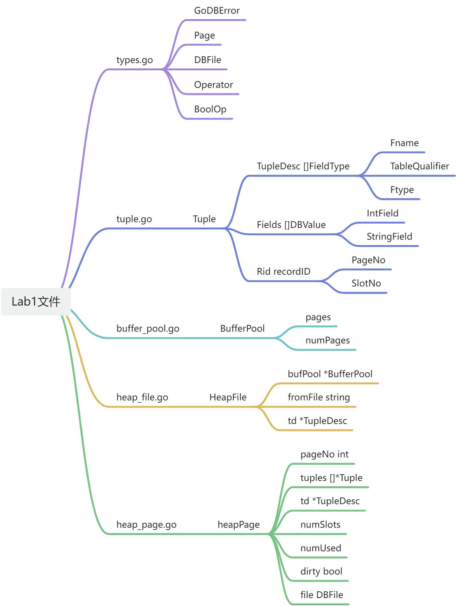

# 简介
> In the lab assignments in 6.5830/6.5831 you will write a basic database
management system called GoDB. For this lab, you will focus on implementing
the core modules required to access stored data on disk; in future labs, you
will add support for various query processing operators, as well as
transactions, locking, and concurrent queries.

在 6.5830/6.5831 的实验作业中，您将编写一个基本数据库管理系统称为GoDB。在本实验中，您将专注于实施访问磁盘上存储的数据所需的核心模块；在未来的实验室中，你将添加对各种查询处理运算符的支持，以及事务、锁定和并发查询。
:::info
接下来是对GODB的简介，使用GO来替代往年的JAVA项目，介绍GO的使用与test，在此不再赘述。
:::
**以下是您可以继续使用 GoDB 的一种方法的粗略概述执行**
> - We have provided you with a set of core types and interfaces in `types.go`.  Review these as you will need to use them.
> - Implement the missing functions in `tuple.go`.  These methods allow you to compare tuples and tuple descriptors.
> - Implement the `buffer_pool.go` constructor and the `GetPage()` method.  You can ignore the transaction methods for lab 1.
> - Implement the missing methods in `heap_file.go` and `heap_page.go`.
These allow you to create heap files, insert and delete records from them,
and iterate through them.  Some of the methods have already been written for you.
> - At this point, you should be able to pass the `lab1_query_test.go` test, which isthe goal for this lab.

- 在 `types.go` 中定义了一些核心类型与接口
- 实现`tuple.go`中的方法，这些方法用来比较tuples与tuple descriptors
- 在 `buffer_pool.go` 中实现构造函数与 GetPage()函数
- 实现 `heap_file.go` 和 `heap_page.go` 中实现方法，这些方法用来创建heap files, 插入和删除records 与迭代。
- 通过 `lab1_query_test.db` 测试

GoDB 有以下几部分组成
> - Structures that represent fields, tuples, and tuple schemas;
> - Methods that apply predicates and conditions to tuples;
> - One or more access methods (e.g., heap files) that store relations on disk and
provide a way to iterate through tuples of those relations;
> - A collection of operator classes (e.g., select, join, insert, delete, etc.)
that process tuples;
> - A buffer pool that caches active tuples and pages in memory and handles
concurrency control and transactions (neither of which you need to worry about
for this lab); and,
> - A catalog that stores information about available tables and their schemas.

表示字段、元组和元组模式的结构；
将谓词和条件应用于元组的方法；
一种或多种访问方法（如堆文件），用于在磁盘上存储关系，并提供一种迭代这些关系的元组的方法；运算符类的集合（如select、join、insert、delete等）处理元组；
一个缓冲池，用于在内存中缓存活动元组和页面并处理它们。
并发控制和事务（两者都不需要担心）对于这个实验室）；
以及一个用于存储有关可用表及其模式的信息的目录。

---


# Core Classes
> The main database state is stored inthe catalog (the list of all the tables in the database - you will not need this in lab 1),the buffer pool (the collection of database file pages that are currently resident in memory), andthe various data files (e.g., heap files) that store data on disk in pages.You will implement the buffer pool and heap files in this lab.

主数据库状态存储在目录（数据库中所有表的列表 - 在实验 1 中不需要它），缓冲池（当前驻留在内存中的数据库文件页的集合），以及以页面形式在磁盘上存储数据的各种数据文件（例如堆文件）。您将在本实验中实现缓冲池和堆文件。

- catalog：主数据库状态
- buffer pool: 内存中数据库文件页
- heapfile: 对文件，磁盘上存储数据的文件

在lab1中需要实现buffer pool和堆文件
除此之外，还需要Tuple数据类型来存储数据
# Operators and Iterators
> Queries in GoDB are implemented using the "iterator" model -- essentially each operator (select, project, join, scan, etc) implements the Operator interface

GoDB 中的查询是使用“迭代器”模型实现的——本质上每个运算符（选择、投影、连接、扫描等）都实现了 Operator 接口
> The Iterator method of each operator returns a function that iterates through its tuples.  Most operators take a "child" operator as a parameter to their constructor that they iterate through and apply their logic to.  Access methods like heap files that implement scans and index lookups don't have children:  they read data directly from files (or caches) and iterate through them.  The advantage of having operators all implement the iterator interface is that operators can be composed arbitrarily -- i.e., a join can read from a filter, or a filter can read from a project which can read from a join of two heap files, without needing to have specific implementations of each operator for each type of child operator.
> If you haven't written code that returns functions like this before, it can be a bit tricky.  We use a pattern in GoDB based on ["closures"](https://go.dev/tour/moretypes/25). Here is an example where we iterate through odd numbers using a closure. `newOdd()` returns a function (a closure) that increments `n` and returns the incremented value. Note that every time you call `newOdd()` it instantiates a new variable `n` that can be used by the returned function.

每个运算符的 Iterator 方法都会返回一个迭代其元组的函数。 大多数运算符将“子”运算符作为其构造函数的参数，并对其进行迭代并应用其逻辑。 实现扫描和索引查找的堆文件等访问方法没有子级：它们直接从文件（或缓存）读取数据并迭代它们。 让运算符全部实现迭代器接口的优点是运算符可以任意组合——即，联接可以从过滤器读取，或者过滤器可以从项目读取，该项目可以从两个堆文件的联接读取，而无需 为每种类型的子运算符提供每个运算符的特定实现。
如果您以前没有编写过返回此类函数的代码，那么这可能会有点棘手。 我们在 GoDB 中使用基于 [“closures”](https://go.dev/tour/moretypes/25) 的模式。 这是一个使用闭包迭代奇数的示例。  `newOdd()` 返回一个函数（闭包），它递增 `n` 并返回递增的值。 请注意，每次调用“newOdd()”时，它都会实例化一个新变量“n”，该变量可供返回的函数使用。
```go
func newOdd() func() int {
    n := 1
    // closure can reference and use the variable n
    return func() int {
        n += 2
        return n
    }
}

func main() {
    iter := newOdd()
    for {
        fmt.Printf("next odd is %d\n", iter())
    }
}
```

---

GoDB中的数据查询使用迭代器Operator进行查询，每调用一次返回下一个* Tuple,直到返回nil。
# Fields and Tuples
> The Tuple struct in GoDB is used to store the in-memory value of a database tuple.
> They consist of a collection of fields implementing the DBValue interface. Different data types (e.g., IntField, StringField) implement DBValue. Tuple objects are created by the underlying access methods (e.g., heap files, or B-trees), as described in the next section. Tuples also have a type (or schema), called a tuple descriptor, represented by a TupleDesc struct, which consists of a collection of FieldType objects, one per field in the tuple, each of which describes the type of the corresponding field.

GoDB中的Tuple结构用于存储数据库元组的内存值。
它们由实现DBValue接口的一组字段组成。
不同的数据类型(例如，Intfield、Stringfield)实现DBValue。
元组对象由底层访问方法(例如，堆文件或B树)创建，如下一节所述。
元组还有一个类型(或架构)，称为元组描述符，由TupleDesc结构表示，该结构由一组FieldType对象组成，元组中的每个字段一个，每个对象描述相应字段的类型。

---

## FieldType
定义元组 (Tuple) 的一个字段 (Field) 描述符，记录了字段的名称，表别名，类型

- Fname string 名称
- TableQualifier string 表别名
- Ftype DBType 类型
   - IntType 类型
   - StringType 类型
## TupleDesc
定义元组的所有字段描述符

- Fields []FieldType 字段描述符数组

具有如下的方法：

- equals : 判断两个描述符是否相等
- findFieldInTd： 找到匹配desc的字段描述符
- copy：复制
- setTableAlias：设置表别名
- merge：合并两个描述符
## Tuple
定义Tuple类型，包含：

- Desc   TupleDesc：Tuple描述符
- Fields []DBValue：字段值
   - IntField
   - StringField
- Rid    recordID：记录其在页面中的位置
   - PageNo：页面号
   - SlotNo：槽位置

具有如下的方法：

- writeTo：将元组值序列化为字节数组，Int类型作为Int64写入，占8个字节，String类型填充0至StringLength字节写入
- readTupleFrom：将字节数组反序列化为元组值，Int类型作为Int64读出，占8个字节，String类型按StringLength字节读出，然后去除填充的0
- equals：判断是否相等
- joinTuples：合并两个元组
- compareField：比较两个元组对应字段的值大小
   - 传入参数有一个Expr类型，用于投影出对应字段
- project： 投影方法，投影出对应字段
- tupleKey：返回哈希值
- HeaderString
- PrettyPrintString
## Exercise
完成Exercise1
# BufferPool
> The buffer pool (class BufferPool in GoDB) is responsible for caching pages in memory that have been recently read from disk. All operators read and write pages from various files on disk through the buffer pool. It consists of a fixed number of pages, defined by the numPages parameter to the BufferPool constructor NewBufferPool.
> For this lab, you only need to implement the constructor and the BufferPool.getPage() method used by the HeapFile iterator. The buffer pool stores structs that implement the Page interface; these pages can be read from underlying database files (such as a heap file) which implement the DBFile interface using the readPage method. The BufferPool should store up to numPages pages. If more than numPages requests are made for different pages, you should evict one of them according to an eviction policy of your choice. Note that you should not evict dirty pages (pages where the Page method isDirty() returns true), for reasons we will explain when we discuss transactions later in the class. You don't need to worry about locking in lab 1.

缓冲池（Godb class Bufferpool）负责最近从磁盘阅读的记忆中的缓存页面。 所有操作员都通过缓冲池从磁盘上的各个文件读取页面。 它由固定数量的页面组成，由numpages参数定义为bufferpool构造函数newbufferpool。
对于此实验室，您只需要实现HeapFile Iterator使用的构造函数和BufferPool.getPage（）方法即可。 缓冲池存储实现页面接口的结构； 这些页面可以从基础数据库文件（例如堆文件）中读取，这些文件使用readPage方法实现了DBFILE接口。 BufferPool应该存储到数字页面。 如果针对不同页面提出了超过数字请求，则应根据您选择的驱逐政策将其中之一驱逐。 请注意，您不应驱逐肮脏的页面（页面方法iSdirty（）返回true的页面），其原因是当我们稍后在课堂上讨论交易时，我们将解释。 您不必担心在实验室1中锁定。

---

## RWPerm
用于后续多线程事务管理
读写锁

- ReadPerm  RWPerm = iota
- WritePerm RWPerm = iota
## BufferPool
缓冲池，用于将存储于磁盘上的页面读入并缓存于内存中，读取或修改数据。
并使用页面级的锁定

- pages    map[uint64]*Page：缓存页表
- numPages int：缓存的容量

具有如下的方法：

- NewBufferPool：新建
- FlushAllPages：刷新所有的缓存表，实验方法，实际使用中不使用
- AbortTransaction：中断事务（后续使用）
- CommitTransaction：提交事务（后续使用）
- BeginTransaction：提交事务（后续使用）
- GetPage：获取页面，缓冲池内取出页面，若不在缓冲池则从磁盘上读取
## Exercise
完成Exercise 2
# HeapFile access method
> Access methods provide a way to read or write data from disk that is arranged in a specific way. Common access methods include heap files (unsorted files of tuples) and B-trees; for this assignment, you will only implement a heap file access method, and we have written some of the code for you.
> A HeapFile object is arranged into a set of pages, each of which consists of a fixed number of bytes for storing tuples, (defined by the constant PageSize), including a header. In GoDB, there is one HeapFile object for each table in the database. Each page in a HeapFile is arranged as a set of slots, each of which can hold one tuple (tuples for a given table in GoDB are all of the same size).
> Pages of HeapFile objects are of type HeapPage which implements the Page interface. Pages are stored in the buffer pool but are read and written by the HeapFile class. Because pages are fixed size, and tuple are fixed size, in GoDB, all pages store the same number of tuples. You are free to choose your in-memory implementation of HeapPage but a reasonable choice would be a slice of Tuples.
> GoDB stores heap files on disk as pages of data arranged consecutively on disk. On disk, each page consists of a header, followed by the PageSize - header size bytes of actual page content. The header consists of a 32 bit integer with the number of slots (tuples), and a second 32 bit integer with the number of used slots. See the comments at the beginning of heap_page.go for more details on the representation.

访问方法提供了一种从以特定方式排列的磁盘读取或写入数据的方法。常见的访问方法包括堆文件(未排序的元组文件)和B树；对于此赋值，您将只实现堆文件访问方法，我们已经为您编写了部分代码。
一个HeapFile对象被安排到一组页面中，每个页面由固定数量的字节组成，用于存储元组(由常量pageSize定义)，包括一个标头。在GoDB中，数据库中的每个表都有一个HeapFile对象。HeapFile中的每个页面都被安排为一组槽，每个槽可以容纳一个元组(GoDB中给定表的元组都具有相同的大小)。
HeapFile对象的页面是实现Page接口的HeapPage类型。页面存储在缓冲池中，但由HeapFile类读取和写入。由于页面大小固定，元组大小固定，因此在GoDB中，所有页面都存储相同数量的元组。您可以自由选择HeapPage的内存实现，但合理的选择应该是一段元组。
GoDB将堆文件作为连续排列在磁盘上的数据页存储在磁盘上。在磁盘上，每个页面都包含一个页眉，后跟实际页面内容的pageSize-Header大小字节。报头由一个带有时隙(元组)数量的32位整数和另一个带有已用时隙数量的32位整数组成。请参阅heap_page开头的注释。有关表示的更多详细信息，请转至`heap_page.go`

---

## heapPage
### 简介
HeapPage为一个页面，其中页面长度为PageSize
在确定TupleDesc后即可确定每个页面中槽的数量
### 属性
heapPage具有如下属性

- pageNo   int：页号
- tuples   []*Tuple：存储Tuple，nil代表空闲
- td       *TupleDesc：描述符
- numSlots int32：总槽位数
- numUsed  int32：使用了的槽位数
- dirty    bool：是否是脏页
- file     DBFile

在写入磁盘时，首先写入4个字节int32的总槽数，然后写入4个字节int32的使用槽位数，然后将非空的Tuple写入，最后填充0至PageSize长度
:::tips
注意，由于GoDB永远不会驱逐脏页，所以不要求写入和读出时的Rid相同，因此只需要在读出时重新编号即可。
:::
### 方法
heapPage具有如下方法：

- newHeapPage：首先计算Tuple序列化的大小，然后计算槽位数，最后新建
- getNumSlots：获取总槽位数
- getNumEmptySlots：获取空闲槽位数，用于判断是否能插入
- insertTuple：插入元组，返回其的Rid
- deleteTuple：输入Rid，删除指定Rid的Tuple
- isDirty
- setDirty
- getFile
- toBuffer：序列化，4字节总槽数，4字节使用槽位数，然后将非空Tuple写入，最后填充至PageSize
- initFromBuffer：反序列化，注意在这一步需要对读入的Tuple进行重新编号
- tupleIter：返回一个迭代器，用于获取Tuple
## HeapFile
### 简介
HeapFile 是一个无序元组的集合，每一个表对应一个HeapFile，其将数据保存在磁盘文件fromFile,通过缓冲池进行读写，可以进行读写Tuple
### 属性
HeapFile具有如下属性

- bufPool ：缓冲池
- fromFile：磁盘文件名
- td *TupleDesc：描述符
### 方法
具有如下方法：

- NewHeapFile：新建
- NumPages：计算总共有多少个页面，通过文件大小/PageSize实时算出
- LoadFromCSV：从CSV中加载数据初始化
- readPage：读取指定页面，将磁盘上对应页面读取并返回，通常由BufferPool调用
- insertTuple：插入一个Tuple，计算哪个页面有空闲，将Tuple插入其页面
- deleteTuple：删除Tuple，删除指定的Tuple
- flushPage：将页面写入磁盘
- Descriptor
- Iterator：返回一个迭代器，迭代页面与Tuple，获取所以Tuple
- pageKey：返回pgNo对应的哈希值
## Exercise
完成Exercise 3
完成Exercise 4
# A simple Query
> In the next lab, you will implement "Operators" that will allow you to run actual SQL queries against GoDB. For the final test in this lab, we ask you to implement a simple query in go logic. This method takes the name of a CSV file and a TupleDesc and a field name and return the sum of the supplied field name. You can use the HeapFile.LoadFromCSV method to load the CSV file, and the fieldFieldInTd methodto find the field number in the TupleDesc, if it exists.

在下一个实验中，您将实现“Operators”，它允许您针对 GoDB 运行实际的 SQL 查询。 对于本实验室的最终测试，我们要求您在 go 逻辑中实现一个简单的查询。 此方法采用 CSV 文件的名称、“TupleDesc”和字段名称，并返回所提供字段名称的总和。 您可以使用“HeapFile.LoadFromCSV”方法加载CSV文件，以及“fieldFieldInTd”方法 查找“TupleDesc”中的字段编号（如果存在）。

---

## computeFieldSum
首先创建一个HeapFile，然后从csv中读取数据
然后遍历所有Tuple，获取对应Tuple指定的字段值，求和
完成Exercise 5
