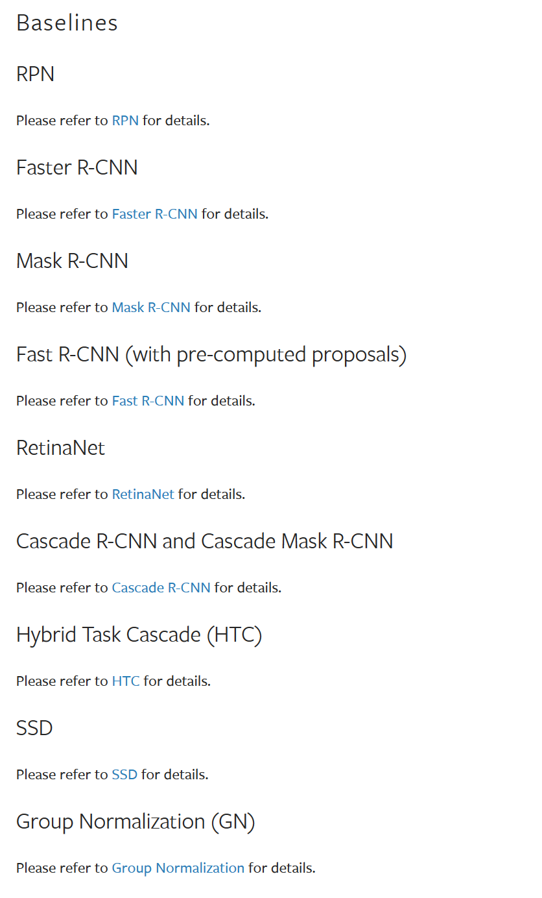

# 0. MMDetection

MMDetection 是一个基于 PyTorch 的目标检测开源工具箱。它是 [OpenMMLab](https://openmmlab.com/) 项目的一部分。

主分支代码目前支持 PyTorch 1.8 及其以上的版本。

Github仓库 [open-mmlab/mmdetection: OpenMMLab Detection Toolbox and Benchmark (github.com)](https://github.com/open-mmlab/mmdetection/tree/main)

官方文档 [Welcome to MMDetection’s documentation! — MMDetection 3.1.0 documentation](https://mmdetection.readthedocs.io/en/latest/)

# 1. FasterRCNN

## 1.1  模型配置文件

在[Model Zoo](https://mmdetection.readthedocs.io/en/latest/model_zoo.html)中找到你需要的检测模型



Faster R-CNN 的model zoo位于[mmdetection/configs/faster_rcnn at main · open-mmlab/mmdetection (github.com)](https://github.com/open-mmlab/mmdetection/tree/main/configs/faster_rcnn)

预训练的结果与模型配置文件，模型文件可以在表格内找到

| Backbone        | Style   | Lr schd | Mem (GB) | Inf time (fps) | box AP | Config                                                       | Download                                                     |
| --------------- | ------- | ------- | -------- | -------------- | ------ | ------------------------------------------------------------ | ------------------------------------------------------------ |
| R-50-C4         | caffe   | 1x      | -        | -              | 35.6   | [config](https://github.com/open-mmlab/mmdetection/blob/main/configs/faster_rcnn/faster-rcnn_r50-caffe_c4-1x_coco.py) | [model](https://download.openmmlab.com/mmdetection/v2.0/faster_rcnn/faster_rcnn_r50_caffe_c4_1x_coco/faster_rcnn_r50_caffe_c4_1x_coco_20220316_150152-3f885b85.pth) \| [log](https://download.openmmlab.com/mmdetection/v2.0/faster_rcnn/faster_rcnn_r50_caffe_c4_1x_coco/faster_rcnn_r50_caffe_c4_1x_coco_20220316_150152.log.json) |
| R-50-DC5        | caffe   | 1x      | -        | -              | 37.2   | [config](https://github.com/open-mmlab/mmdetection/blob/main/configs/faster_rcnn/faster-rcnn_r50-caffe-dc5_1x_coco.py) | [model](https://download.openmmlab.com/mmdetection/v2.0/faster_rcnn/faster_rcnn_r50_caffe_dc5_1x_coco/faster_rcnn_r50_caffe_dc5_1x_coco_20201030_151909-531f0f43.pth) \| [log](https://download.openmmlab.com/mmdetection/v2.0/faster_rcnn/faster_rcnn_r50_caffe_dc5_1x_coco/faster_rcnn_r50_caffe_dc5_1x_coco_20201030_151909.log.json) |
| R-50-FPN        | caffe   | 1x      | 3.8      |                | 37.8   | [config](https://github.com/open-mmlab/mmdetection/blob/main/configs/faster_rcnn/faster-rcnn_r50-caffe_fpn_1x_coco.py) | [model](https://download.openmmlab.com/mmdetection/v2.0/faster_rcnn/faster_rcnn_r50_caffe_fpn_1x_coco/faster_rcnn_r50_caffe_fpn_1x_coco_bbox_mAP-0.378_20200504_180032-c5925ee5.pth) \| [log](https://download.openmmlab.com/mmdetection/v2.0/faster_rcnn/faster_rcnn_r50_caffe_fpn_1x_coco/faster_rcnn_r50_caffe_fpn_1x_coco_20200504_180032.log.json) |
| R-50-FPN        | pytorch | 1x      | 4.0      | 21.4           | 37.4   | [config](https://github.com/open-mmlab/mmdetection/blob/main/configs/faster_rcnn/faster-rcnn_r50_fpn_1x_coco.py) | [model](https://download.openmmlab.com/mmdetection/v2.0/faster_rcnn/faster_rcnn_r50_fpn_1x_coco/faster_rcnn_r50_fpn_1x_coco_20200130-047c8118.pth) \| [log](https://download.openmmlab.com/mmdetection/v2.0/faster_rcnn/faster_rcnn_r50_fpn_1x_coco/faster_rcnn_r50_fpn_1x_coco_20200130_204655.log.json) |
| R-50-FPN (FP16) | pytorch | 1x      | 3.4      | 28.8           | 37.5   | [config](https://github.com/open-mmlab/mmdetection/blob/main/configs/faster_rcnn/faster-rcnn_r50_fpn_amp-1x_coco.py) | [model](https://download.openmmlab.com/mmdetection/v2.0/fp16/faster_rcnn_r50_fpn_fp16_1x_coco/faster_rcnn_r50_fpn_fp16_1x_coco_20200204-d4dc1471.pth) \| [log](https://download.openmmlab.com/mmdetection/v2.0/fp16/faster_rcnn_r50_fpn_fp16_1x_coco/faster_rcnn_r50_fpn_fp16_1x_coco_20200204_143530.log.json) |
| R-50-FPN        | pytorch | 2x      | -        | -              | 38.4   | [config](https://github.com/open-mmlab/mmdetection/blob/main/configs/faster_rcnn/faster-rcnn_r50_fpn_2x_coco.py) | [model](https://download.openmmlab.com/mmdetection/v2.0/faster_rcnn/faster_rcnn_r50_fpn_2x_coco/faster_rcnn_r50_fpn_2x_coco_bbox_mAP-0.384_20200504_210434-a5d8aa15.pth) \| [log](https://download.openmmlab.com/mmdetection/v2.0/faster_rcnn/faster_rcnn_r50_fpn_2x_coco/faster_rcnn_r50_fpn_2x_coco_20200504_210434.log.json) |
| R-101-FPN       | caffe   | 1x      | 5.7      |                | 39.8   | [config](https://github.com/open-mmlab/mmdetection/blob/main/configs/faster_rcnn/faster-rcnn_r101-caffe_fpn_1x_coco.py) | [model](https://download.openmmlab.com/mmdetection/v2.0/faster_rcnn/faster_rcnn_r101_caffe_fpn_1x_coco/faster_rcnn_r101_caffe_fpn_1x_coco_bbox_mAP-0.398_20200504_180057-b269e9dd.pth) \| [log](https://download.openmmlab.com/mmdetection/v2.0/faster_rcnn/faster_rcnn_r101_caffe_fpn_1x_coco/faster_rcnn_r101_caffe_fpn_1x_coco_20200504_180057.log.json) |
| R-101-FPN       | pytorch | 1x      | 6.0      | 15.6           | 39.4   | [config](https://github.com/open-mmlab/mmdetection/blob/main/configs/faster_rcnn/faster-rcnn_r101_fpn_1x_coco.py) | [model](https://download.openmmlab.com/mmdetection/v2.0/faster_rcnn/faster_rcnn_r101_fpn_1x_coco/faster_rcnn_r101_fpn_1x_coco_20200130-f513f705.pth) \| [log](https://download.openmmlab.com/mmdetection/v2.0/faster_rcnn/faster_rcnn_r101_fpn_1x_coco/faster_rcnn_r101_fpn_1x_coco_20200130_204655.log.json) |
| R-101-FPN       | pytorch | 2x      | -        | -              | 39.8   | [config](https://github.com/open-mmlab/mmdetection/blob/main/configs/faster_rcnn/faster-rcnn_r101_fpn_2x_coco.py) | [model](https://download.openmmlab.com/mmdetection/v2.0/faster_rcnn/faster_rcnn_r101_fpn_2x_coco/faster_rcnn_r101_fpn_2x_coco_bbox_mAP-0.398_20200504_210455-1d2dac9c.pth) \| [log](https://download.openmmlab.com/mmdetection/v2.0/faster_rcnn/faster_rcnn_r101_fpn_2x_coco/faster_rcnn_r101_fpn_2x_coco_20200504_210455.log.json) |
| X-101-32x4d-FPN | pytorch | 1x      | 7.2      | 13.8           | 41.2   | [config](https://github.com/open-mmlab/mmdetection/blob/main/configs/faster_rcnn/faster-rcnn_x101-32x4d_fpn_1x_coco.py) | [model](https://download.openmmlab.com/mmdetection/v2.0/faster_rcnn/faster_rcnn_x101_32x4d_fpn_1x_coco/faster_rcnn_x101_32x4d_fpn_1x_coco_20200203-cff10310.pth) \| [log](https://download.openmmlab.com/mmdetection/v2.0/faster_rcnn/faster_rcnn_x101_32x4d_fpn_1x_coco/faster_rcnn_x101_32x4d_fpn_1x_coco_20200203_000520.log.json) |
| X-101-32x4d-FPN | pytorch | 2x      | -        | -              | 41.2   | [config](https://github.com/open-mmlab/mmdetection/blob/main/configs/faster_rcnn/faster-rcnn_x101-32x4d_fpn_2x_coco.py) | [model](https://download.openmmlab.com/mmdetection/v2.0/faster_rcnn/faster_rcnn_x101_32x4d_fpn_2x_coco/faster_rcnn_x101_32x4d_fpn_2x_coco_bbox_mAP-0.412_20200506_041400-64a12c0b.pth) \| [log](https://download.openmmlab.com/mmdetection/v2.0/faster_rcnn/faster_rcnn_x101_32x4d_fpn_2x_coco/faster_rcnn_x101_32x4d_fpn_2x_coco_20200506_041400.log.json) |
| X-101-64x4d-FPN | pytorch | 1x      | 10.3     | 9.4            | 42.1   | [config](https://github.com/open-mmlab/mmdetection/blob/main/configs/faster_rcnn/faster-rcnn_x101-64x4d_fpn_1x_coco.py) | [model](https://download.openmmlab.com/mmdetection/v2.0/faster_rcnn/faster_rcnn_x101_64x4d_fpn_1x_coco/faster_rcnn_x101_64x4d_fpn_1x_coco_20200204-833ee192.pth) \| [log](https://download.openmmlab.com/mmdetection/v2.0/faster_rcnn/faster_rcnn_x101_64x4d_fpn_1x_coco/faster_rcnn_x101_64x4d_fpn_1x_coco_20200204_134340.log.json) |
| X-101-64x4d-FPN | pytorch | 2x      | -        | -              | 41.6   | [config](https://github.com/open-mmlab/mmdetection/blob/main/configs/faster_rcnn/faster-rcnn_x101-64x4d_fpn_2x_coco.py) | [model](https://download.openmmlab.com/mmdetection/v2.0/faster_rcnn/faster_rcnn_x101_64x4d_fpn_2x_coco/faster_rcnn_x101_64x4d_fpn_2x_coco_20200512_161033-5961fa95.pth) \| [log](https://download.openmmlab.com/mmdetection/v2.0/faster_rcnn/faster_rcnn_x101_64x4d_fpn_2x_coco/faster_rcnn_x101_64x4d_fpn_2x_coco_20200512_161033.log.json) |

点击R-101-FPN对应的config即可进入该模型对应的配置文件。点击model即可下载该预训练模型。

R-101-FPN的配置文件如下:

```python
_base_ = './faster-rcnn_r50_fpn_2x_coco.py'
model = dict(
    backbone=dict(
        depth=101,
        init_cfg=dict(type='Pretrained',
                      checkpoint='torchvision://resnet101')))
```

R-101-FPN基于R-50-FPN，相对于R-50-FPN的区别仅为模型的backbone换为了深度为101层的resnet。

查看R-50-FPN的配置文件

```python
_base_ = [
    '../_base_/models/faster-rcnn_r50_fpn.py',
    '../_base_/datasets/coco_detection.py',
    '../_base_/schedules/schedule_2x.py', '../_base_/default_runtime.py'
]
```

包含了如下的四个配置文件，分别为

- faster-rcnn_r50_fpn.py 模型配置文件
- datasets/coco_detection.py 数据集配置文件
- schedules/schedule_2x.py
- default_runtime.py

查看faster-rcnn_r50_fpn.py配置文件

```python
# model settings
model = dict(
    type='FasterRCNN',
    data_preprocessor=dict(
        type='DetDataPreprocessor',
        mean=[123.675, 116.28, 103.53],
        std=[58.395, 57.12, 57.375],
        bgr_to_rgb=True,
        pad_size_divisor=32),
    backbone=dict(
        type='ResNet',
        depth=50,
        num_stages=4,
        out_indices=(0, 1, 2, 3),
        frozen_stages=1,
        norm_cfg=dict(type='BN', requires_grad=True),
        norm_eval=True,
        style='pytorch',
        init_cfg=dict(type='Pretrained', checkpoint='torchvision://resnet50')),
    neck=dict(
        type='FPN',
        in_channels=[256, 512, 1024, 2048],
        out_channels=256,
        num_outs=5),
    rpn_head=dict(
        type='RPNHead',
        in_channels=256,
        feat_channels=256,
        anchor_generator=dict(
            type='AnchorGenerator',
            scales=[8],
            ratios=[0.5, 1.0, 2.0],
            strides=[4, 8, 16, 32, 64]),
        bbox_coder=dict(
            type='DeltaXYWHBBoxCoder',
            target_means=[.0, .0, .0, .0],
            target_stds=[1.0, 1.0, 1.0, 1.0]),
        loss_cls=dict(
            type='CrossEntropyLoss', use_sigmoid=True, loss_weight=1.0),
        loss_bbox=dict(type='L1Loss', loss_weight=1.0)),
    roi_head=dict(
        type='StandardRoIHead',
        bbox_roi_extractor=dict(
            type='SingleRoIExtractor',
            roi_layer=dict(type='RoIAlign', output_size=7, sampling_ratio=0),
            out_channels=256,
            featmap_strides=[4, 8, 16, 32]),
        bbox_head=dict(
            type='Shared2FCBBoxHead',
            in_channels=256,
            fc_out_channels=1024,
            roi_feat_size=7,
            num_classes=80,
            bbox_coder=dict(
                type='DeltaXYWHBBoxCoder',
                target_means=[0., 0., 0., 0.],
                target_stds=[0.1, 0.1, 0.2, 0.2]),
            reg_class_agnostic=False,
            loss_cls=dict(
                type='CrossEntropyLoss', use_sigmoid=False, loss_weight=1.0),
            loss_bbox=dict(type='L1Loss', loss_weight=1.0))),
    # model training and testing settings
    train_cfg=dict(
        rpn=dict(
            assigner=dict(
                type='MaxIoUAssigner',
                pos_iou_thr=0.7,
                neg_iou_thr=0.3,
                min_pos_iou=0.3,
                match_low_quality=True,
                ignore_iof_thr=-1),
            sampler=dict(
                type='RandomSampler',
                num=256,
                pos_fraction=0.5,
                neg_pos_ub=-1,
                add_gt_as_proposals=False),
            allowed_border=-1,
            pos_weight=-1,
            debug=False),
        rpn_proposal=dict(
            nms_pre=2000,
            max_per_img=1000,
            nms=dict(type='nms', iou_threshold=0.7),
            min_bbox_size=0),
        rcnn=dict(
            assigner=dict(
                type='MaxIoUAssigner',
                pos_iou_thr=0.5,
                neg_iou_thr=0.5,
                min_pos_iou=0.5,
                match_low_quality=False,
                ignore_iof_thr=-1),
            sampler=dict(
                type='RandomSampler',
                num=512,
                pos_fraction=0.25,
                neg_pos_ub=-1,
                add_gt_as_proposals=True),
            pos_weight=-1,
            debug=False)),
    test_cfg=dict(
        rpn=dict(
            nms_pre=1000,
            max_per_img=1000,
            nms=dict(type='nms', iou_threshold=0.7),
            min_bbox_size=0),
        rcnn=dict(
            score_thr=0.05,
            nms=dict(type='nms', iou_threshold=0.5),
            max_per_img=100)
        # soft-nms is also supported for rcnn testing
        # e.g., nms=dict(type='soft_nms', iou_threshold=0.5, min_score=0.05)
    ))
```

模型由以下几个部分组成，通过配置文件传递参数

- data_preprocessor: 输入图像变换
- backbone: 使用ResNet-50
- neck：使用FPN
- rpn_head: 使用RPN
- roi_head: 使用StandardRoIHead
- train_cfg: 训练时使用的参数
- test_cfg： 测试时使用的参数

注释后的配置文件

```python
# model settings
model = dict(
    type='FasterRCNN', # 检测器名
    data_preprocessor=dict( # 数据预处理器，用于对数据进行预处理，包括归一化、paddding等
        type='DetDataPreprocessor', # 数据预处理器名
        mean=[123.675, 116.28, 103.53], # 用于对数据进行归一化的均值, 按R, G, B顺序
        std=[58.395, 57.12, 57.375], # 用于对数据进行归一化的标准差, 按R, G, B顺序
        bgr_to_rgb=True, # 是否将BGR转换为RGB
        pad_size_divisor=32), # paading的尺寸应该是32的倍数
    backbone=dict(
        type='ResNet', # 骨干网络名
        depth=50, # 骨干网络深度, ResNet 通常有50, 101, 152三种
        num_stages=4, # 骨干网络的stage数
        out_indices=(0, 1, 2, 3), # 骨干网络输出的stage
        frozen_stages=1, # 冻结的stage数
        norm_cfg=dict(type='BN', requires_grad=True), # BN层的配置
        norm_eval=True, # 是否冻结BN层
        style='pytorch', # 骨干网络的风格 'pytorch' 意思是步长为2的层为 3x3 卷积， 'caffe' 意思是步长为2的层为 1x1 卷积
        init_cfg=dict(type='Pretrained', checkpoint='torchvision://resnet50')), # 加载通过 ImageNet 预训练的模型
    neck=dict(
        type='FPN', # 检测器的neck名
        in_channels=[256, 512, 1024, 2048], # 输入通道数，与backbone的out_indices对应
        out_channels=256, # 输出通道数
        num_outs=5 # 输出的scale数
        ),
    rpn_head=dict(
        type='RPNHead', # RPNHead名
        in_channels=256, # 输入通道数，与neck的out_channels对应
        feat_channels=256, # 特征通道数
        anchor_generator=dict(  # anchor生成器
            type='AnchorGenerator', # anchor生成器名
            scales=[8], # 锚点的基本比例， 特征图某一位置的锚点面积为 scale * base_sizes
            ratios=[0.5, 1.0, 2.0], # 锚点的长宽比
            strides=[4, 8, 16, 32, 64] # 锚生成器的步幅。这与 FPN 特征步幅一致。 如果未设置 base_sizes，则当前步幅值将被视为 base_sizes
            ),
        bbox_coder=dict( # 在训练和测试期间对框进行编码和解码
            type='DeltaXYWHBBoxCoder', # bbox编码器名
            target_means=[.0, .0, .0, .0], # bbox编码器的均值
            target_stds=[1.0, 1.0, 1.0, 1.0]), # bbox编码器的标准差
        loss_cls=dict( # RPNHead的分类损失
            type='CrossEntropyLoss', use_sigmoid=True, loss_weight=1.0), # 分类损失的配置, 交叉熵损失, 是否使用sigmoid, 损失权重
        loss_bbox=dict(type='L1Loss', loss_weight=1.0)), # RPNHead的回归损失, L1损失, 损失权重
    roi_head=dict( # RoIHead的配置
        type='StandardRoIHead', # RoIHead名
        bbox_roi_extractor=dict( # RoI特征提取器
            type='SingleRoIExtractor', # RoI特征提取器名
            roi_layer=dict(type='RoIAlign', output_size=7, sampling_ratio=0), # RoI层的配置, RoIAlign, 输出尺寸, 采样率
            out_channels=256, # 输出通道数
            featmap_strides=[4, 8, 16, 32]), # 特征图步幅, 与neck的strides对应
        bbox_head=dict( # bbox头
            type='Shared2FCBBoxHead', # bbox head 类名
            in_channels=256, # 输入通道数，与RoI特征提取器的out_channels对应
            fc_out_channels=1024, # 全连接层输出通道数
            roi_feat_size=7, # RoI特征尺寸
            num_classes=80, # 类别数
            bbox_coder=dict( # 第二阶段使用的框编码器
                type='DeltaXYWHBBoxCoder', # 框编码器名
                target_means=[0., 0., 0., 0.], # 框编码器的均值
                target_stds=[0.1, 0.1, 0.2, 0.2]), # 框编码器的标准差
            reg_class_agnostic=False, # 回归是否与类别无关
            loss_cls=dict( # 分类损失
                type='CrossEntropyLoss', use_sigmoid=False, loss_weight=1.0), # 交叉熵损失, 是否使用sigmoid, 损失权重
            loss_bbox=dict(type='L1Loss', loss_weight=1.0))), # 回归损失, L1损失, 损失权重
    # model training and testing settings
    train_cfg=dict( # rpn和rcnn的训练配置
        rpn=dict( # rpn的训练配置
            assigner=dict( # rpn的正负样本分配器
                type='MaxIoUAssigner', # 正负样本分配器名
                pos_iou_thr=0.7, # IoU >= 0.7为正样本
                neg_iou_thr=0.3, # IoU < 0.3为负样本
                min_pos_iou=0.3, # 将框作为正样本的最小 IoU 阈值
                match_low_quality=True, # 是否匹配低质量的框
                ignore_iof_thr=-1), # 忽略IoF阈值
            sampler=dict(
                type='RandomSampler', # 正/负采样器(sampler)的配置
                num=256, # 采样个数
                pos_fraction=0.5, # 正样本比例
                neg_pos_ub=-1, # 基于正样本数量的负样本上限
                add_gt_as_proposals=False), # 是否将gt添加到proposals中
            allowed_border=-1, # 允许在边界框周围的区域内预测
            pos_weight=-1, # 训练期间正样本的权重, -1表示不改变原始的权重
            debug=False),
        rpn_proposal=dict( # 训练期间生成proposals的配置
            nms_pre=2000,   # 在NMS之前保留的最大proposal数
            max_per_img=1000, # 每张图片最多保留的proposals数
            nms=dict(type='nms', iou_threshold=0.7), # NMS的配置, nms, IoU阈值
            min_bbox_size=0), # 最小bbox尺寸
        rcnn=dict( # rcnn的训练配置
            assigner=dict( # rcnn的正负样本分配器
                type='MaxIoUAssigner', # 正负样本分配器名
                pos_iou_thr=0.5, # IoU >= 0.5为正样本
                neg_iou_thr=0.5, # IoU < 0.5为负样本
                min_pos_iou=0.5, # 将框作为正样本的最小 IoU 阈值 
                match_low_quality=False, # 是否匹配低质量的框
                ignore_iof_thr=-1), # 忽略IoF阈值
            sampler=dict(
                type='RandomSampler', # 正/负采样器(sampler)的配置
                num=512, # 采样个数
                pos_fraction=0.25, # 正样本比例
                neg_pos_ub=-1, # 基于正样本数量的负样本上限
                add_gt_as_proposals=True), # 是否将gt添加到proposals中
            pos_weight=-1, # 训练期间正样本的权重, -1表示不改变原始的权重
            debug=False)),
    test_cfg=dict( # rpn和rcnn的测试配置
        rpn=dict( # rpn的测试配置
            nms_pre=1000, # 在NMS之前保留的最大proposal数
            max_per_img=1000, # 每张图片最多保留的proposals数
            nms=dict(type='nms', iou_threshold=0.7), # NMS的配置, nms, IoU阈值
            min_bbox_size=0), # 最小bbox尺寸
        rcnn=dict( # rcnn的测试配置
            score_thr=0.05, # 分数阈值, 低于该阈值的框将被过滤
            nms=dict(type='nms', iou_threshold=0.5), # NMS的配置, nms, IoU阈值
            max_per_img=100) # 每张图片最多保留的proposals数
        # soft-nms is also supported for rcnn testing
        # e.g., nms=dict(type='soft_nms', iou_threshold=0.5, min_score=0.05)
    ))

```


## 1.2 data_preprocessors

配置信息

```python
data_preprocessor=dict( # 数据预处理器，用于对数据进行预处理，包括归一化、paddding等
        type='DetDataPreprocessor', # 数据预处理器名
        mean=[123.675, 116.28, 103.53], # 用于对数据进行归一化的均值, 按R, G, B顺序
        std=[58.395, 57.12, 57.375], # 用于对数据进行归一化的标准差, 按R, G, B顺序
        bgr_to_rgb=True, # 是否将BGR转换为RGB
        pad_size_divisor=32), # paading的尺寸应该是32的倍数
```

源代码位于mmdet\models\data_preprocessors\data_preprocessor.py

类：DetDataPreprocessor

参数：

- mean=[123.675, 116.28, 103.53]: The pixel mean of R, G, B channels
- std=[58.395, 57.12, 57.375]:  The pixel standard deviation of  R, G, B channels.
- bgr_to_rgb: convert image from BGR to RGB
- pad_size_divisor=32: The size of padded image should be divisible by ``pad_size_divisor``

## 1.3 backbone

配置信息

```python
backbone=dict(
        type='ResNet', # 骨干网络名
        depth=50, # 骨干网络深度, ResNet 通常有50, 101, 152三种
        num_stages=4, # 骨干网络的stage数
        out_indices=(0, 1, 2, 3), # 骨干网络输出的stage
        frozen_stages=1, # 冻结的stage数
        norm_cfg=dict(type='BN', requires_grad=True), # BN层的配置
        norm_eval=True, # 是否冻结BN层
        style='pytorch', # 骨干网络的风格 'pytorch' 意思是步长为2的层为 3x3 卷积， 'caffe' 意思是步长为2的层为 1x1 卷积
        init_cfg=dict(type='Pretrained', checkpoint='torchvision://resnet50')), # 加载通过 ImageNet 预训练的模型
```

源代码位于mmdet\models\backbones\resnet.py

类：ResNet

参数：

- depth=50: 深度为50或101
- num_stages: Resnet stages
- out_indices = (0, 1, 2, 3):  Output from which stages
- frozen_stages=1 : Stages to be frozen (stop grad and set eval mode).
- norm_cfg=dict(type='BN', requires_grad=True):  Dictionary to construct and config norm layer
- norm_eval=True:  Whether to set norm layers to eval mode, namely
- style: `pytorch` or `caffe`. If set to "pytorch", the stride-two, layer is the 3x3 conv layer, otherwise the stride-two layer is  the first 1x1 conv layer。
- init_cfg: 初始化配置

## 1.4 neck

配置信息

```python
neck=dict(
        type='FPN', # 检测器的neck名
        in_channels=[256, 512, 1024, 2048], # 输入通道数，与backbone的out_indices对应
        out_channels=256, # 输出通道数
        num_outs=5 # 输出的scale数
        ),
```

源代码位于mmdet\models\necks\fpn.py

类：FPN

参数：

- in_channels: Number of input channels per scale.
- out_cheanels: Number of output channels (used at each scale)
- num_outs=5: Number of output scales

## 1.5 rpn_head

配置信息

```python
rpn_head=dict(
        type='RPNHead', # RPNHead名
        in_channels=256, # 输入通道数，与neck的out_channels对应
        feat_channels=256, # 特征通道数
        anchor_generator=dict(  # anchor生成器
            type='AnchorGenerator', # anchor生成器名
            scales=[8], # 锚点的基本比例， 特征图某一位置的锚点面积为 scale * base_sizes
            ratios=[0.5, 1.0, 2.0], # 锚点的长宽比
            strides=[4, 8, 16, 32, 64] # 锚生成器的步幅。这与 FPN 特征步幅一致。 如果未设置 base_sizes，则当前步幅值将被视为 base_sizes
            ),
        bbox_coder=dict( # 在训练和测试期间对框进行编码和解码
            type='DeltaXYWHBBoxCoder', # bbox编码器名
            target_means=[.0, .0, .0, .0], # bbox编码器的均值
            target_stds=[1.0, 1.0, 1.0, 1.0]), # bbox编码器的标准差
        loss_cls=dict( # RPNHead的分类损失
            type='CrossEntropyLoss', use_sigmoid=True, loss_weight=1.0), # 分类损失的配置, 交叉熵损失, 是否使用sigmoid, 损失权重
        loss_bbox=dict(type='L1Loss', loss_weight=1.0)), # RPNHead的回归损失, L1损失, 损失权重
```

源代码位于mmdet\models\dense_heads\rpn_head.py

类：RPNHead

参数：

-  in_channels (int): Number of channels in the input feature map

其余参数配置位于父类：AnchorHead

位于mmdet\models\dense_heads\anchor_head.py

类：AnchorHead

参数：

-  anchor_generator： Config dict for anchor generator
- bbox_coder: Config of bounding box coder
- loss_cls:  Config of classification loss.
- loss_bbox: Config of localization loss.

## 1.6 roi_head

配置信息

```python
roi_head=dict( # RoIHead的配置
        type='StandardRoIHead', # RoIHead名
        bbox_roi_extractor=dict( # RoI特征提取器
            type='SingleRoIExtractor', # RoI特征提取器名
            roi_layer=dict(type='RoIAlign', output_size=7, sampling_ratio=0), # RoI层的配置, RoIAlign, 输出尺寸, 采样率
            out_channels=256, # 输出通道数
            featmap_strides=[4, 8, 16, 32]), # 特征图步幅, 与neck的strides对应
        bbox_head=dict( # bbox头
            type='Shared2FCBBoxHead', # bbox head 类名
            in_channels=256, # 输入通道数，与RoI特征提取器的out_channels对应
            fc_out_channels=1024, # 全连接层输出通道数
            roi_feat_size=7, # RoI特征尺寸
            num_classes=80, # 类别数
            bbox_coder=dict( # 第二阶段使用的框编码器
                type='DeltaXYWHBBoxCoder', # 框编码器名
                target_means=[0., 0., 0., 0.], # 框编码器的均值
                target_stds=[0.1, 0.1, 0.2, 0.2]), # 框编码器的标准差
            reg_class_agnostic=False, # 回归是否与类别无关
            loss_cls=dict( # 分类损失
                type='CrossEntropyLoss', use_sigmoid=False, loss_weight=1.0), # 交叉熵损失, 是否使用sigmoid, 损失权重
            loss_bbox=dict(type='L1Loss', loss_weight=1.0))), # 回归损失, L1损失, 损失权重
```

源代码位于mmdet\models\roi_heads\standard_roi_head.py

类：StandardRoIHead

参数位于父类：BaseRoIHead

源代码位于：mmdet/models/roi_heads/base_roi_head.py

类：BaseRoIHead

参数：

- bbox_roi_extractor： SingleRoIExtractor，Extract RoI features from a single level feature map
- bbox_head： Shared2FCBBoxHead，计算分类回归信息

## 1.7 train_config

配置信息

```python
# model training and testing settings
    train_cfg=dict( # rpn和rcnn的训练配置
        rpn=dict( # rpn的训练配置
            assigner=dict( # rpn的正负样本分配器
                type='MaxIoUAssigner', # 正负样本分配器名
                pos_iou_thr=0.7, # IoU >= 0.7为正样本
                neg_iou_thr=0.3, # IoU < 0.3为负样本
                min_pos_iou=0.3, # 将框作为正样本的最小 IoU 阈值
                match_low_quality=True, # 是否匹配低质量的框
                ignore_iof_thr=-1), # 忽略IoF阈值
            sampler=dict(
                type='RandomSampler', # 正/负采样器(sampler)的配置
                num=256, # 采样个数
                pos_fraction=0.5, # 正样本比例
                neg_pos_ub=-1, # 基于正样本数量的负样本上限
                add_gt_as_proposals=False), # 是否将gt添加到proposals中
            allowed_border=-1, # 允许在边界框周围的区域内预测
            pos_weight=-1, # 训练期间正样本的权重, -1表示不改变原始的权重
            debug=False),
        rpn_proposal=dict( # 训练期间生成proposals的配置
            nms_pre=2000,   # 在NMS之前保留的最大proposal数
            max_per_img=1000, # 每张图片最多保留的proposals数
            nms=dict(type='nms', iou_threshold=0.7), # NMS的配置, nms, IoU阈值
            min_bbox_size=0), # 最小bbox尺寸
        rcnn=dict( # rcnn的训练配置
            assigner=dict( # rcnn的正负样本分配器
                type='MaxIoUAssigner', # 正负样本分配器名
                pos_iou_thr=0.5, # IoU >= 0.5为正样本
                neg_iou_thr=0.5, # IoU < 0.5为负样本
                min_pos_iou=0.5, # 将框作为正样本的最小 IoU 阈值 
                match_low_quality=False, # 是否匹配低质量的框
                ignore_iof_thr=-1), # 忽略IoF阈值
            sampler=dict(
                type='RandomSampler', # 正/负采样器(sampler)的配置
                num=512, # 采样个数
                pos_fraction=0.25, # 正样本比例
                neg_pos_ub=-1, # 基于正样本数量的负样本上限
                add_gt_as_proposals=True), # 是否将gt添加到proposals中
            pos_weight=-1, # 训练期间正样本的权重, -1表示不改变原始的权重
            debug=False)),
```

训练时添加的超参数

参数rpn: 对应的应用信息位于mmdet/models/dense_heads/anchor_head.py内

相关应用信息位于类AnchorHead

```python
if self.train_cfg:
    self.assigner = TASK_UTILS.build(self.train_cfg['assigner'])
    if train_cfg.get('sampler', None) is not None:
        self.sampler = TASK_UTILS.build(
            self.train_cfg['sampler'], default_args=dict(context=self))
    else:
        self.sampler = PseudoSampler(context=self)
```

将assigner, sampler进行应用

参数rcnn: 对应的应用信息位于mmdet/models/roi_heads/standard_roi_head.py内

```python
if self.train_cfg:
    self.bbox_assigner = TASK_UTILS.build(self.train_cfg.assigner)
    self.bbox_sampler = TASK_UTILS.build(
        self.train_cfg.sampler, default_args=dict(context=self))

```

## 1.8 test_config

配置信息：

```python
test_cfg=dict( # rpn和rcnn的测试配置
        rpn=dict( # rpn的测试配置
            nms_pre=1000, # 在NMS之前保留的最大proposal数
            max_per_img=1000, # 每张图片最多保留的proposals数
            nms=dict(type='nms', iou_threshold=0.7), # NMS的配置, nms, IoU阈值
            min_bbox_size=0), # 最小bbox尺寸
        rcnn=dict( # rcnn的测试配置
            score_thr=0.05, # 分数阈值, 低于该阈值的框将被过滤
            nms=dict(type='nms', iou_threshold=0.5), # NMS的配置, nms, IoU阈值
            max_per_img=100) # 每张图片最多保留的proposals数
        # soft-nms is also supported for rcnn testing
        # e.g., nms=dict(type='soft_nms', iou_threshold=0.5, min_score=0.05)
    ))
```

配置信息同train_cfg

# 2. coco数据集和评测器


# 2. 各个模型测试结果

## 2.1 COCO数据集预训练模型

### 2.1.1 FasterRCNN

config链接：https://github.com/open-mmlab/mmdetection/blob/main/configs/faster_rcnn/faster-rcnn_r101_fpn_2x_coco.py

checkpoint链接：https://download.openmmlab.com/mmdetection/v2.0/faster_rcnn/faster_rcnn_r101_fpn_2x_coco/faster_rcnn_r101_fpn_2x_coco_bbox_mAP-0.398_20200504_210455-1d2dac9c.pth

```json
{"coco/bbox_mAP": 0.398, "coco/bbox_mAP_50": 0.601, "coco/bbox_mAP_75": 0.433, "coco/bbox_mAP_s": 0.225, "coco/bbox_mAP_m": 0.436, "coco/bbox_mAP_l": 0.528, "data_time": 0.14929865856170654, "time": 0.19665712566375732}
```

### 2.1.2 SSD

config链接：https://github.com/open-mmlab/mmdetection/blob/main/configs/ssd/ssd512_coco.py

checkpoint链接：https://download.openmmlab.com/mmdetection/v2.0/ssd/ssd512_coco/ssd512_coco_20210803_022849-0a47a1ca.pth

```json
{"coco/bbox_mAP": 0.295, "coco/bbox_mAP_50": 0.493, "coco/bbox_mAP_75": 0.309, "coco/bbox_mAP_s": 0.121, "coco/bbox_mAP_m": 0.341, "coco/bbox_mAP_l": 0.449, "data_time": 0.010663883209228515, "time": 0.1468013153076172}
```

### 2.1.3 Retinanet

config链接：https://github.com/open-mmlab/mmdetection/blob/main/configs/retinanet/retinanet_r101_fpn_2x_coco.py

checkpoint链接：https://download.openmmlab.com/mmdetection/v2.0/retinanet/retinanet_r101_fpn_2x_coco/retinanet_r101_fpn_2x_coco_20200131-5560aee8.pth

```json
{"coco/bbox_mAP": 0.389, "coco/bbox_mAP_50": 0.58, "coco/bbox_mAP_75": 0.415, "coco/bbox_mAP_s": 0.21, "coco/bbox_mAP_m": 0.428, "coco/bbox_mAP_l": 0.524, "data_time": 0.003380171012878418, "time": 0.08712620434761047}
```

## 2.1.4 centernet

config链接：https://github.com/open-mmlab/mmdetection/blob/main/configs/centernet/centernet_r18-dcnv2_8xb16-crop512-140e_coco.py

checkpoint链接：https://download.openmmlab.com/mmdetection/v2.0/centernet/centernet_resnet18_dcnv2_140e_coco/centernet_resnet18_dcnv2_140e_coco_20210702_155131-c8cd631f.pth

```json
{"coco/bbox_mAP": 0.296, "coco/bbox_mAP_50": 0.462, "coco/bbox_mAP_75": 0.314, "coco/bbox_mAP_s": 0.102, "coco/bbox_mAP_m": 0.329, "coco/bbox_mAP_l": 0.467, "data_time": 0.003469311761856079, "time": 0.043782154369354245}
```

### 2.1.5 centernet_update

config链接：https://github.com/open-mmlab/mmdetection/blob/main/configs/centernet/centernet-update_r50-caffe_fpn_ms-1x_coco.py

checkpoint链接：https://download.openmmlab.com/mmdetection/v3.0/centernet/centernet-update_r50-caffe_fpn_ms-1x_coco/centernet-update_r50-caffe_fpn_ms-1x_coco_20230512_203845-8306baf2.pth

```json
{"coco/bbox_mAP": 0.402, "coco/bbox_mAP_50": 0.583, "coco/bbox_mAP_75": 0.438, "coco/bbox_mAP_s": 0.234, "coco/bbox_mAP_m": 0.448, "coco/bbox_mAP_l": 0.516, "data_time": 0.0034139031887054443, "time": 0.08413881421089173}
```

### 2.1.6 yolov3

config链接：https://github.com/open-mmlab/mmdetection/blob/main/configs/yolo/yolov3_d53_8xb8-ms-608-273e_coco.py

checkpoint链接：https://download.openmmlab.com/mmdetection/v2.0/yolo/yolov3_d53_mstrain-608_273e_coco/yolov3_d53_mstrain-608_273e_coco_20210518_115020-a2c3acb8.pth

```json
{"coco/bbox_mAP": 0.338, "coco/bbox_mAP_50": 0.568, "coco/bbox_mAP_75": 0.352, "coco/bbox_mAP_s": 0.197, "coco/bbox_mAP_m": 0.373, "coco/bbox_mAP_l": 0.435, "data_time": 0.0026830642223358153, "time": 0.0734889976978302}
```

## 2.2 pascal_voc数据集

### 2.2.1 FasterRCNN

config链接：https://github.com/open-mmlab/mmdetection/blob/main/configs/pascal_voc/faster-rcnn_r50_fpn_1x_voc0712.py

checkpoint链接：https://download.openmmlab.com/mmdetection/v2.0/pascal_voc/faster_rcnn_r50_fpn_1x_voc0712/faster_rcnn_r50_fpn_1x_voc0712_20220320_192712-54bef0f3.pth

```json
{"pascal_voc/mAP": 0.8035323023796082, "pascal_voc/AP50": 0.804, "data_time": 0.0025495167502679037, "time": 0.035022825628567206}
```

### 2.2.2 Retinanet

config链接：https://github.com/open-mmlab/mmdetection/blob/main/configs/pascal_voc/retinanet_r50_fpn_1x_voc0712.py

checkpoint链接：https://download.openmmlab.com/mmdetection/v2.0/pascal_voc/retinanet_r50_fpn_1x_voc0712/retinanet_r50_fpn_1x_voc0712_20200617-47cbdd0e.pth

```json
{"pascal_voc/mAP": 0.7738053798675537, "pascal_voc/AP50": 0.774, "data_time": 0.002849532541050087, "time": 0.03530912710314613}
```

### 2.2.3 SSD

config链接：https://github.com/open-mmlab/mmdetection/blob/main/configs/pascal_voc/ssd512_voc0712.py

checkpoint链接：https://download.openmmlab.com/mmdetection/v2.0/pascal_voc/ssd512_voc0712/ssd512_voc0712_20220320_194717-03cefefe.pth

```json
{"pascal_voc/mAP": 0.7945083975791931, "pascal_voc/AP50": 0.795, "data_time": 0.0022496522339557406, "time": 0.025717813575787767}
```


