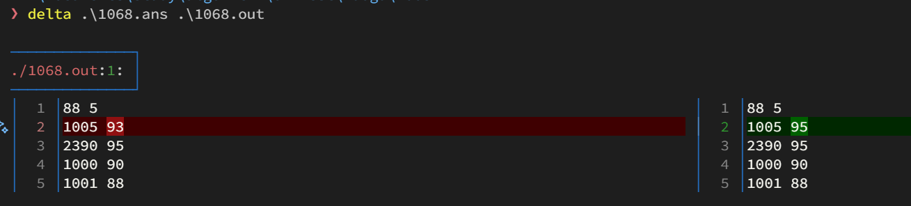

# 0. Modern 

[ibraheemdev/modern-unix: A collection of modern/faster/saner alternatives to common unix commands. (github.com)](https://github.com/ibraheemdev/modern-unix)

该仓库提供了许多Linux传统工具的现代化替代工具。

# 1. delta

对`git`(对比功能)和`diff`的升级。

仓库: [dandavison/delta: A syntax-highlighting pager for git, diff, and grep output (github.com)](https://github.com/dandavison/delta)

文档: [Introduction - delta (dandavison.github.io)](https://dandavison.github.io/delta/introduction.html)

## 1.1 安装

参照[Installation - delta (dandavison.github.io)](https://dandavison.github.io/delta/installation.html)

windows可以使用`winget`进行安装，注意事项见[Using Delta on Windows - delta (dandavison.github.io)](https://dandavison.github.io/delta/tips-and-tricks/using-delta-on-windows.html)

## 1.2 命令行使用

配置通过环境变量配置

命令行直接使用 

```bash
delta a.txt b.txt
```

或使用管道

```bash
git diff a.txt b.txt | delta
diff a.txt b.txt | delta
```

## 1.3 配合git使用

配置通过修改~/.gitconfig

```
[core]
    pager = delta

[interactive]
    diffFilter = delta --color-only --features=interactive

[delta]
    features = decorations

[delta "interactive"]
    keep-plus-minus-markers = false

[delta "decorations"]
    commit-decoration-style = blue ol
    commit-style = raw
    file-style = omit
    hunk-header-decoration-style = blue box
    hunk-header-file-style = red
    hunk-header-line-number-style = "#067a00"
    hunk-header-style = file line-number syntax
```

以下一些命令中的对比工具会被修改为delta

- `git diff`
- `git show`
- `git log -p`
- `git stash show -p`
- `git reflog -p`
- `git add -p`

## 1.4 使用的配置

### 1.4.1 显示行号

```
[delta]
    line-numbers = true
```

```bash
delta -n
```

### 1.4.2 横向对比

```bash
[delta]
    side-by-side = true
```

```
delta -s
```

```
export DELTA_FEATURES=+side-by-side # activate
export DELTA_FEATURES=+             # deactivate
```

## 1.5 效果


