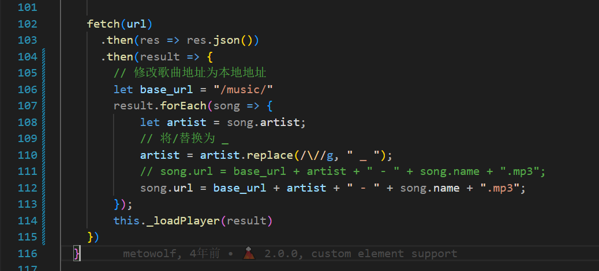

# 0. 前言

本blog 的音乐页面使用以下两个插件进行构建。

- [hexo-tag-aplayer](https://github.com/MoePlayer/hexo-tag-aplayer)
- [MetingJS](https://github.com/metowolf/MetingJS)

单独使用其中某个插件会存在以下的问题。

hexo-tag-aplayer:

- 只能引用本地的文件（封面，歌词，音源）
- 封面，歌词的下载与存储较为复杂

MetingJS

- 无法获取QQ音乐会员的歌曲音源

为了解决上述两个问题，我们可以采用下面的思路

- 将QQ音乐歌曲下载到本地
- 对QQ音乐会员歌曲进行解码至mp3格式，存储于web本地。QQ音乐解密见另一篇文章
- 修改MetingJS 音源url至本地，保留其他接口不变

同时为了一次性部署多个音乐，我们使用歌单的形式，创建QQ音乐歌单，将需要部署的歌曲存入歌单。

# 1. QQ音乐获取相关信息

## 1.1 歌单创建

创建歌单：Blog


获取歌单的ID，在QQ音乐网页端，获取歌单Blog的ID

歌单URL为https://y.qq.com/n/ryqq/playlist/8976385915

则歌单的ID为`8976385915`

## 1.2 歌曲解码

将歌单内所有音乐下载


找到下载的音乐目录，会发现非会员歌曲为.ogg格式，位于根目录下，可以直接解码为mp3


会员歌曲位于/VipSongsDownload目录下，为.mgg格式，需要先进行解密为.ogg格式，后解码为mp3


接下来首先将所有mgg格式音乐解密为.ogg格式，使用[unlock-music](https://git.unlock-music.dev/um/web)工具进行解码，也可以使用[命令行工具um](https://git.unlock-music.dev/um/cli)进行批量解锁。

批量解锁python脚本供参考

```python
import os
import subprocess


# ogg格式文件夹
dst_file_folder = "./"
# mgg格式文件夹
src_file_folder = "VipSongsDownload/"
# 获取mgg文件夹中的文件列表
files = os.listdir(src_file_folder)
# 遍历文件列表
for file in files: 
    # 如果文件名以.mgg结尾
    if file.endswith(".mgg"):
        # 输出文件名
        print("待解密文件名：", file)
        file_name = os.path.splitext(file)[0]
        # 判断是否已经解密过
        dst_file_path = dst_file_folder + file_name + ".ogg"
        if os.path.exists(dst_file_path):
            continue
        # 执行解密命令
        subprocess.call (["um", "-i", src_file_folder + file, "-o", dst_file_folder],shell=True)
        print("解密完成：", dst_file_path)  
```

最后将所有.ogg格式歌曲解码为mp3格式，使用python库pydub进行解码，由于解码速度较慢，使用线程池进行多线程解锁。

批量解码python脚本供参考

```python
import os
from pydub import AudioSegment
from concurrent.futures import ThreadPoolExecutor
import threading

# 解码函数
def convert(src, dst):
    sound = AudioSegment.from_ogg(src)
    sound.export(dst, format="mp3")

# 开启线程池
pool = ThreadPoolExecutor(max_workers=10)

# mp3格式文件夹
dst_file_folder = "mp3/"
# ogg格式文件夹
src_file_folder = "./"
# 遍历文件列表
files = os.listdir(src_file_folder)
for file in files: 
    if file.endswith(".ogg"):
        print("待解密文件名：", file)
        # 判断是否已经解密过
        file_name = os.path.splitext(file)[0]
        dst_file_path= dst_file_folder + file_name + ".mp3"
        if os.path.exists(dst_file_path):
            continue
        print("解密完成：", dst_file_path)
        # 提交线程池， 多线程执行
        pool.submit(convert, src_file_folder + file, dst_file_path) 
```

最后将所有解码为mp3的歌曲，放在`/source/music`文件夹下

# 2. Meting JS 配置

## 2.1 修改Meting JS源码

从[MetingJS](https://github.com/metowolf/MetingJS)的github仓库，克隆其源码，修改/source/Meting.js

103行开始

```javascript
fetch(url)
      .then(res => res.json())
      .then(result => {
        // 修改歌曲地址为本地地址
        let base_url = "/music/"
        result.forEach(song => {
            let artist = song.artist;
            // 将/替换为 _ 
            artist = artist.replace(/\//g, " _ ");
            // song.url = base_url + artist + " - " + song.name + ".mp3";
            song.url = base_url + artist + " - " + song.name + ".mp3";
        });
        this._loadPlayer(result)
    })
```



修改完成后进行build 

```shell
npm install
npm run build
```

## 2.2 部署Meting.min.js

将build完成的Meting.min.js（位于/dist/Meting.min.js)移动至blog项目中，移动到/source/js/ Meting.min.js

# 3 部署

为了方便使用，这里使用CDN的方式进行部署，在md文件内插入js与html标签

插入aplayer相关css和js

```html
<link rel="stylesheet" href="https://cdn.jsdelivr.net/npm/aplayer/dist/APlayer.min.css"/>
<script src="https://cdn.jsdelivr.net/npm/aplayer/dist/APlayer.min.js"></script>
```

插入meting相关js

```html
<script >
    "use strict";function ownKeys(a,b){var c=Object.keys(a);if(Object.getOwnPropertySymbols){var d=Object.getOwnPropertySymbols(a);b&&(d=d.filter(function(b){return Object.getOwnPropertyDescriptor(a,b).enumerable})),c.push.apply(c,d)}return c}function _objectSpread(a){for(var b,c=1;c<arguments.length;c++)b=null==arguments[c]?{}:arguments[c],c%2?ownKeys(Object(b),!0).forEach(function(c){_defineProperty(a,c,b[c])}):Object.getOwnPropertyDescriptors?Object.defineProperties(a,Object.getOwnPropertyDescriptors(b)):ownKeys(Object(b)).forEach(function(c){Object.defineProperty(a,c,Object.getOwnPropertyDescriptor(b,c))});return a}function _defineProperty(a,b,c){return b=_toPropertyKey(b),b in a?Object.defineProperty(a,b,{value:c,enumerable:!0,configurable:!0,writable:!0}):a[b]=c,a}function _toPropertyKey(a){var b=_toPrimitive(a,"string");return"symbol"==typeof b?b:b+""}function _toPrimitive(a,b){if("object"!=typeof a||null===a)return a;var c=a[Symbol.toPrimitive];if(c!==void 0){var d=c.call(a,b||"default");if("object"!=typeof d)return d;throw new TypeError("@@toPrimitive must return a primitive value.")}return("string"===b?String:Number)(a)}class MetingJSElement extends HTMLElement{connectedCallback(){window.APlayer&&window.fetch&&(this._init(),this._parse())}disconnectedCallback(){this.lock||this.aplayer.destroy()}_camelize(a){return a.replace(/^[_.\- ]+/,"").toLowerCase().replace(/[_.\- ]+(\w|$)/g,(a,b)=>b.toUpperCase())}_init(){for(var a={},b=0;b<this.attributes.length;b+=1)a[this._camelize(this.attributes[b].name)]=this.attributes[b].value;var c=["server","type","id","api","auth","auto","lock","name","title","artist","author","url","cover","pic","lyric","lrc"];this.meta={};for(var d,e=0,f=c;e<f.length;e++)d=f[e],this.meta[d]=a[d],delete a[d];this.config=a,this.api=this.meta.api||window.meting_api||"https://api.i-meto.com/meting/api?server=:server&type=:type&id=:id&r=:r",this.meta.auto&&this._parse_link()}_parse_link(){for(var a=[["music.163.com.*song.*id=(\\d+)","netease","song"],["music.163.com.*album.*id=(\\d+)","netease","album"],["music.163.com.*artist.*id=(\\d+)","netease","artist"],["music.163.com.*playlist.*id=(\\d+)","netease","playlist"],["music.163.com.*discover/toplist.*id=(\\d+)","netease","playlist"],["y.qq.com.*song/(\\w+).html","tencent","song"],["y.qq.com.*album/(\\w+).html","tencent","album"],["y.qq.com.*singer/(\\w+).html","tencent","artist"],["y.qq.com.*playsquare/(\\w+).html","tencent","playlist"],["y.qq.com.*playlist/(\\w+).html","tencent","playlist"],["xiami.com.*song/(\\w+)","xiami","song"],["xiami.com.*album/(\\w+)","xiami","album"],["xiami.com.*artist/(\\w+)","xiami","artist"],["xiami.com.*collect/(\\w+)","xiami","playlist"]],b=0,c=a;b<c.length;b++){var d=c[b],e=new RegExp(d[0]),f=e.exec(this.meta.auto);if(null!==f)return this.meta.server=d[1],this.meta.type=d[2],void(this.meta.id=f[1])}}_parse(){if(this.meta.url){var a={name:this.meta.name||this.meta.title||"Audio name",artist:this.meta.artist||this.meta.author||"Audio artist",url:this.meta.url,cover:this.meta.cover||this.meta.pic,lrc:this.meta.lrc||this.meta.lyric||"",type:this.meta.type||"auto"};return a.lrc||(this.meta.lrcType=0),this.innerText&&(a.lrc=this.innerText,this.meta.lrcType=2),void this._loadPlayer([a])}var b=this.api.replace(":server",this.meta.server).replace(":type",this.meta.type).replace(":id",this.meta.id).replace(":auth",this.meta.auth).replace(":r",Math.random());fetch(b).then(a=>a.json()).then(a=>{a.forEach(a=>{var b=a.artist;b=b.replace(/\//g," _ "),a.url="/music/"+b+" - "+a.name+".mp3"}),this._loadPlayer(a)})}_loadPlayer(a){var b={audio:a,mutex:!0,lrcType:this.meta.lrcType||3,storageName:"metingjs"};if(a.length){var c=_objectSpread(_objectSpread({},b),this.config);for(var d in c)("true"===c[d]||"false"===c[d])&&(c[d]="true"===c[d]);var e=document.createElement("div");c.container=e,this.appendChild(e),this.aplayer=new APlayer(c)}}}console.log("\n %c MetingJS v2.0.1 %c https://github.com/metowolf/MetingJS \n","color: #fadfa3; background: #030307; padding:5px 0;","background: #fadfa3; padding:5px 0;"),window.customElements&&!window.customElements.get("meting-js")&&(window.MetingJSElement=MetingJSElement,window.customElements.define("meting-js",MetingJSElement));

</script>

<script>
    // 自定义 meting_api
    var meting_api='https://api.injahow.cn/meting/?server=:server&type=:type&id=:id&auth=:auth&r=:r';
</script>
```

插入meting的播放标签

```html
<meting-js
	server="tencent"
	type="playlist"
	id="8976385915">
</meting-js>

```

