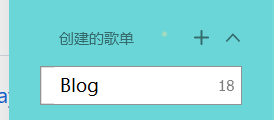
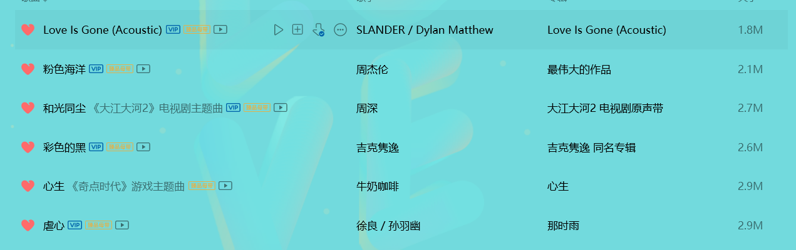
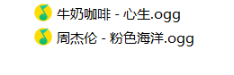
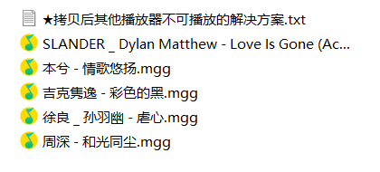

# 0. 前言

本blog 的音乐页面使用以下两个插件进行构建。

- [hexo-tag-aplayer](https://github.com/MoePlayer/hexo-tag-aplayer)
- [MetingJS](https://github.com/metowolf/MetingJS)

单独使用其中某个插件会存在以下的问题。

hexo-tag-aplayer:

- 只能引用本地的文件（封面，歌词，音源）
- 封面，歌词的下载与存储较为复杂

MetingJS

- 无法获取QQ音乐会员的歌曲音源

为了解决上述两个问题，我们可以采用下面的思路

- 将QQ音乐歌曲下载到本地
- 对QQ音乐会员歌曲进行解码至mp3格式，存储于web本地。QQ音乐解密见另一篇文章
- 修改MetingJS 音源url至本地，保留其他接口不变

同时为了一次性部署多个音乐，我们使用歌单的形式，创建QQ音乐歌单，将需要部署的歌曲存入歌单。

# 1. QQ音乐获取相关信息

## 1.1 歌单创建

创建歌单：Blog



获取歌单的ID，在QQ音乐网页端，获取歌单Blog的ID

歌单URL为https://y.qq.com/n/ryqq/playlist/8976385915

则歌单的ID为`8976385915`

## 1.2 歌曲解码

将歌单内所有音乐下载



找到下载的音乐目录，会发现非会员歌曲为.ogg格式，位于根目录下，可以直接解码为mp3



会员歌曲位于/VipSongsDownload目录下，为.mgg格式，需要先进行解密为.ogg格式，后解码为mp3



接下来首先将所有mgg格式音乐解密为.ogg格式，使用[unlock-music](https://git.unlock-music.dev/um/web)工具进行解码，也可以使用[命令行工具um](https://git.unlock-music.dev/um/cli)进行批量解锁。

批量解锁python脚本供参考

```python
import os
import subprocess


# ogg格式文件夹
dst_file_folder = "./"
# mgg格式文件夹
src_file_folder = "VipSongsDownload/"
# 获取mgg文件夹中的文件列表
files = os.listdir(src_file_folder)
# 遍历文件列表
for file in files: 
    # 如果文件名以.mgg结尾
    if file.endswith(".mgg"):
        # 输出文件名
        print("待解密文件名：", file)
        file_name = os.path.splitext(file)[0]
        # 判断是否已经解密过
        dst_file_path = dst_file_folder + file_name + ".ogg"
        if os.path.exists(dst_file_path):
            continue
        # 执行解密命令
        subprocess.call (["um", "-i", src_file_folder + file, "-o", dst_file_folder],shell=True)
        print("解密完成：", dst_file_path)  
```

最后将所有.ogg格式歌曲解码为mp3格式，使用python库pydub进行解码，由于解码速度较慢，使用线程池进行多线程解锁。

批量解码python脚本供参考

```python
import os
from pydub import AudioSegment
from concurrent.futures import ThreadPoolExecutor
import threading

# 解码函数
def convert(src, dst):
    sound = AudioSegment.from_ogg(src)
    sound.export(dst, format="mp3")

# 开启线程池
pool = ThreadPoolExecutor(max_workers=10)

# mp3格式文件夹
dst_file_folder = "mp3/"
# ogg格式文件夹
src_file_folder = "./"
# 遍历文件列表
files = os.listdir(src_file_folder)
for file in files: 
    if file.endswith(".ogg"):
        print("待解密文件名：", file)
        # 判断是否已经解密过
        file_name = os.path.splitext(file)[0]
        dst_file_path= dst_file_folder + file_name + ".mp3"
        if os.path.exists(dst_file_path):
            continue
        print("解密完成：", dst_file_path)
        # 提交线程池， 多线程执行
        pool.submit(convert, src_file_folder + file, dst_file_path) 
```

最后将所有解码为mp3的歌曲，放在`/source/music`文件夹下

# 2. Meting JS 配置

## 2.1 获取Meting JS

本人对原版MetingJS进行了修改，见[仓库](https://github.com/Icathian-Rain/MetingJS)

增加了两个配置选项:

| option | default | description          |
| ------ | ------- | -------------------- |
| local  | false   | 是否使用本地资源文件 |
| path   | ""      | 本地资源文件路径     |

clone仓库:

```bash
git clone https://github.com/Icathian-Rain/MetingJS.git
```

进行build 

```shell
npm install
npm run build
```

## 2.2 部署Meting.min.js

将build完成的Meting.min.js（位于/dist/Meting.min.js)移动至blog项目中，移动到/source/js/Meting.min.js

# 3 部署

为了方便使用，这里使用CDN的方式进行部署，在md文件内插入js与html标签

插入aplayer相关css和js

```html
<link rel="stylesheet" href="https://cdn.jsdelivr.net/npm/aplayer/dist/APlayer.min.css"/>
<script src="https://cdn.jsdelivr.net/npm/aplayer/dist/APlayer.min.js"></script>
```

插入meting相关js

```html
<script src="/js/Meting.min"></script>
<script>
    // 自定义 meting_api
    var meting_api='https://api.injahow.cn/meting/?server=:server&type=:type&id=:id&auth=:auth&r=:r';
</script>
```

插入meting的播放标签

```html
<meting-js
	server="tencent"
	type="playlist"
	id="8976385915"
    local="true"
    path="/music/">
</meting-js>
```

