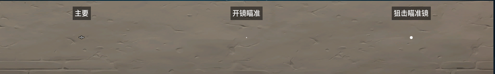
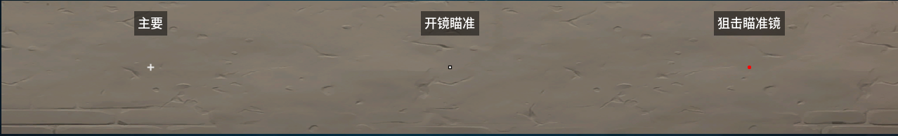
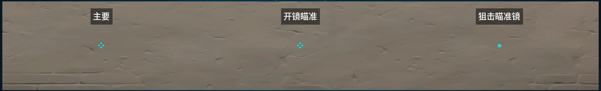

# 常用准星

本人常用的无畏契约准星如下

---
## 蓝色点准星


代码如下

```
0;s;1;P;c;5;o;1;d;1;z;3;f;0;0t;6;0l;0;0a;1;0f;0;1b;0;S;c;6;s;0.949;o;1
```

---


## 短十字准星



代码如下:

```
0;p;0;s;1;P;u;000000FF;o;1;0t;1;0l;4;0v;2;0g;1;0o;0;0a;1;0f;0;1b;0;A;h;0;d;1;0b;0;1b;0;S;c;0;o;1
```

---

## 十字准星



代码如下:

```
0;p;0;s;1;P;u;000000FF;h;0;m;1;0l;4;0v;0;0o;0;0a;0.833;0f;0;1b;0;A;o;1;d;1;0b;0;1b;0;S;s;0.7;o;1
```

---

## 绿点


代码如下:

```
0;s;1;P;c;1;t;2;o;1;d;1;0b;0;1b;0;S;b;1;c;8;s;0.823
```

---

## 梅花



代码如下:

```
0;s;1;P;c;5;h;0;0t;1;0l;4;0o;1;0a;1;0f;0;1t;3;1o;2;1a;1;1m;0;1f;0;S;c;5
```

---

## 十字带间隔


```
0;s;1;P;o;1;f;0;0t;1;0l;3;0o;2;0a;1;0f;0;1b;0;S;c;1;s;0.331;o;1
```
---

## Extra

附带全部可用准心：
```
点准心 0;s;1;P;c;5;o;1;d;1;z;3;f;0;0t;6;0l;0;0a;1;0f;0;1b;0;S;c;6;s;0.949;o;1

十字准心：0;p;0;s;1;P;u;000000FF;h;0;m;1;0l;4;0v;0;0o;0;0a;0.833;0f;0;1b;0;A;o;1;d;1;0b;0;1b;0;S;s;0.7;o;1

短十字准心：0;p;0;s;1;P;u;000000FF;o;1;0t;1;0l;4;0v;2;0g;1;0o;0;0a;1;0f;0;1b;0;A;h;0;d;1;0b;0;1b;0;S;c;0;o;1

选手准星代码区▼
TenZ 0;s;1;P;c;5;h;0;m;1;0l;4;0o;2;0f;0;1b;0;S;c;5;o;1

zekken 0;s;1;P;c;1;t;2;o;1;d;1;0b;0;1b;0;S;b;1;c;8;s;0.823

Demon1 0;s;1;P;o;1;f;0;0t;1;0l;3;0o;2;0a;1;0f;0;1b;0;S;c;1;s;0.331;o;1

nats 0;P;c;1;o;1;0t;1;0l;2;0o;2;0a;1;0f;0;1b;0

Derke 0;P;c;8;o;1;d;1;b;1;0b;0;1b;0

benjyfishy 0;P;c;7;h;0;0l;4;0o;0;0a;1;0f;0;1t;0;1l;0;1o;0;1a;0;1m;0;1f;0

f0rsakeN
0;s;1;P;u;000000FF;o;1;s;0;0t;3;0l;1;0v;0;0g;1;0o;0;0a;1;0f;0;1t;1;1l;4;1g;1;1o;0;1a;1;1m;0;1f;0;S;c;0;s;0.9;o;1

ZmjjKK
0;s;1;P;c;8;u;000000FF;h;0;b;1;0l;3;0v;5;0o;1;0a;1;0f;0;1b;0;S;c;4;s;0.6

方形点准星：0;s;1;P;c;5;o;1;d;1;z;3;0b;0;1b;0;S;c;5;o;1

Tenz：0;s;1;P;c;5;h;0;0l;4;0o;2;0a;1;0f;0;1b;0;S;c;5

忍者准星（手里剑）：0;s;1;P;c;5;h;0;f;0;0l;4;0o;2;0a;1;0f;0;1t;8;1l;1;1o;1;1a;1;1m;0;1f;0;S;c;5

梅花准星：0;s;1;P;c;5;h;0;0t;1;0l;4;0o;1;0a;1;0f;0;1t;3;1o;2;1a;1;1m;0;1f;0;S;c;5

雪花准星：0;s;1;P;c;5;h;0;f;0;0o;0;0a;1;0f;0;1t;4;1o;2;1a;1;1m;0;1f;0;S;c;5

圆点准星：0;s;1;P;c;5;h;0;f;0;0t;4;0l;2;0o;1;0a;1;0f;0;1b;0;S;c;5

箭头准星：0;s;1;P;c;5;h;0;0l;2;0a;1;0f;0;1t;4;1o;5;1a;1;1m;0;1f;0;S;c;5

十字准星：0;s;1;P;c;5;h;0;0l;4;0o;0;0a;1;0f;0;1b;0

十字动态准星1：0;s;1;P;c;5;u;FF4500FF;o;1;m;1;0t;1;0l;4;0v;2;0g;1;0o;0;0a;1;0e;0.2;1b;0;S;c;5;t;0602F7FF;o;1

方形动态准星：0;s;1;P;c;5;o;0.15;m;1;0t;1;0l;2;0o;1;0a;1;0m;1;0s;0.02;0e;0.05;1t;3;1o;0;1a;1;1s;0.02;1e;0.05;S;c;5;o;1

十字动态准星2：0;s;1;P;c;5;u;7FFFD4FF;h;0;0l;2;0o;1;0a;1;0m;1;0s;0.01;0e;0.05;1l;5;1o;0;1a;1;1s;0.01;1e;0.05;S;c;5;o;1 
```